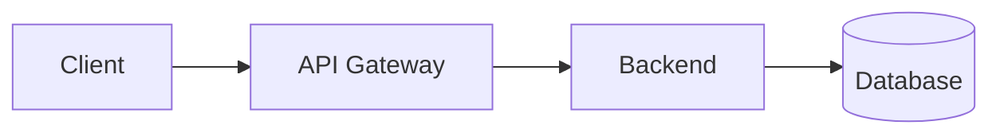

# Documentation SkillSwap

> **Guide complet** pour exploiter et contribuer à la documentation technique du projet SkillSwap.

Documentation technique utilisant [MkDocs Material](https://squidfunk.github.io/mkdocs-material/), suivant le template [Arc42](https://arc42.org/) pour l'architecture logicielle.

---

## État d'avancement

> **Dernière mise à jour** : 22 janvier 2025

| Phase                        | Statut   | Contenu                                              |
| ---------------------------- | -------- | ---------------------------------------------------- |
| **Phase A : Fondations**     | ✅ 100%  | MkDocs + Arc42 (12 sections) + Diagrammes C4/Mermaid |
| **Phase B : Backend**        | ✅ 100%  | OpenAPI (31 endpoints) + Database (14 modèles) + Docker |
| **Phase C : Frontend**       | ✅ 100%  | Consolidé dans `arc42/05-building-blocks.md` (57 composants, 10 hooks) |
| **Phase D : Qualité**        | ⏳ 0%   | Vitest + Playwright                                  |
| **Phase E : Finalisation**   | ⏳ 0%   | Fiches soutenance + Déploiement Vercel               |

**Progression globale** : ~60%

### Restructuration (22 janvier 2025)

- **ADRs** : 9 décisions consolidées dans `arc42/09-decisions.md`
- **Frontend** : 57 composants, 10 hooks, 5 patterns consolidés dans `arc42/05-building-blocks.md`
- **Dossiers supprimés** : `adr/` et `frontend/` (contenu migré vers arc42/)

---

## Quick Start (30 secondes)

```bash
# 1. Se placer dans le dossier docs
cd docs

# 2. Créer l'environnement virtuel (une seule fois)
python3 -m venv .venv

# 3. Installer les dépendances
.venv/bin/pip install mkdocs-material mkdocs-swagger-ui-tag

# 4. Lancer le serveur
.venv/bin/mkdocs serve
```

Accéder à la documentation : <http://localhost:8000>

Le serveur recharge automatiquement quand vous modifiez les fichiers `.md`.

---

## Structure du projet

```plaintext
docs/
├── .venv/                          # Environnement virtuel Python (ignoré par git)
├── mkdocs.yml                      # Configuration MkDocs Material
├── README.md                       # Ce fichier (guide collaborateurs)
│
├── documentation-implementation/   # CONTENU MARKDOWN (source MkDocs)
│   ├── index.md                    # Page d'accueil
│   ├── arc42/                      # Architecture (12 sections Arc42)
│   │   ├── 01-introduction/
│   │   │   └── index.md
│   │   ├── 02-constraints/
│   │   │   └── index.md
│   │   ├── 03-context/
│   │   │   └── index.md
│   │   ├── 04-solution-strategy/
│   │   │   └── index.md
│   │   ├── 05-building-blocks/     # Frontend + Backend + BDD (éclaté)
│   │   │   ├── index.md            # Vue d'ensemble
│   │   │   ├── frontend.md         # 57 composants, 10 hooks, patterns
│   │   │   ├── backend.md          # Architecture en couches
│   │   │   └── database.md         # 14 modèles Prisma
│   │   ├── 06-runtime/             # Scénarios d'exécution (éclaté)
│   │   │   ├── index.md
│   │   │   ├── authentication.md
│   │   │   ├── search.md
│   │   │   ├── messaging.md
│   │   │   └── error-handling.md
│   │   ├── 07-deployment/
│   │   │   └── index.md
│   │   ├── 08-crosscutting/        # Concepts transverses (éclaté)
│   │   │   ├── index.md
│   │   │   ├── authentication.md
│   │   │   ├── validation.md
│   │   │   ├── error-handling.md
│   │   │   ├── logging.md
│   │   │   ├── security.md
│   │   │   └── i18n.md
│   │   ├── 09-decisions/           # 9 ADRs (fichiers individuels)
│   │   │   ├── index.md            # Index des ADRs
│   │   │   ├── 001-nextjs.md
│   │   │   ├── 002-tailwind.md
│   │   │   ├── 003-prisma.md
│   │   │   ├── 004-tanstack-query.md
│   │   │   ├── 005-zod.md
│   │   │   ├── 006-atomic-design.md
│   │   │   ├── 007-jwt.md
│   │   │   ├── 008-meilisearch.md
│   │   │   └── 009-mock-to-api.md
│   │   ├── 10-quality/             # Exigences qualité (éclaté)
│   │   │   ├── index.md
│   │   │   ├── scenarios.md
│   │   │   ├── testing.md
│   │   │   ├── accessibility.md
│   │   │   └── monitoring.md
│   │   ├── 11-risks/
│   │   │   └── index.md
│   │   └── 12-glossary/
│   │       └── index.md
│   ├── api-reference/              # Documentation API OpenAPI
│   │   ├── index.md
│   │   ├── swagger.md
│   │   ├── authentication.md
│   │   ├── errors.md
│   │   ├── testing-tools.md        # Postman, Newman, curl
│   │   ├── openapi.yaml
│   │   └── examples/
│   ├── database/                   # Schéma base de données (14 modèles)
│   │   ├── index.md                # ERD Mermaid
│   │   ├── models/                 # Documentation par modèle
│   │   ├── enums.md
│   │   ├── relations.md
│   │   └── migrations.md
│   └── infrastructure/             # Configuration Docker
│       ├── index.md
│       ├── services.md
│       ├── networks.md
│       ├── volumes.md
│       └── troubleshooting.md
│
├── site/                           # SITE GÉNÉRÉ (mkdocs build)
│   └── ...                         # HTML/CSS/JS statiques
│
├── documentation-strategy/         # STRATÉGIE DE DOCUMENTATION
│   ├── README.md                   # Vue d'ensemble stratégie
│   ├── 00-plan-action-global.md
│   ├── 01-stack.md                 # Choix des outils
│   ├── 02-arc42-mkdocs.md          # Guide Arc42
│   ├── ...
│   └── 14-planning.md              # Planning 30 jours
│
├── merise/                         # Modélisation Merise
├── uml/                            # Diagrammes UML
└── endpoints/                      # Documentation endpoints brute
```

---

## Le dossier site - Comment est-il généré

Le dossier `site/` contient le **site statique généré** par MkDocs. Il est créé automatiquement par la commande :

```bash
.venv/bin/mkdocs build
```

### Ce qui se passe

1. MkDocs lit `mkdocs.yml` (configuration)
2. MkDocs parcourt tous les fichiers `.md` dans `documentation-implementation/`
3. MkDocs convertit le Markdown en HTML avec le thème Material
4. MkDocs génère les assets (CSS, JS, images) dans `site/`
5. Le dossier `site/` est prêt pour le déploiement

### Points importants

- **Ne pas modifier `site/`** directement - vos changements seront écrasés
- **Modifier les fichiers dans `documentation-implementation/`** (source Markdown)
- Le dossier `site/` est ignoré par Git (voir `.gitignore`)
- Pour le développement, utilisez `mkdocs serve` (pas besoin de build)

---

## Commandes utiles

| Commande                                          | Description                              |
| ------------------------------------------------- | ---------------------------------------- |
| `.venv/bin/mkdocs serve`                          | Serveur de développement (localhost:8000)|
| `.venv/bin/mkdocs build`                          | Génère le site statique dans `site/`     |
| `.venv/bin/mkdocs serve --dev-addr=0.0.0.0:8000`  | Accessible depuis d'autres machines      |
| `.venv/bin/mkdocs gh-deploy`                      | Déploie sur GitHub Pages                 |

---

## Comment contribuer

### Ajouter une page

1. **Créer** un fichier `.md` dans le dossier approprié de `documentation-implementation/`
2. **Ajouter** la page à la navigation dans `mkdocs.yml` :

```yaml
nav:
  - Accueil: index.md
  - Architecture:
    - Introduction: arc42/01-introduction/index.md
    - Ma nouvelle page: arc42/01-introduction/nouvelle-page.md  # Ajouter ici
```

1. **Vérifier** que la page s'affiche correctement sur localhost:8000

### Modifier une page existante

1. **Trouver** le fichier `.md` correspondant dans `documentation-implementation/`
2. **Modifier** le contenu Markdown
3. **Vérifier** le rendu (le serveur recharge automatiquement)

### Conventions de style

- **Titres** : Un seul `#` par page (titre principal)
- **Sections** : `##` pour les sections principales, `###` pour les sous-sections
- **Code** : Utiliser les blocs de code avec coloration syntaxique
- **Liens** : Utiliser des chemins relatifs (`../arc42/01-introduction/index.md`)
- **Images** : Placer dans `documentation-implementation/assets/` et référencer avec ``

### Diagrammes Mermaid

Les diagrammes Mermaid sont supportés nativement :

````markdown

````

Types supportés : `flowchart`, `sequenceDiagram`, `classDiagram`, `erDiagram`, `gantt`

---

## Où trouver quoi

| Je cherche...                | Aller dans...                                        |
| ---------------------------- | ---------------------------------------------------- |
| L'architecture globale       | `documentation-implementation/arc42/`                |
| Les décisions techniques (ADRs) | `documentation-implementation/arc42/09-decisions/index.md` |
| L'architecture frontend      | `documentation-implementation/arc42/05-building-blocks/index.md` |
| La documentation API         | `documentation-implementation/api-reference/`        |
| Le schéma de la BDD          | `documentation-implementation/database/`             |
| La configuration Docker      | `documentation-implementation/infrastructure/`       |
| La stratégie de documentation| `documentation-strategy/`                            |

---

## Storybook - Catalogue de composants UI

Storybook documente visuellement tous les composants React du frontend.

### Lancer Storybook

```bash
# Se placer dans le dossier frontend
cd ../frontend

# Lancer le serveur de développement
npm run storybook
```

Accéder à Storybook : <http://localhost:6006>

### Build statique

```bash
# Générer le site statique
npm run build-storybook

# Le site est généré dans frontend/storybook-static/
```

### Couverture actuelle

| Catégorie | Composants | Stories | Couverture |
|-----------|------------|---------|------------|
| **Atoms** | 15 | ~95 | 100% |
| **Molecules** | 9 | ~50 | 100% |
| **Organisms** | 4 (P1) | ~26 | Priorité 1 |
| **Total** | 28 | ~171 | 90% |

### Organisation des stories

```plaintext
frontend/src/components/
├── atoms/
│   ├── Button.tsx
│   ├── Button.stories.tsx      ← Story colocalisée
│   └── ...
├── molecules/
│   ├── ProfileCard.tsx
│   ├── ProfileCard.stories.tsx
│   └── ...
└── organisms/
    ├── Header/
    │   ├── index.tsx
    │   └── Header.stories.tsx
    └── ...
```

### Fonctionnalités clés

| Onglet | Description |
|--------|-------------|
| **Canvas** | Composant rendu interactivement |
| **Docs** | Documentation auto-générée (props, exemples) |
| **Controls** | Modifier les props en temps réel |
| **Actions** | Logger les événements (onClick, onChange) |
| **Accessibility** | Audit WCAG automatique (addon-a11y) |

### Ressources Storybook

- Documentation officielle : <https://storybook.js.org/docs>
- Addon a11y : <https://storybook.js.org/addons/@storybook/addon-a11y>
- Plan d'action détaillé : `documentation-strategy/08-storybook.md`

---

## URLs de déploiement (à venir)

| Documentation    | URL                              | Contenu                           |
| ---------------- | -------------------------------- | --------------------------------- |
| **Technique**    | docs.skillswap.vercel.app        | Arc42, ADRs, OpenAPI              |
| **Utilisateur**  | guide.skillswap.vercel.app       | Tutorials, How-to (Docusaurus)    |
| **Composants**   | storybook.skillswap.vercel.app   | Catalogue UI (Storybook)          |

---

## Prérequis

- **Python 3.10+** (pour MkDocs)
- **Git** (pour le versioning)
- Optionnel : **Node.js 20+** (pour Storybook/Docusaurus - Phase C)

### Vérifier les versions

```bash
python3 --version  # Python 3.10+
git --version      # Git 2.x+
```

---

## Troubleshooting

### Command not found mkdocs

```bash
# Assurez-vous d'utiliser le chemin complet
.venv/bin/mkdocs serve

# OU activez l'environnement virtuel
source .venv/bin/activate
mkdocs serve
```

### Le serveur ne se lance pas

```bash
# Vérifiez que vous êtes dans le bon dossier
pwd  # Doit afficher .../docs

# Réinstallez les dépendances
.venv/bin/pip install --upgrade mkdocs-material mkdocs-swagger-ui-tag
```

### Les diagrammes Mermaid ne s'affichent pas

Vérifiez que `mkdocs.yml` contient :

```yaml
markdown_extensions:
  - pymdownx.superfences:
      custom_fences:
        - name: mermaid
          class: mermaid
          format: !!python/name:pymdownx.superfences.fence_code_format
```

---

## Ressources

### Documentation officielle

- [MkDocs](https://www.mkdocs.org/) - Générateur de documentation
- [MkDocs Material](https://squidfunk.github.io/mkdocs-material/) - Thème utilisé
- [Arc42](https://arc42.org/) - Template d'architecture
- [Mermaid](https://mermaid.js.org/) - Diagrammes as code

### Stratégie de documentation

- [Plan d'action global](./documentation-strategy/00-plan-action-global.md)
- [Stack documentation](./documentation-strategy/01-stack.md)
- [Planning 30 jours](./documentation-strategy/14-planning.md)

### Aide

- Slack : `#doc-skillswap`
- Issues GitHub : Créer une issue avec le label `documentation`

---

## Contributeurs

| Rôle          | Responsabilité                  |
| ------------- | ------------------------------- |
| Lead Doc      | Arc42, coordination, revue      |
| Frontend Dev  | Storybook, composants           |
| Backend Dev   | API, BDD, Docker                |
| DevOps        | CI/CD, déploiement              |

---

Dernière mise à jour : 23 janvier 2025
