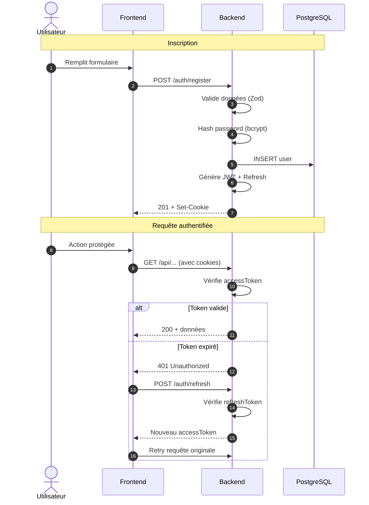

# Authentification

## Vue d'ensemble

SkillSwap utilise une authentification basée sur **JWT (JSON Web Tokens)** avec un système de double token :

| Token | Durée | Stockage | Usage |
| ----- | ----- | -------- | ----- |
| `accessToken` | 15 min | Cookie HTTP-only | Authentifier les requêtes |
| `refreshToken` | 7 jours | Cookie HTTP-only | Renouveler l'accessToken |

---

## Flow d'authentification



---

## Endpoints d'authentification

### POST /auth/register

Inscription d'un nouveau membre.

**Request Body :**

```json
{
  "lastname": "Dupont",
  "firstname": "Marie",
  "email": "marie@example.com",
  "password": "SecurePass123!",
  "confirmation": "SecurePass123!"
}
```

**Réponses :**

| Code | Description |
| ---- | ----------- |
| 201 | Inscription réussie, cookies définis |
| 400 | Données invalides |
| 409 | Email déjà utilisé |

---

### POST /auth/login

Connexion d'un utilisateur existant.

**Request Body :**

```json
{
  "email": "marie@example.com",
  "password": "SecurePass123!"
}
```

**Réponses :**

| Code | Description |
| ---- | ----------- |
| 200 | Connexion réussie, cookies définis |
| 401 | Identifiants incorrects |

---

### POST /auth/logout

Déconnexion (suppression des cookies).

**Réponses :**

| Code | Description |
| ---- | ----------- |
| 200 | Déconnexion réussie |

---

### POST /auth/refresh

Renouvellement du token d'accès.

**Réponses :**

| Code | Description |
| ---- | ----------- |
| 200 | Nouveau accessToken défini |
| 401 | RefreshToken invalide ou expiré |

---

### GET /auth/me

Récupère le profil de l'utilisateur connecté.

**Headers requis :** Cookie `accessToken`

**Réponses :**

| Code | Description |
| ---- | ----------- |
| 200 | Profil utilisateur |
| 401 | Non authentifié |

---

## Structure du JWT

```typescript
interface JWTPayload {
  sub: number;      // User ID
  email: string;    // Email de l'utilisateur
  role: string;     // Rôle (user, admin)
  iat: number;      // Timestamp de création
  exp: number;      // Timestamp d'expiration
}
```

---

## Sécurité

### Cookies HTTP-only

Les tokens sont stockés dans des cookies avec les options :

```typescript
{
  httpOnly: true,     // Inaccessible via JavaScript
  secure: true,       // HTTPS uniquement (en production)
  sameSite: 'strict', // Protection CSRF
  path: '/'
}
```

### Hachage des mots de passe

Les mots de passe sont hachés avec **bcrypt** (10 rounds) :

```typescript
const hashedPassword = await bcrypt.hash(password, 10);
```

### Middleware checkAuth

```typescript
// Extrait et vérifie le JWT
const token = req.cookies.accessToken;
const decoded = jwt.verify(token, process.env.JWT_SECRET);
req.userId = decoded.sub;
req.userRole = decoded.role;
```

---

## Exemple de flow complet

### 1. Inscription

```bash
curl -X POST http://localhost:5000/api/v1/auth/register \
  -H "Content-Type: application/json" \
  -d '{
    "lastname": "Dupont",
    "firstname": "Marie",
    "email": "marie@example.com",
    "password": "SecurePass123!",
    "confirmation": "SecurePass123!"
  }' \
  -c cookies.txt
```

### 2. Requête authentifiée

```bash
curl http://localhost:5000/api/v1/auth/me \
  -b cookies.txt
```

### 3. Refresh du token

```bash
curl -X POST http://localhost:5000/api/v1/auth/refresh \
  -b cookies.txt \
  -c cookies.txt
```

---

## Navigation

| Précédent | Suivant |
| --------- | ------- |
| [← Vue d'ensemble](index.md) | [Codes d'erreur →](errors.md) |
