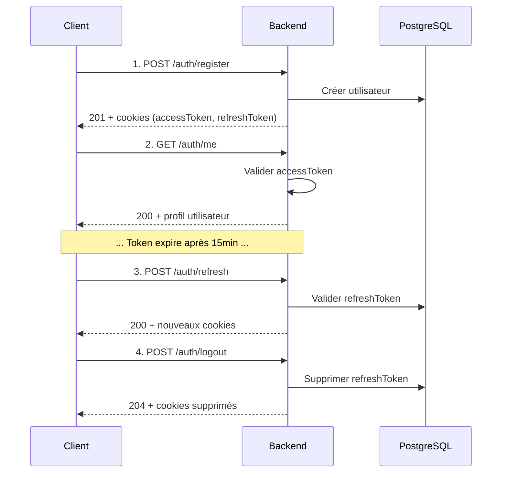

# Exemple : Flux d'authentification

Ce guide montre le flux complet d'authentification d'un utilisateur sur SkillSwap.

## Vue d'ensemble



---

## Étape 1 : Inscription

### Requête

```bash
curl -X POST http://localhost:3000/api/v1/auth/register \
  -H "Content-Type: application/json" \
  -d '{
    "email": "marie.dupont@example.com",
    "password": "MotDePasse123!",
    "confirmation": "MotDePasse123!",
    "firstname": "Marie",
    "lastname": "Dupont"
  }'
```

### Schéma de validation (Zod)

```typescript
const registerSchema = z.object({
  email: z.email(),
  password: z.string().min(8),
  confirmation: z.string(),
  firstname: z.string().min(1).regex(/^[A-Za-zÀ-ÿ\s\-']+$/),
  lastname: z.string().min(1).regex(/^[A-Za-zÀ-ÿ\s\-']+$/),
}).refine(data => data.password === data.confirmation);
```

### Réponse succès (201 Created)

```json
{
  "success": true,
  "data": {
    "id": 42,
    "email": "marie.dupont@example.com",
    "firstname": "Marie",
    "lastname": "Dupont",
    "avatarUrl": null,
    "createdAt": "2025-01-22T10:30:00.000Z"
  }
}
```

### Cookies définis

| Cookie | Valeur | Durée | HttpOnly |
|--------|--------|-------|----------|
| `accessToken` | JWT signé | 15 min | Non |
| `accessTokenExpires` | Timestamp | 15 min | Non |
| `refreshToken` | UUID | 30 jours | **Oui** |

### Erreurs possibles

| Code | Cause | Exemple de réponse |
|------|-------|-------------------|
| 409 | Email déjà utilisé | `{ "success": false, "error": "Email already exists" }` |
| 422 | Validation échouée | `{ "success": false, "error": "Validation failed", "details": [...] }` |

---

## Étape 2 : Récupérer son profil

### Requête

```bash
curl -X GET http://localhost:3000/api/v1/auth/me \
  -H "Cookie: accessToken=eyJhbGciOiJIUzI1NiIs..."
```

!!! info "Cookie automatique"
    Dans le navigateur, le cookie est envoyé automatiquement grâce à `credentials: 'include'` dans fetch.

### Réponse succès (200 OK)

```json
{
  "success": true,
  "data": {
    "id": 42,
    "email": "marie.dupont@example.com",
    "firstname": "Marie",
    "lastname": "Dupont",
    "bio": null,
    "city": null,
    "avatarUrl": null,
    "skills": [],
    "interests": [],
    "availabilities": [],
    "createdAt": "2025-01-22T10:30:00.000Z"
  }
}
```

### Erreurs possibles

| Code | Cause |
|------|-------|
| 401 | Token manquant ou invalide |
| 401 | Token expiré → voir étape 3 |

---

## Étape 3 : Rafraîchir le token

Quand l'`accessToken` expire (après 15min), utilisez le `refreshToken` pour en obtenir un nouveau.

### Requête

```bash
curl -X POST http://localhost:3000/api/v1/auth/refresh \
  -H "Cookie: refreshToken=550e8400-e29b-41d4-a716-446655440000"
```

### Réponse succès (200 OK)

```json
{
  "success": true,
  "data": {
    "message": "Token are refreshing"
  }
}
```

Les cookies `accessToken` et `refreshToken` sont remplacés par de nouvelles valeurs.

### Erreurs possibles

| Code | Cause | Action |
|------|-------|--------|
| 401 | RefreshToken invalide | Rediriger vers /connexion |
| 401 | RefreshToken expiré (30j) | Rediriger vers /connexion |

---

## Étape 4 : Connexion (utilisateur existant)

### Requête

```bash
curl -X POST http://localhost:3000/api/v1/auth/login \
  -H "Content-Type: application/json" \
  -d '{
    "email": "marie.dupont@example.com",
    "password": "MotDePasse123!"
  }'
```

### Réponse succès (200 OK)

```json
{
  "success": true,
  "data": {
    "id": 42,
    "email": "marie.dupont@example.com",
    "firstname": "Marie",
    "lastname": "Dupont"
  }
}
```

### Erreurs possibles

| Code | Cause |
|------|-------|
| 401 | Email ou mot de passe incorrect |
| 422 | Format email invalide |

---

## Étape 5 : Déconnexion

### Requête

```bash
curl -X POST http://localhost:3000/api/v1/auth/logout \
  -H "Cookie: refreshToken=550e8400-e29b-41d4-a716-446655440000"
```

### Réponse succès (204 No Content)

Aucun body. Les cookies sont supprimés côté serveur.

---

## Implémentation Frontend (React)

### Hook useAuth

```typescript
// hooks/useAuth.ts
export function useAuth() {
  const queryClient = useQueryClient();

  const { data: user, isLoading } = useQuery({
    queryKey: ['auth', 'me'],
    queryFn: () => api.get('/auth/me'),
    retry: false,
  });

  const loginMutation = useMutation({
    mutationFn: (data: LoginInput) => api.post('/auth/login', data),
    onSuccess: () => {
      queryClient.invalidateQueries({ queryKey: ['auth'] });
    },
  });

  const logoutMutation = useMutation({
    mutationFn: () => api.post('/auth/logout'),
    onSuccess: () => {
      queryClient.clear();
    },
  });

  return {
    user,
    isLoading,
    isAuthenticated: !!user,
    login: loginMutation.mutate,
    logout: logoutMutation.mutate,
  };
}
```

### Intercepteur Axios pour le refresh

```typescript
// lib/api-client.ts
api.interceptors.response.use(
  (response) => response,
  async (error) => {
    const originalRequest = error.config;

    if (error.response?.status === 401 && !originalRequest._retry) {
      originalRequest._retry = true;

      try {
        await api.post('/auth/refresh');
        return api(originalRequest);
      } catch {
        window.location.href = '/connexion';
      }
    }

    return Promise.reject(error);
  }
);
```

---

## Sécurité

| Mesure | Description |
|--------|-------------|
| **HTTP-only cookie** | Le `refreshToken` est inaccessible via JavaScript |
| **Expiration courte** | L'`accessToken` expire en 15 minutes |
| **Rotation des tokens** | Nouveau `refreshToken` à chaque refresh |
| **Validation Zod** | Tous les inputs sont validés côté serveur |

---

## Voir aussi

- [ADR-007 : JWT Authentication](../../arc42/09-decisions/007-jwt.md)
- [API Reference - Authentication](../authentication.md)
