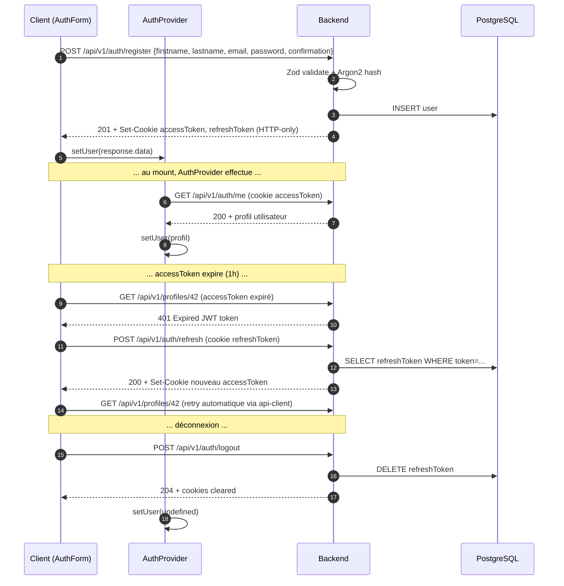

# Exemple : Flux d'authentification

> **Source de vérité narrative** : voir
> [`arc42/06-runtime/authentication.md`](../../arc42/06-runtime/authentication.md).
> **Source de vérité technique** :
> [`backend/src/services/auth.service.ts`](https://github.com/Sojeremy/documentation-skillswap/blob/main/backend/src/services/auth.service.ts),
> [`backend/src/middlewares/auth.middleware.ts`](https://github.com/Sojeremy/documentation-skillswap/blob/main/backend/src/middlewares/auth.middleware.ts),
> [`frontend/src/components/providers/AuthProvider.tsx`](https://github.com/Sojeremy/documentation-skillswap/blob/main/frontend/src/components/providers/AuthProvider.tsx).

## Diagramme de séquence

```mermaid
sequenceDiagram
    autonumber
    participant C as Client (AuthForm)
    participant AP as AuthProvider
    participant B as Backend
    participant DB as PostgreSQL

    C->>B: POST /api/v1/auth/register {firstname, lastname, email, password, confirmation}
    B->>B: Zod validate + Argon2 hash
    B->>DB: INSERT user
    B-->>C: 201 + Set-Cookie accessToken, refreshToken (HTTP-only)
    C->>AP: setUser(response.data)

    Note over C,B: ... au mount, AuthProvider effectue ...
    AP->>B: GET /api/v1/auth/me (cookie accessToken)
    B-->>AP: 200 + profil utilisateur
    AP->>AP: setUser(profil)

    Note over C,B: ... accessToken expire (1h) ...
    C->>B: GET /api/v1/profiles/42 (accessToken expiré)
    B-->>C: 401 Expired JWT token
    C->>B: POST /api/v1/auth/refresh (cookie refreshToken)
    B->>DB: SELECT refreshToken WHERE token=...
    B-->>C: 200 + Set-Cookie nouveau accessToken
    C->>B: GET /api/v1/profiles/42 (retry automatique via api-client)

    Note over C,B: ... déconnexion ...
    C->>B: POST /api/v1/auth/logout
    B->>DB: DELETE refreshToken
    B-->>C: 204 + cookies cleared
    AP->>AP: setUser(undefined)
```

## Côté frontend — `AuthProvider`

`AuthProvider` (`frontend/src/components/providers/AuthProvider.tsx`, 167 LOC)
expose un `Context` global avec :

| Méthode / state           | Rôle                                                                                       |
|---------------------------|--------------------------------------------------------------------------------------------|
| `user`                    | `CurrentUser \| undefined` — utilisateur authentifié, ou `undefined`                       |
| `isAuthenticated`         | `!!user`                                                                                   |
| `isLoading`               | `true` pendant le fetch initial `getMe()` au mount                                          |
| `login(email, password)`  | `POST /auth/login` puis `setUser(data)`                                                    |
| `register(data)`          | `POST /auth/register` puis `setUser(data)`                                                 |
| `logout()`                | `POST /auth/logout` puis `setUser(undefined)`                                              |
| `refresh()`               | `GET /auth/me` (utilisé après une redirection middleware vers une route auth)              |

L'implémentation **n'utilise aucune librairie de cache** — uniquement
`useState` + `useEffect` + `useCallback` (cf.
[ADR-004](../../arc42/09-decisions/004-tanstack-query.md)). Au mount,
`useEffect` déclenche `api.getMe()` une seule fois pour rétablir la session
si les cookies sont valides.

## Côté backend — endpoints

| Méthode | Chemin                       | Auth   | Comportement                                                                  |
|---------|------------------------------|--------|-------------------------------------------------------------------------------|
| POST    | `/api/v1/auth/register`      | Public | Crée user + RefreshToken, pose cookies HTTP-only                              |
| POST    | `/api/v1/auth/login`         | Public | Vérifie email + Argon2, pose cookies                                          |
| POST    | `/api/v1/auth/logout`        | Auth   | Supprime le `refreshToken` en base, clear cookies                             |
| POST    | `/api/v1/auth/refresh`       | Public (cookie refreshToken) | Génère un nouveau `accessToken`, pose cookie       |
| GET     | `/api/v1/auth/me`            | Auth   | Renvoie le profil utilisateur courant                                          |

| Aspect                | Choix                                                                          |
|-----------------------|--------------------------------------------------------------------------------|
| Hash mot de passe     | **Argon2id** (cf. `backend/src/lib/auth.ts`)                                    |
| Algorithme JWT        | **HS256**                                                                       |
| Durée `accessToken`   | 1 heure                                                                         |
| Durée `refreshToken`  | 30 jours (stocké en BDD, table `refresh_token`)                                |
| Cookies               | HTTP-only, `Secure` en prod, `SameSite=Lax`                                    |
| Format d'erreur       | `{ "error": "string" }` (cf. [`api-reference/errors.md`](../errors.md))         |
