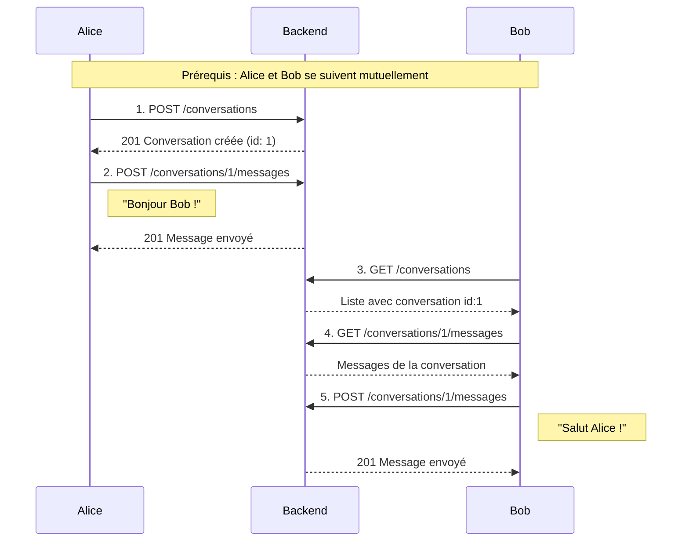

# Exemple : Messagerie complète

Ce guide montre le flux complet pour échanger des messages entre deux membres sur SkillSwap.

## Vue d'ensemble



---

## Prérequis : Suivre un membre

Avant de pouvoir créer une conversation, les deux utilisateurs doivent se suivre mutuellement.

### Suivre un utilisateur

```bash
curl -X POST http://localhost:3000/api/v1/follows/42/follow \
  -H "Cookie: accessToken=eyJhbGciOiJIUzI1NiIs..."
```

### Réponse (201 Created)

```json
{
  "success": true,
  "data": {
    "id": 15,
    "followerId": 1,
    "followedId": 42,
    "createdAt": "2025-01-22T10:00:00.000Z"
  }
}
```

### Vérifier ses abonnements

```bash
curl -X GET http://localhost:3000/api/v1/follows/following \
  -H "Cookie: accessToken=eyJhbGciOiJIUzI1NiIs..."
```

### Réponse

```json
{
  "success": true,
  "data": [
    {
      "id": 42,
      "firstname": "Marie",
      "lastname": "Dupont",
      "avatarUrl": "/uploads/avatar-42.jpg"
    }
  ]
}
```

---

## Étape 1 : Créer une conversation

### Requête

```bash
curl -X POST http://localhost:3000/api/v1/conversations \
  -H "Content-Type: application/json" \
  -H "Cookie: accessToken=eyJhbGciOiJIUzI1NiIs..." \
  -d '{
    "participantId": 42
  }'
```

### Schéma de validation

```typescript
const CreateConversationSchema = z.object({
  participantId: z.number().int().positive()
});
```

### Réponse succès (201 Created)

```json
{
  "success": true,
  "data": {
    "id": 1,
    "status": "ACTIVE",
    "createdAt": "2025-01-22T10:30:00.000Z",
    "participants": [
      { "id": 1, "firstname": "Alice", "lastname": "Martin" },
      { "id": 42, "firstname": "Marie", "lastname": "Dupont" }
    ]
  }
}
```

### Erreurs possibles

| Code | Cause |
|------|-------|
| 400 | Conversation déjà existante |
| 403 | Les utilisateurs ne se suivent pas mutuellement |
| 404 | Participant non trouvé |

---

## Étape 2 : Envoyer un message

### Requête

```bash
curl -X POST http://localhost:3000/api/v1/conversations/1/messages \
  -H "Content-Type: application/json" \
  -H "Cookie: accessToken=eyJhbGciOiJIUzI1NiIs..." \
  -d '{
    "content": "Bonjour Marie ! J'\''aimerais apprendre React, tu aurais du temps cette semaine ?"
  }'
```

### Schéma de validation

```typescript
const CreateMessageSchema = z.object({
  content: z.string().min(1).max(2000)
});
```

### Réponse succès (201 Created)

```json
{
  "success": true,
  "data": {
    "id": 101,
    "content": "Bonjour Marie ! J'aimerais apprendre React, tu aurais du temps cette semaine ?",
    "conversationId": 1,
    "senderId": 1,
    "createdAt": "2025-01-22T10:31:00.000Z",
    "updatedAt": null
  }
}
```

---

## Étape 3 : Lister ses conversations

### Requête

```bash
curl -X GET http://localhost:3000/api/v1/conversations \
  -H "Cookie: accessToken=eyJhbGciOiJIUzI1NiIs..."
```

### Réponse (200 OK)

```json
{
  "success": true,
  "data": [
    {
      "id": 1,
      "status": "ACTIVE",
      "createdAt": "2025-01-22T10:30:00.000Z",
      "participants": [
        { "id": 1, "firstname": "Alice", "lastname": "Martin" },
        { "id": 42, "firstname": "Marie", "lastname": "Dupont" }
      ],
      "lastMessage": {
        "id": 101,
        "content": "Bonjour Marie ! J'aimerais apprendre React...",
        "senderId": 1,
        "createdAt": "2025-01-22T10:31:00.000Z"
      }
    }
  ]
}
```

---

## Étape 4 : Récupérer les messages d'une conversation

### Requête avec pagination

```bash
curl -X GET "http://localhost:3000/api/v1/conversations/1/messages?limit=20&offset=0" \
  -H "Cookie: accessToken=eyJhbGciOiJIUzI1NiIs..."
```

### Paramètres de query

| Paramètre | Type | Défaut | Description |
|-----------|------|--------|-------------|
| `limit` | number | 20 | Nombre de messages à retourner |
| `offset` | number | 0 | Décalage pour la pagination |

### Réponse (200 OK)

```json
{
  "success": true,
  "data": {
    "messages": [
      {
        "id": 101,
        "content": "Bonjour Marie ! J'aimerais apprendre React, tu aurais du temps cette semaine ?",
        "senderId": 1,
        "sender": { "id": 1, "firstname": "Alice", "lastname": "Martin" },
        "createdAt": "2025-01-22T10:31:00.000Z",
        "updatedAt": null
      },
      {
        "id": 102,
        "content": "Salut Alice ! Oui bien sûr, je suis disponible mercredi soir. Ça te va ?",
        "senderId": 42,
        "sender": { "id": 42, "firstname": "Marie", "lastname": "Dupont" },
        "createdAt": "2025-01-22T11:15:00.000Z",
        "updatedAt": null
      }
    ],
    "pagination": {
      "total": 2,
      "limit": 20,
      "offset": 0,
      "hasMore": false
    }
  }
}
```

---

## Étape 5 : Modifier un message

### Requête

```bash
curl -X PATCH http://localhost:3000/api/v1/conversations/1/message/101 \
  -H "Content-Type: application/json" \
  -H "Cookie: accessToken=eyJhbGciOiJIUzI1NiIs..." \
  -d '{
    "content": "Bonjour Marie ! J'\''aimerais apprendre React. Tu aurais du temps mercredi ?"
  }'
```

### Réponse (200 OK)

```json
{
  "success": true,
  "data": {
    "id": 101,
    "content": "Bonjour Marie ! J'aimerais apprendre React. Tu aurais du temps mercredi ?",
    "conversationId": 1,
    "senderId": 1,
    "createdAt": "2025-01-22T10:31:00.000Z",
    "updatedAt": "2025-01-22T10:35:00.000Z"
  }
}
```

!!! warning "Seul l'auteur"
    Un utilisateur ne peut modifier que ses propres messages.

---

## Étape 6 : Supprimer un message

### Requête

```bash
curl -X DELETE http://localhost:3000/api/v1/conversations/1/message/101 \
  -H "Cookie: accessToken=eyJhbGciOiJIUzI1NiIs..."
```

### Réponse (204 No Content)

Aucun body retourné.

---

## Implémentation Frontend

### Hook useConversation

```typescript
// hooks/useConversation.ts
import { useQuery, useMutation, useQueryClient } from '@tanstack/react-query';

export function useConversation(conversationId: number) {
  const queryClient = useQueryClient();

  const { data: messages, isLoading } = useQuery({
    queryKey: ['conversations', conversationId, 'messages'],
    queryFn: () => api.get(`/conversations/${conversationId}/messages`),
    refetchInterval: 5000, // Polling toutes les 5s
  });

  const sendMessage = useMutation({
    mutationFn: (content: string) =>
      api.post(`/conversations/${conversationId}/messages`, { content }),
    onSuccess: () => {
      queryClient.invalidateQueries({
        queryKey: ['conversations', conversationId, 'messages']
      });
    },
  });

  return {
    messages: messages?.data.messages ?? [],
    isLoading,
    sendMessage: sendMessage.mutate,
    isSending: sendMessage.isPending,
  };
}
```

### Hook useConversations (liste)

```typescript
// hooks/useConversations.ts
export function useConversations() {
  return useQuery({
    queryKey: ['conversations'],
    queryFn: () => api.get('/conversations'),
  });
}
```

### Composant MessageList

```tsx
// components/MessageList.tsx
import { useConversation } from '@/hooks/useConversation';
import { useAuth } from '@/hooks/useAuth';
import { formatRelativeTime } from '@/utils/date';

interface Props {
  conversationId: number;
}

export function MessageList({ conversationId }: Props) {
  const { user } = useAuth();
  const { messages, isLoading } = useConversation(conversationId);

  if (isLoading) return <MessagesSkeleton />;

  return (
    <div className="flex flex-col gap-2 p-4">
      {messages.map((message) => (
        <div
          key={message.id}
          className={cn(
            'max-w-[70%] p-3 rounded-lg',
            message.senderId === user?.id
              ? 'self-end bg-primary text-white'
              : 'self-start bg-gray-100'
          )}
        >
          <p>{message.content}</p>
          <span className="text-xs opacity-70">
            {formatRelativeTime(message.createdAt)}
          </span>
        </div>
      ))}
    </div>
  );
}
```

---

## Statuts de conversation

| Statut | Description |
|--------|-------------|
| `ACTIVE` | Conversation normale |
| `ARCHIVED` | Archivée par l'utilisateur |
| `BLOCKED` | Un participant a bloqué l'autre |

---

## Récapitulatif des endpoints

| Méthode | Endpoint | Description |
|---------|----------|-------------|
| GET | `/conversations` | Lister ses conversations |
| POST | `/conversations` | Créer une conversation |
| GET | `/conversations/:id` | Détails d'une conversation |
| DELETE | `/conversations/:id` | Supprimer une conversation |
| GET | `/conversations/:id/messages` | Lister les messages |
| POST | `/conversations/:id/messages` | Envoyer un message |
| PATCH | `/conversations/:id/message/:messageId` | Modifier un message |
| DELETE | `/conversations/:id/message/:messageId` | Supprimer un message |

---

## Voir aussi

- [API Reference - Conversations](../index.md)
- [Database - Conversation Model](../../database/index.md)
- [Frontend Design Patterns](../../arc42/05-building-blocks/frontend.md)
