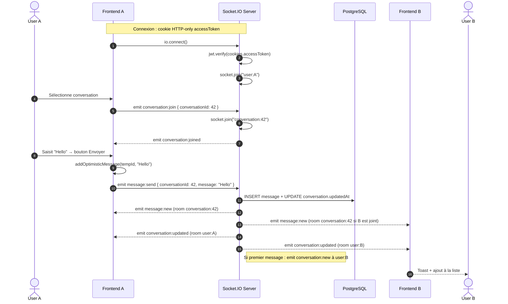

# Exemple : Messagerie

> **Source de vérité narrative** : voir
> [`arc42/06-runtime/messaging.md`](../../arc42/06-runtime/messaging.md)
> (architecture hybride REST + Socket.IO, 6 events serveur→client, 4 events
> client→serveur, modèle de rooms `user:${id}` / `conversation:${id}`).
> **ADR associée** : [`011-socket-io.md`](../../arc42/09-decisions/011-socket-io.md).
> **Sources techniques** :
> [`backend/src/realtime/socket.ts`](https://github.com/Sojeremy/documentation-skillswap/blob/main/backend/src/realtime/socket.ts) (446 LOC),
> [`frontend/src/lib/socket-client.ts`](https://github.com/Sojeremy/documentation-skillswap/blob/main/frontend/src/lib/socket-client.ts),
> [`frontend/src/hooks/useMessaging.ts`](https://github.com/Sojeremy/documentation-skillswap/blob/main/frontend/src/hooks/useMessaging.ts).

## Architecture en bref

| Opération                                      | Canal                                              |
|------------------------------------------------|----------------------------------------------------|
| Liste des conversations                        | REST `GET /api/v1/conversations`                   |
| Création de conversation                       | REST `POST /api/v1/conversations` (+ `requireSimpleFollow`) |
| Historique paginé d'une conversation           | REST `GET /api/v1/conversations/:id/messages` (cursor) |
| **Envoi d'un message**                         | **Socket.IO event `message:send`**                 |
| **Fermeture d'une conversation**               | **Socket.IO event `conversation:close`**           |
| Notification message reçu                      | Socket.IO event `message:new`                      |
| Notification conversation mise à jour          | Socket.IO event `conversation:updated`             |
| Notification nouvelle conversation             | Socket.IO event `conversation:new`                 |
| Notification fermeture                         | Socket.IO event `conversation:closed`              |

!!! warning "Doublons REST/Socket.IO"
    Les routes REST `POST /:id/messages` et `PATCH /:id/close` existent
    pour la parité d'API mais le frontend prod **n'utilise pas** ces routes
    pour l'envoi/fermeture — il passe par les events Socket.IO. Détails dans
    [`06-runtime/messaging.md`](../../arc42/06-runtime/messaging.md) et
    [ADR-011](../../arc42/09-decisions/011-socket-io.md).

## Diagramme de séquence — envoi d'un message


```mermaid
sequenceDiagram
    autonumber
    actor UA as User A
    participant FA as Frontend A
    participant SS as Socket.IO Server
    participant DB as PostgreSQL
    participant FB as Frontend B
    actor UB as User B

    Note over FA,SS: Connexion : cookie HTTP-only accessToken
    FA->>SS: io.connect()
    SS->>SS: jwt.verify(cookies.accessToken)
    SS->>SS: socket.join("user:A")

    UA->>FA: Sélectionne conversation #42
    FA->>SS: emit conversation:join { conversationId: 42 }
    SS->>SS: socket.join("conversation:42")
    SS-->>FA: emit conversation:joined

    UA->>FA: Saisit "Hello" → bouton Envoyer
    FA->>FA: addOptimisticMessage(tempId, "Hello")
    FA->>SS: emit message:send { conversationId: 42, message: "Hello" }
    SS->>DB: INSERT message + UPDATE conversation.updatedAt
    SS-->>FA: emit message:new (room conversation:42)
    SS-->>FB: emit message:new (room conversation:42 si B est joint)
    SS-->>FA: emit conversation:updated (room user:A)
    SS-->>FB: emit conversation:updated (room user:B)
    Note right of SS: Si premier message : emit conversation:new à user:B
    FB-->>UB: Toast + ajout à la liste
```

## Côté frontend — façade `useMessaging`

```ts
// frontend/src/hooks/useMessaging.ts (extrait simplifié)
export function useMessaging() {
  const { conversations, addConversation, ... } = useConversationList();
  const { selectedConvId, selectedConv, ... } = useSelectedConversation(conversations);
  const { messages, hasMore, loadMore, addMessage, addOptimisticMessage } =
    useConversationMessages({ conversationId: selectedConvId, limit: 30 });
  const { onConversationUpdate, onConversationClosed, onConversationNew } = useGlobalSocket();

  const actions = useConversationActions({ /* selectedConvId, addMessage, ... */ });
  return { conversations, selectedConv, messages, ...actions };
}
```

`useMessaging` compose 6 hooks spécialisés (`useConversationList`,
`useSelectedConversation`, `useConversationMessages`, `useFollowedUsers`,
`useGlobalSocket`, `useConversationActions`) — tous reposent sur des hooks
React natifs, pas sur une librairie de cache (cf.
[ADR-004](../../arc42/09-decisions/004-tanstack-query.md)). L'optimistic UI
est implémenté manuellement avec un `tempId` négatif (`-Date.now()`) avant
l'aller-retour serveur.

## Sécurité Socket.IO

- Authentification au handshake via cookie `accessToken` (`io.use()` dans `socket.ts:88-122`)
- Vérification participant à `conversation:join`, `message:send`, `conversation:close`
- Validation message : trim + longueur ∈ [1..2000]
- Refus d'envoi sur conversation `Close` (status persisté en BDD)
- Codes d'erreur : `FORBIDDEN`, `VALIDATION` (cf. union `ServerToClientEvents.error` à `socket.ts:56-59`)

Format d'erreur HTTP côté API REST associée :
[`api-reference/errors.md`](../errors.md).
