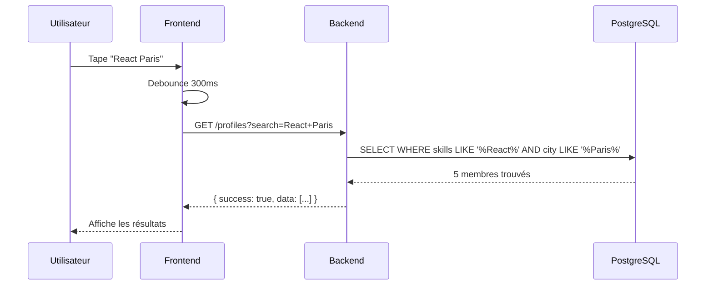
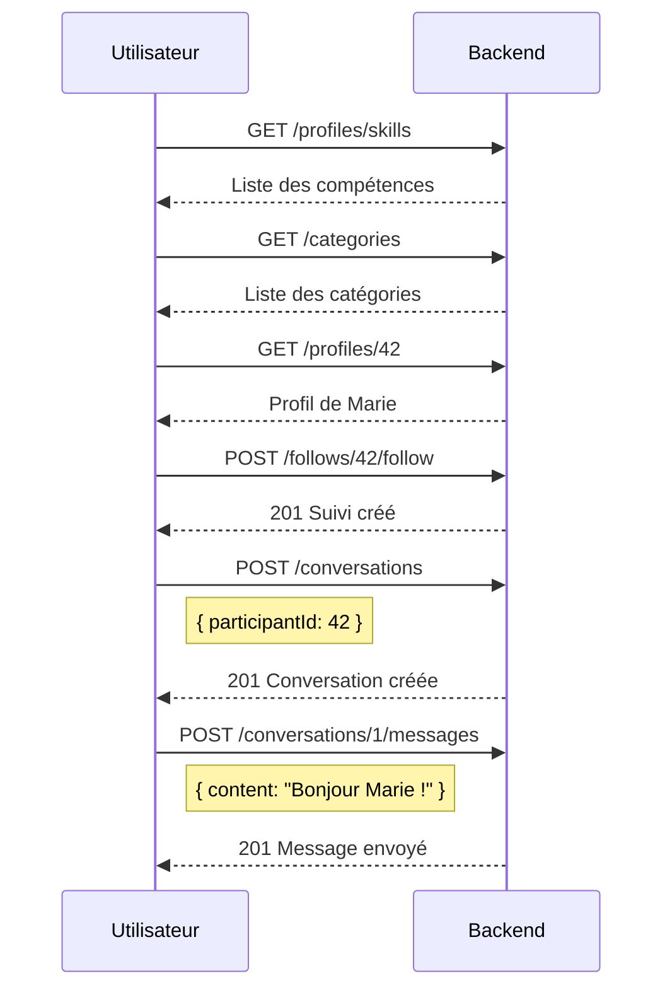

# Exemple : Recherche de membres

Ce guide montre comment rechercher et filtrer des membres sur SkillSwap.

## Vue d'ensemble



!!! info "Évolution future"
    Une intégration Meilisearch est prévue pour améliorer la recherche avec typo-tolerance et scoring de pertinence. Voir [ADR-008](../../arc42/09-decisions/008-meilisearch.md).

---

## Méthode actuelle : Lister les profils

### Récupérer un profil par ID

```bash
curl -X GET http://localhost:3000/api/v1/profiles/42 \
  -H "Cookie: accessToken=eyJhbGciOiJIUzI1NiIs..."
```

### Réponse (200 OK)

```json
{
  "success": true,
  "data": {
    "id": 42,
    "firstname": "Marie",
    "lastname": "Dupont",
    "email": "marie.dupont@example.com",
    "bio": "Développeuse React passionnée par l'UX",
    "city": "Paris",
    "avatarUrl": "/uploads/avatar-42.jpg",
    "skills": [
      {
        "id": 1,
        "name": "React",
        "categoryId": 2,
        "category": { "id": 2, "name": "Développement Web" }
      },
      {
        "id": 5,
        "name": "TypeScript",
        "categoryId": 2,
        "category": { "id": 2, "name": "Développement Web" }
      }
    ],
    "interests": [
      {
        "id": 12,
        "name": "Piano",
        "categoryId": 4,
        "category": { "id": 4, "name": "Musique" }
      }
    ],
    "availabilities": [
      { "id": 1, "day": "MONDAY", "startTime": "18:00", "endTime": "20:00" },
      { "id": 2, "day": "WEDNESDAY", "startTime": "18:00", "endTime": "20:00" }
    ],
    "rating": 4.5,
    "followersCount": 23,
    "followingCount": 15,
    "createdAt": "2024-12-01T10:00:00.000Z"
  }
}
```

---

## Récupérer toutes les compétences

Pour afficher les filtres de recherche, récupérez la liste des compétences.

### Requête

```bash
curl -X GET http://localhost:3000/api/v1/profiles/skills \
  -H "Cookie: accessToken=eyJhbGciOiJIUzI1NiIs..."
```

### Réponse (200 OK)

```json
{
  "success": true,
  "data": [
    { "id": 1, "name": "React", "categoryId": 2 },
    { "id": 2, "name": "Vue.js", "categoryId": 2 },
    { "id": 3, "name": "Node.js", "categoryId": 2 },
    { "id": 4, "name": "Python", "categoryId": 2 },
    { "id": 5, "name": "TypeScript", "categoryId": 2 },
    { "id": 10, "name": "Piano", "categoryId": 4 },
    { "id": 11, "name": "Guitare", "categoryId": 4 }
  ]
}
```

---

## Récupérer les catégories

### Requête

```bash
curl -X GET http://localhost:3000/api/v1/categories
```

!!! note "Endpoint public"
    Les catégories sont accessibles sans authentification.

### Réponse (200 OK)

```json
{
  "success": true,
  "data": [
    { "id": 1, "name": "Langues", "slug": "langues" },
    { "id": 2, "name": "Développement Web", "slug": "developpement-web" },
    { "id": 3, "name": "Design", "slug": "design" },
    { "id": 4, "name": "Musique", "slug": "musique" },
    { "id": 5, "name": "Sport", "slug": "sport" },
    { "id": 6, "name": "Cuisine", "slug": "cuisine" },
    { "id": 7, "name": "Photo/Vidéo", "slug": "photo-video" },
    { "id": 8, "name": "Autre", "slug": "autre" }
  ]
}
```

---

## Implémentation Frontend

### Hook useSearch (avec React Query)

```typescript
// hooks/useSearch.ts
import { useQuery } from '@tanstack/react-query';
import { useDebouncedValue } from './useDebouncedValue';

interface SearchFilters {
  query: string;
  categoryId?: number;
  city?: string;
}

export function useSearch(filters: SearchFilters) {
  const debouncedQuery = useDebouncedValue(filters.query, 300);

  return useQuery({
    queryKey: ['search', debouncedQuery, filters.categoryId, filters.city],
    queryFn: async () => {
      const params = new URLSearchParams();
      if (debouncedQuery) params.set('search', debouncedQuery);
      if (filters.categoryId) params.set('categoryId', String(filters.categoryId));
      if (filters.city) params.set('city', filters.city);

      const response = await api.get(`/profiles?${params}`);
      return response.data;
    },
    enabled: debouncedQuery.length >= 2,
    staleTime: 30000, // 30 secondes
  });
}
```

### Hook useDebouncedValue

```typescript
// hooks/useDebouncedValue.ts
import { useState, useEffect } from 'react';

export function useDebouncedValue<T>(value: T, delay: number): T {
  const [debouncedValue, setDebouncedValue] = useState(value);

  useEffect(() => {
    const timer = setTimeout(() => setDebouncedValue(value), delay);
    return () => clearTimeout(timer);
  }, [value, delay]);

  return debouncedValue;
}
```

### Composant SearchBar

```tsx
// components/SearchBar.tsx
import { useState } from 'react';
import { useSearch } from '@/hooks/useSearch';
import { useCategories } from '@/hooks/useCategories';

export function SearchBar() {
  const [query, setQuery] = useState('');
  const [categoryId, setCategoryId] = useState<number | undefined>();

  const { data: categories } = useCategories();
  const { data: results, isLoading } = useSearch({ query, categoryId });

  return (
    <div className="space-y-4">
      <div className="flex gap-4">
        <input
          type="text"
          value={query}
          onChange={(e) => setQuery(e.target.value)}
          placeholder="Rechercher une compétence, un membre..."
          className="flex-1 px-4 py-2 border rounded-lg"
        />

        <select
          value={categoryId ?? ''}
          onChange={(e) => setCategoryId(e.target.value ? Number(e.target.value) : undefined)}
          className="px-4 py-2 border rounded-lg"
        >
          <option value="">Toutes les catégories</option>
          {categories?.map((cat) => (
            <option key={cat.id} value={cat.id}>{cat.name}</option>
          ))}
        </select>
      </div>

      {isLoading && <p>Recherche en cours...</p>}

      {results && (
        <div className="grid grid-cols-1 md:grid-cols-2 lg:grid-cols-3 gap-4">
          {results.map((member) => (
            <MemberCard key={member.id} member={member} />
          ))}
        </div>
      )}
    </div>
  );
}
```

---

## Flux complet : Trouver un membre et le contacter



---

## Métriques de performance

| Métrique | Valeur actuelle | Cible avec Meilisearch |
|----------|-----------------|------------------------|
| Temps de recherche | ~200ms | < 50ms |
| Typo-tolerance | Non | Oui |
| Filtres combinés | Lent | Instantané |

---

## Voir aussi

- [ADR-008 : Meilisearch Search](../../arc42/09-decisions/008-meilisearch.md)
- [API Reference - Profiles](../index.md)
- [Frontend Patterns](../../arc42/05-building-blocks/frontend.md)
