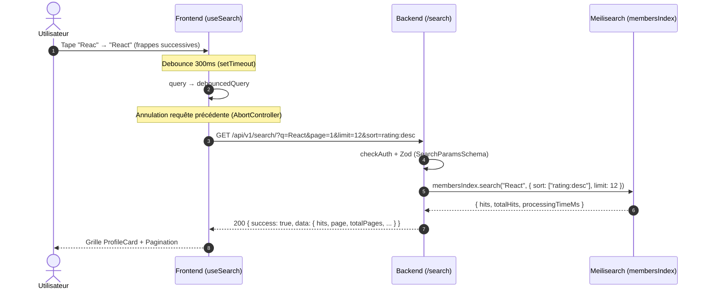

# Exemple : Recherche de membres

> **Source de vérité narrative** : voir
> [`arc42/06-runtime/search.md`](../../arc42/06-runtime/search.md).
> **Sources techniques** :
> [`frontend/src/hooks/useSearch.ts`](https://github.com/Sojeremy/documentation-skillswap/blob/main/frontend/src/hooks/useSearch.ts) (202 LOC),
> [`backend/src/services/search.service.ts`](https://github.com/Sojeremy/documentation-skillswap/blob/main/backend/src/services/search.service.ts),
> [`backend/src/lib/mailisearch.ts`](https://github.com/Sojeremy/documentation-skillswap/blob/main/backend/src/lib/mailisearch.ts).

## Diagramme de séquence


```mermaid
sequenceDiagram
    autonumber
    actor U as Utilisateur
    participant F as Frontend (useSearch)
    participant B as Backend (/search)
    participant MS as Meilisearch (membersIndex)

    U->>F: Tape "Reac" → "React" (frappes successives)
    Note over F: Debounce 300ms (setTimeout)
    F->>F: query → debouncedQuery
    Note over F: Annulation requête précédente (AbortController)
    F->>B: GET /api/v1/search/?q=React&page=1&limit=12&sort=rating:desc
    B->>B: checkAuth + Zod (SearchParamsSchema)
    B->>MS: membersIndex.search("React", { sort: ["rating:desc"], limit: 12 })
    MS-->>B: { hits, totalHits, processingTimeMs }
    B-->>F: 200 { success: true, data: { hits, page, totalPages, ... } }
    F-->>U: Grille ProfileCard + Pagination
```

## Endpoints REST

| Méthode | Chemin                                | Auth   | Rôle                                                              |
|---------|---------------------------------------|--------|-------------------------------------------------------------------|
| GET     | `/api/v1/search/`                     | Auth   | Recherche full-text avec filtres (`q`, `category`, `page`, `limit`, `sort`) |
| GET     | `/api/v1/search/top-rated`            | Public | Top membres triés par note (utilisé par la home + sitemap)        |

## Hook `useSearch` côté frontend

`useSearch` n'utilise **aucune** librairie de cache (cf.
[ADR-004](../../arc42/09-decisions/004-tanstack-query.md)). Il s'appuie sur :

- `useState` pour `query`, `debouncedQuery`, `category`, `page`, `results`, `isLoading` ;
- `useEffect` pour le debounce (`setTimeout` cancellé au cleanup) ;
- `useEffect` + `useRef<AbortController>` pour annuler la requête en cours
  dès qu'une nouvelle frappe ou un changement de filtre arrive ;
- `useCallback` pour stabiliser les setters (`setQuery`, `setCategory`).

Le détail (extrait de code, conditions de déclenchement de la recherche,
limites min/max) figure dans
[`arc42/06-runtime/search.md`](../../arc42/06-runtime/search.md).

## Filtres supportés

| Paramètre  | Type      | Défaut          | Notes                                                             |
|------------|-----------|-----------------|-------------------------------------------------------------------|
| `q`        | `string`  | `""`            | Full-text Meilisearch (typo-tolérant)                             |
| `category` | `string`  | (aucun)         | **Slug** (filtre Meilisearch `categorySlugs = "<slug>"`)          |
| `page`     | `number`  | `1`             | Clamped à `Math.max(1, page)`                                     |
| `limit`    | `number`  | `12`            | Clamped à `Math.min(50, Math.max(1, limit))`                      |
| `sort`     | `string`  | `rating:desc`   | Attributs triables : `rating`, `createdAt`                        |

!!! note "Paramètres `city` / `available`"
    Mentionnés dans des itérations antérieures de la doc, ils **ne sont pas
    implémentés** en prod. Source de vérité : `SearchParamsSchema` dans
    `backend/src/validation/search.validation.ts`.

## Exemple d'appel curl

```bash
curl -X GET 'https://api.skillswap.example.com/api/v1/search/?q=React&category=informatique&page=1&limit=12' \
  --cookie 'accessToken=...' \
  -H 'Accept: application/json'
```

Réponse type (succès) :

```json
{
  "success": true,
  "data": {
    "hits": [
      { "id": 1, "firstname": "Marie", "lastname": "Dupont", "fullname": "Marie Dupont", "rating": 4.6, "skills": ["React", "TypeScript"] }
    ],
    "page": 1,
    "totalPages": 5,
    "totalHits": 54,
    "processingTimeMs": 12,
    "query": "React"
  },
  "count": 1
}
```

Format d'erreur : voir [`api-reference/errors.md`](../errors.md).
