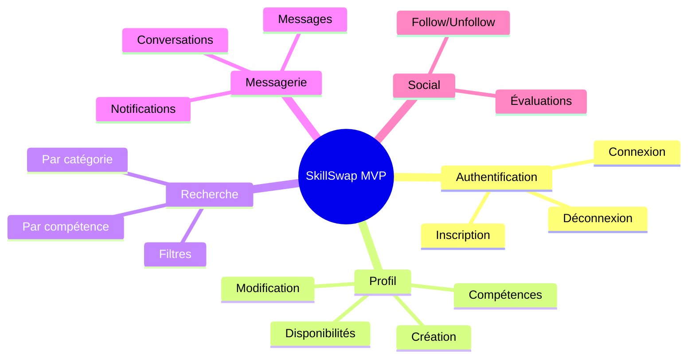

# 1. Introduction et Objectifs

## 1.1 Objectifs du système

**SkillSwap** est une plateforme web permettant l'échange de compétences entre particuliers.

### Objectifs principaux

| Objectif | Description | Priorité |
| -------- | ----------- | -------- |
| **Mise en relation** | Permettre aux utilisateurs de trouver des personnes ayant les compétences qu'ils recherchent | Haute |
| **Échange équitable** | Faciliter un système d'échange basé sur le temps plutôt que l'argent | Haute |
| **Confiance** | Établir un système de notation et d'avis pour garantir la qualité des échanges | Moyenne |
| **Simplicité** | Offrir une interface intuitive et accessible | Haute |

### Critères de succès

- [ ] Inscription et création de profil en moins de 5 minutes
- [ ] Recherche de compétences avec résultats pertinents
- [ ] Système de messagerie fonctionnel entre utilisateurs
- [ ] Notation des échanges réalisés

---

## 1.2 Parties prenantes (Stakeholders)

| Rôle | Attentes | Influence |
| ---- | -------- | --------- |
| **Utilisateurs** | Interface simple, recherche efficace, messagerie fluide | Haute |
| **Administrateurs** | Modération, statistiques, gestion des utilisateurs | Moyenne |
| **Équipe de développement** | Code maintenable, documentation claire | Haute |
| **O'clock (Formation)** | Respect du cahier des charges, qualité du livrable | Haute |

---

## 1.3 Périmètre fonctionnel

### Inclus dans le MVP

### Hors périmètre (V2+)

- Paiement en ligne
- Application mobile native
- Vidéoconférence intégrée
- Géolocalisation avancée
- Système de badges/gamification

---

## 1.4 Contraintes de qualité

| Attribut | Objectif | Mesure |
| -------- | -------- | ------ |
| **Performance** | Temps de réponse < 500ms | Lighthouse |
| **Disponibilité** | 99% uptime | Monitoring |
| **Sécurité** | Protection des données personnelles | OWASP Top 10 |
| **Accessibilité** | WCAG 2.1 AA | Axe-core |
| **Maintenabilité** | Code coverage > 70% | Vitest |

---

## Navigation

| Précédent | Suivant |
| --------- | ------- |
| [← Accueil](../../index.md) | [2. Contraintes →](../02-constraints/index.md) |
