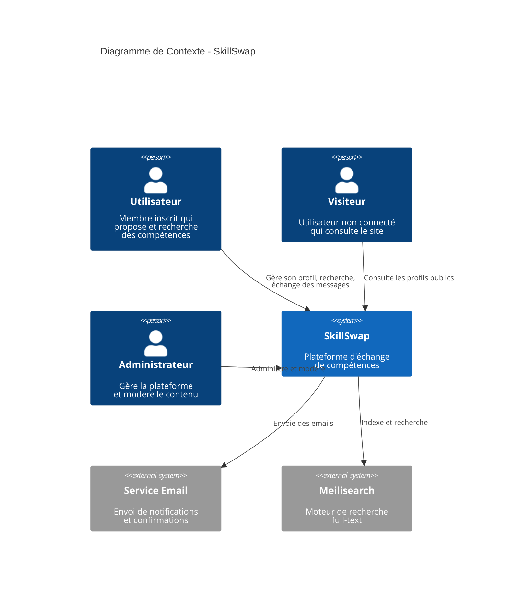
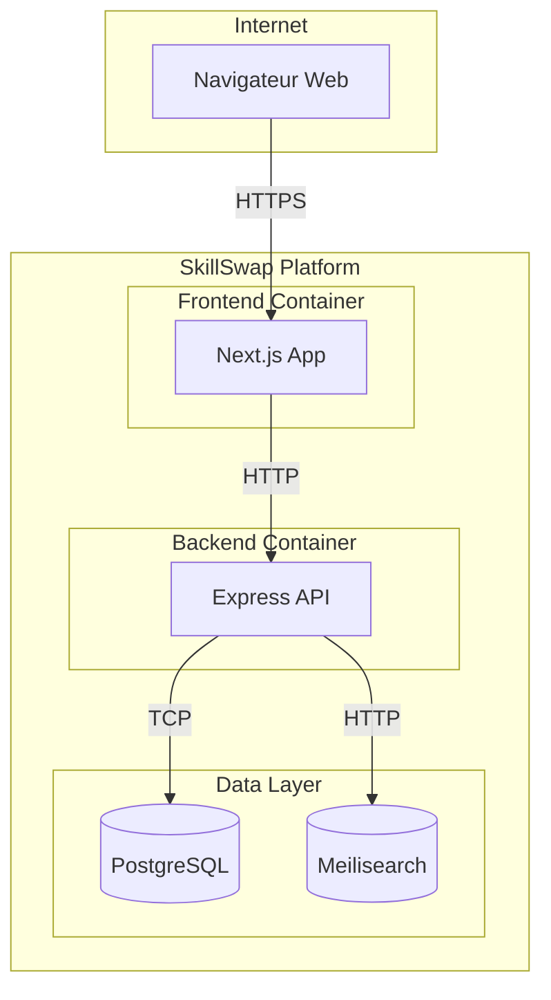
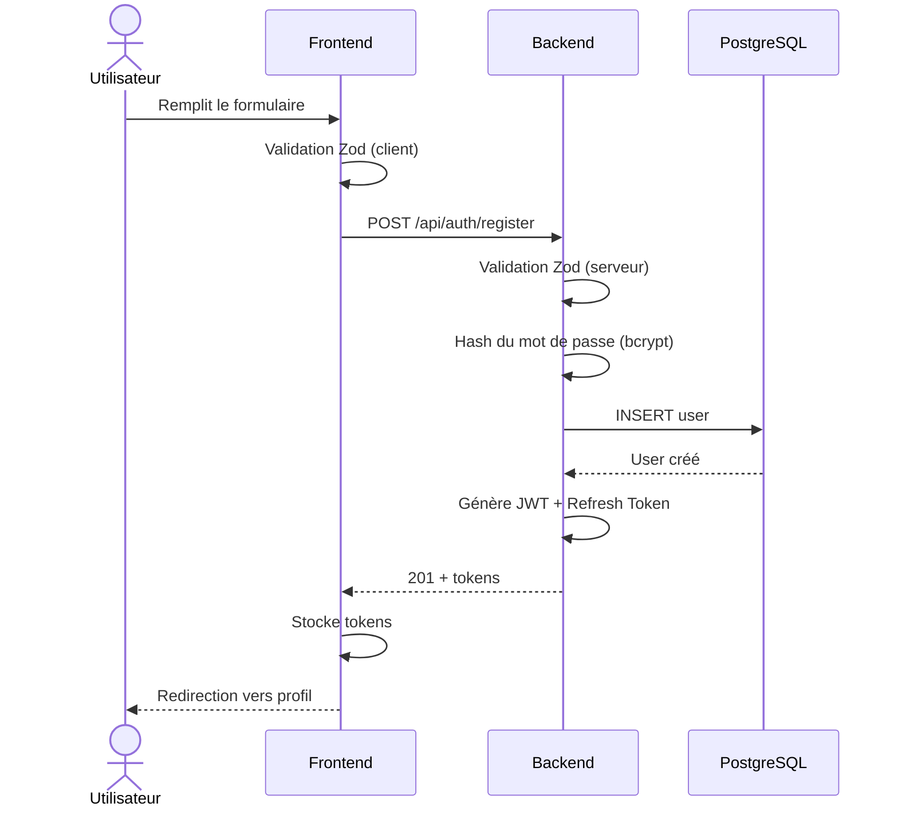
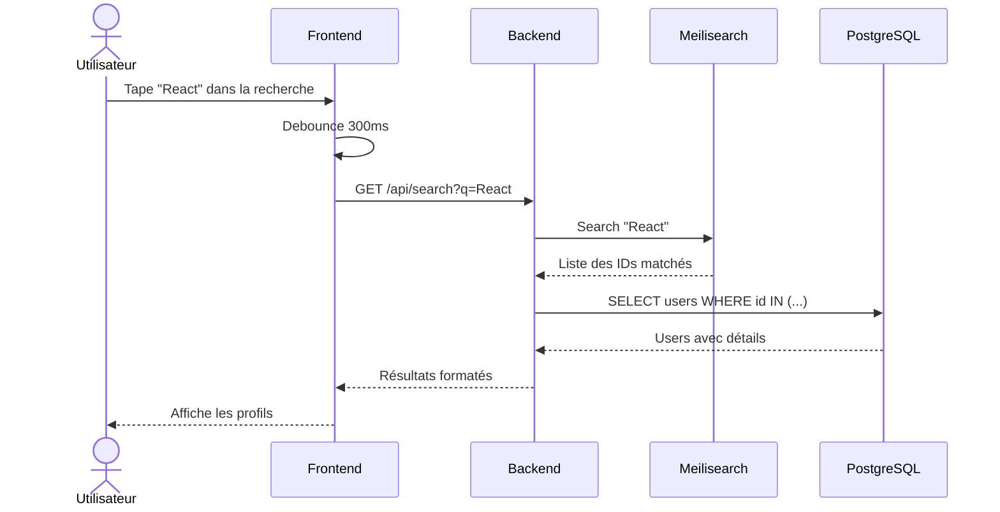

# 3. Contexte et Périmètre

## 3.1 Contexte métier

SkillSwap s'inscrit dans l'économie collaborative en permettant l'échange de compétences sans transaction monétaire.

### Acteurs externes

---

## 3.2 Contexte technique

### Interfaces externes

| Système externe | Type | Protocole | Description |
| --------------- | ---- | --------- | ----------- |
| **Meilisearch** | Service | HTTP/REST | Recherche full-text des membres et compétences |
| **PostgreSQL** | Base de données | TCP/5432 | Stockage des données persistantes |
| **SMTP (futur)** | Service | SMTP/587 | Envoi d'emails transactionnels |

### Frontières du système

---

## 3.3 Utilisateurs et rôles

| Rôle | Permissions | Cas d'usage |
| ---- | ----------- | ----------- |
| **Visiteur** | Lecture seule | Consulter les profils publics, page d'accueil |
| **Membre** | CRUD sur son profil, messagerie | Gérer son profil, contacter d'autres membres |
| **Admin** | Toutes permissions | Modérer, gérer les catégories, voir les statistiques |

---

## 3.4 Flux de données principaux

### Inscription d'un utilisateur

### Recherche de compétences

---

## Navigation

| Précédent | Suivant |
| --------- | ------- |
| [← 2. Contraintes](../02-constraints/index.md) | [4. Stratégie →](../04-solution-strategy/index.md) |
