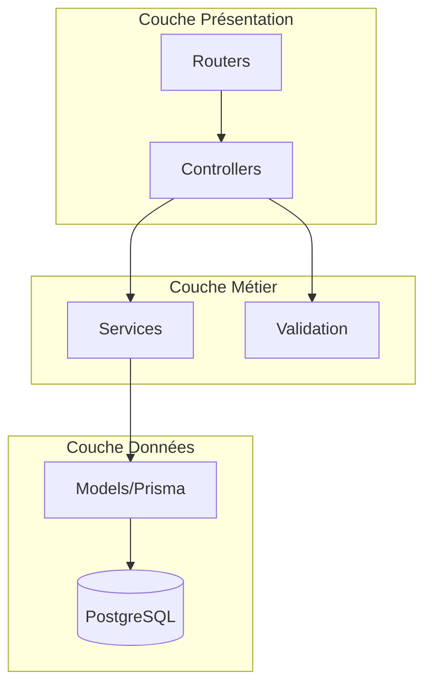
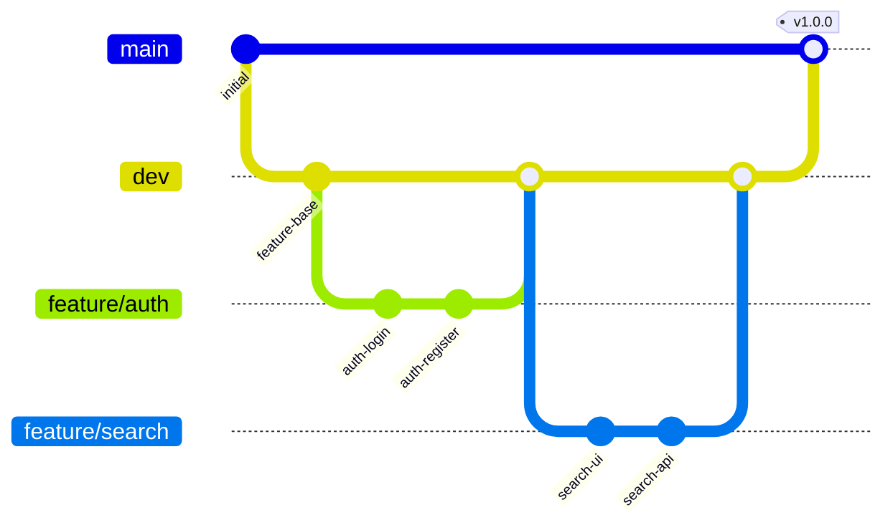

# 4. Stratégie de Solution

## 4.1 Décisions technologiques

### Frontend

| Technologie | Raison du choix |
| ----------- | --------------- |
| **Next.js 14** | App Router, RSC, optimisations automatiques |
| **TypeScript** | Type safety, meilleure DX, refactoring facilité |
| **Tailwind CSS** | Productivité, cohérence, pas de CSS custom |
| **shadcn/ui** | Composants accessibles, personnalisables, pas de dépendance |
| **TanStack Query** | Cache intelligent, synchronisation serveur, devtools |

### Backend

| Technologie | Raison du choix |
| ----------- | --------------- |
| **Express.js** | Simplicité, écosystème mature, performance |
| **Prisma** | Type safety, migrations, studio de développement |
| **Zod** | Validation runtime, inférence TypeScript |
| **JWT** | Stateless auth, scalabilité horizontale |

### Infrastructure

| Technologie | Raison du choix |
| ----------- | --------------- |
| **Docker Compose** | Environnement reproductible, isolation |
| **PostgreSQL** | ACID, relations complexes, JSON support |
| **Meilisearch** | Recherche rapide, typo-tolerant, facile à configurer |
| **Nginx** | Reverse proxy, SSL termination, load balancing |

---

## 4.2 Patterns architecturaux

### Atomic Design (Frontend)

```mermaid
graph TD
    subgraph Atoms
        A1[Button]
        A2[Input]
        A3[Avatar]
        A4[Badge]
    end

    subgraph Molecules
        M1[ProfileCard]
        M2[MessageBubble]
        M3[SearchInput]
    end

    subgraph Organisms
        O1[Header]
        O2[SearchPage]
        O3[ConversationSection]
    end

    subgraph Templates
        T1[MainLayout]
    end

    subgraph Pages
        P1[/recherche]
        P2[/profil/:id]
        P3[/conversation]
    end

    A1 --> M1
    A2 --> M3
    A3 --> M1
    A4 --> M1
    M1 --> O2
    M2 --> O3
    M3 --> O2
    O1 --> T1
    O2 --> P1
    O3 --> P3
    T1 --> P1
    T1 --> P2
    T1 --> P3
```

### Architecture en couches (Backend)



---

## 4.3 Stratégies de qualité

| Objectif | Stratégie | Outils |
| -------- | --------- | ------ |
| **Maintenabilité** | Clean Code, SOLID, documentation | ESLint, Prettier, TypeDoc |
| **Testabilité** | Tests unitaires, E2E | Vitest, Playwright |
| **Performance** | SSR, caching, lazy loading | Next.js, TanStack Query |
| **Sécurité** | Validation, sanitization, HTTPS | Zod, Helmet, bcrypt |

---

## 4.4 Approche de développement

### Git Flow simplifié



### Conventions de commit

```plaintext
feat: nouvelle fonctionnalité
fix: correction de bug
docs: documentation
style: formatting, semicolons
refactor: restructuration sans changement fonctionnel
test: ajout de tests
chore: maintenance, dépendances
```

---

## Navigation

| Précédent | Suivant |
| --------- | ------- |
| [← 3. Contexte](../03-context/index.md) | [5. Building Blocks →](../05-building-blocks/index.md) |
