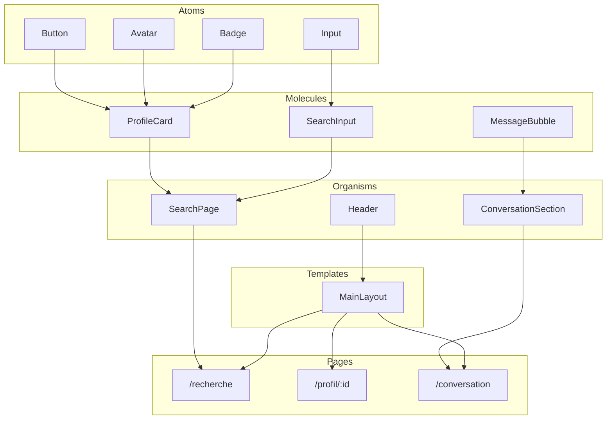
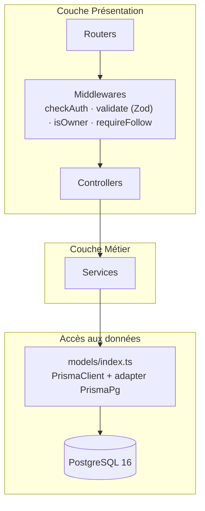
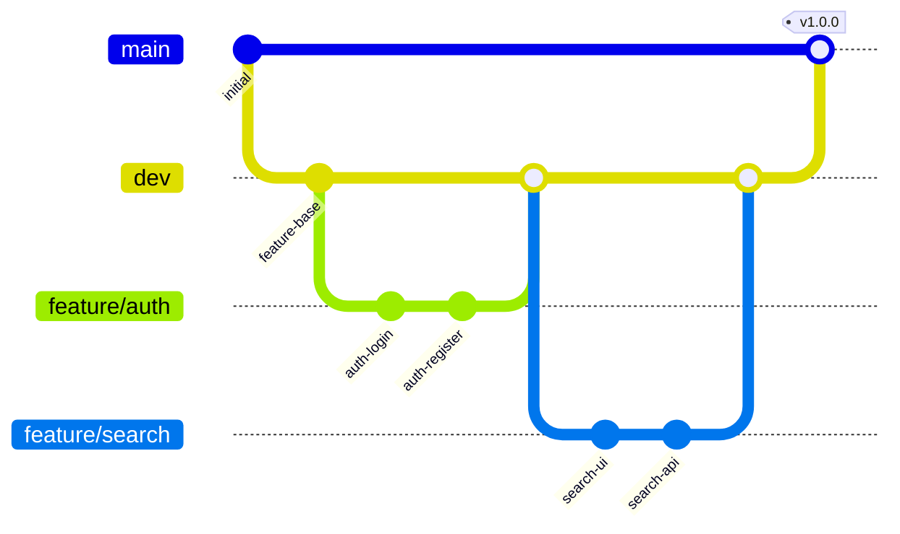

# 4. Stratégie de Solution

## 4.1 Décisions technologiques

### Frontend

| Technologie | Raison du choix |
| ----------- | --------------- |
| **Next.js 16.1.1** | App Router, RSC, optimisations automatiques |
| **TypeScript** | Type safety, meilleure DX, refactoring facilité |
| **Tailwind CSS** | Productivité, cohérence, pas de CSS custom |
| **shadcn/ui** | Composants accessibles, personnalisables, pas de dépendance |
| **socket.io-client** | Messagerie temps réel (cf. [ADR-011](../09-decisions/011-socket-io.md)) |
| **Hooks React natifs** | State serveur géré par composition de hooks (`useState`/`useEffect`/`useCallback`/`useRef` + `AbortController`). TanStack Query a été évalué puis rejeté (cf. [ADR-004](../09-decisions/004-tanstack-query.md)) car il ferait double emploi avec Socket.IO pour la propagation push. |

### Backend

| Technologie | Raison du choix |
| ----------- | --------------- |
| **Express.js** | Simplicité, écosystème mature, performance |
| **Prisma** | Type safety, migrations, studio de développement |
| **Zod** | Validation runtime, inférence TypeScript |
| **JWT** | Stateless auth, scalabilité horizontale |

### Infrastructure

| Technologie | Raison du choix |
| ----------- | --------------- |
| **Docker Compose** | Environnement reproductible, isolation |
| **PostgreSQL** | ACID, relations complexes, JSON support |
| **Meilisearch** | Recherche rapide, typo-tolerant, facile à configurer |
| **Nginx** | Reverse proxy, SSL termination, load balancing |

---

## 4.2 Patterns architecturaux

### Atomic Design (Frontend)


```mermaid
graph TD
    subgraph Atoms
        A1["Button"]
        A2["Input"]
        A3["Avatar"]
        A4["Badge"]
    end

    subgraph Molecules
        M1["ProfileCard"]
        M2["MessageBubble"]
        M3["SearchInput"]
    end

    subgraph Organisms
        O1["Header"]
        O2["SearchPage"]
        O3["ConversationSection"]
    end

    subgraph Templates
        T1["MainLayout"]
    end

    subgraph Pages
        P1["/recherche"]
        P2["/profil/:id"]
        P3["/conversation"]
    end

    A1 --> M1
    A2 --> M3
    A3 --> M1
    A4 --> M1
    M1 --> O2
    M2 --> O3
    M3 --> O2
    O1 --> T1
    O2 --> P1
    O3 --> P3
    T1 --> P1
    T1 --> P2
    T1 --> P3
```

### Architecture en couches (Backend)


```mermaid
graph TB
    subgraph "Couche Présentation"
        R["Routers"]
        V["Middlewares<br/>checkAuth · validate (Zod) · isOwner · requireFollow"]
        C["Controllers"]
    end

    subgraph "Couche Métier"
        S["Services"]
    end

    subgraph "Accès aux données"
        M["models/index.ts<br/>PrismaClient + adapter PrismaPg"]
        DB[("PostgreSQL 16")]
    end

    R --> V
    V --> C
    C --> S
    S --> M
    M --> DB
```

!!! note "Où s'exécute la validation"
    La validation Zod **n'est pas appelée par le controller** : `validate(...)`
    est un middleware monté dans le router, exécuté **avant** lui
    (`backend/src/middlewares/auth.middleware.ts:8-13`, monté par exemple dans
    `backend/src/routers/auth.router.ts:14`). Elle appartient donc à la couche
    présentation, comme garde d'entrée.

!!! warning "« Accès aux données » ≠ couche d'abstraction"
    Ce bloc ne représente **pas** un pattern Repository ou DAO. Il n'y a ni
    entité de domaine, ni DTO généralisé : `models/index.ts` est un fichier de
    8 lignes qui instancie et exporte le client Prisma, et les services
    appellent `prisma.<modèle>.<verbe>()` en direct. Détail des composants
    réellement implémentés — client unique, SQL brut paramétré, transaction,
    mapper Meilisearch — dans [ADR-003](../09-decisions/003-prisma.md).
    Cinq modules accèdent à Prisma hors de la couche Services ; ils sont
    listés dans [5.3 Backend](../05-building-blocks/backend.md).

---

## 4.3 Stratégies de qualité

| Objectif | Stratégie | Outils |
| -------- | --------- | ------ |
| **Maintenabilité** | Clean Code, SOLID, documentation | ESLint, Prettier, Husky pre-commit (TypeDoc en V2) |
| **Testabilité** | Tests d'intégration backend uniquement | `node --test` natif (7 fichiers `*.spec.test.ts`) — **aucun test frontend dans le livrable** ; Vitest/Playwright planifiés, cf. [ADR-010](../09-decisions/010-testing-strategy.md) |
| **Performance** | SSR, caching, lazy loading | Next.js (App Router) |
| **Sécurité** | Validation, hashing, HTTPS, cookies httpOnly | Zod, argon2, JWT, Nginx (TLS) |

---

## 4.4 Approche de développement

### Git Flow simplifié


```mermaid
gitGraph
    commit id: "initial"
    branch dev
    checkout dev
    commit id: "feature-base"
    branch feature/auth
    checkout feature/auth
    commit id: "auth-login"
    commit id: "auth-register"
    checkout dev
    merge feature/auth
    branch feature/search
    checkout feature/search
    commit id: "search-ui"
    commit id: "search-api"
    checkout dev
    merge feature/search
    checkout main
    merge dev tag: "v1.0.0"
```

### Conventions de commit

```plaintext
feat: nouvelle fonctionnalité
fix: correction de bug
docs: documentation
style: formatting, semicolons
refactor: restructuration sans changement fonctionnel
test: ajout de tests
chore: maintenance, dépendances
```

---

## Navigation

| Précédent | Suivant |
| --------- | ------- |
| [← 3. Contexte](../03-context/index.md) | [5. Building Blocks →](../05-building-blocks/index.md) |
