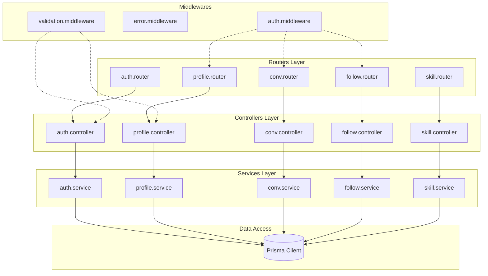

# 5.3 Backend

## Architecture en couches



---

## Structure des dossiers

```plaintext
backend/
├── src/
│   ├── routers/              # Routes Express
│   │   ├── auth.router.ts
│   │   ├── profile.router.ts
│   │   ├── conversation.router.ts
│   │   ├── follow.router.ts
│   │   └── skill.router.ts
│   │
│   ├── controllers/          # Logique HTTP
│   │   ├── auth.controller.ts
│   │   ├── profile.controller.ts
│   │   └── ...
│   │
│   ├── services/             # Logique métier
│   │   ├── auth.service.ts
│   │   ├── profile.service.ts
│   │   └── ...
│   │
│   ├── middlewares/          # Intercepteurs
│   │   ├── auth.middleware.ts
│   │   ├── error.middleware.ts
│   │   └── validation.middleware.ts
│   │
│   ├── validators/           # Schémas Zod
│   │   ├── auth.validator.ts
│   │   └── profile.validator.ts
│   │
│   └── utils/                # Utilitaires
│       ├── jwt.ts
│       └── password.ts
│
└── prisma/
    ├── schema.prisma         # Schéma BDD
    └── seed.ts               # Données initiales
```

---

## Endpoints API (31 routes)

| Route | Méthode | Auth | Description |
| ----- | ------- | ---- | ----------- |
| **Authentification** | | | |
| `/auth/register` | POST | Non | Inscription |
| `/auth/login` | POST | Non | Connexion |
| `/auth/logout` | POST | Oui | Déconnexion |
| `/auth/refresh` | POST | Non | Renouveler token |
| `/auth/me` | GET | Oui | Profil connecté |
| **Profils** | | | |
| `/profiles` | GET | Non | Liste des membres |
| `/profiles/:id` | GET | Non | Détail d'un profil |
| `/profiles/:id` | PATCH | Oui | Modifier son profil |
| `/profiles/:id/skills` | GET | Non | Compétences d'un membre |
| `/profiles/:id/interests` | GET | Non | Intérêts d'un membre |
| **Recherche** | | | |
| `/search/members` | GET | Non | Recherche de membres |
| `/search/skills` | GET | Non | Recherche de compétences |
| **Conversations** | | | |
| `/conversations` | GET | Oui | Mes conversations |
| `/conversations` | POST | Oui | Créer conversation |
| `/conversations/:id` | GET | Oui | Détail conversation |
| `/conversations/:id/messages` | GET | Oui | Messages |
| `/conversations/:id/messages` | POST | Oui | Envoyer message |
| **Abonnements** | | | |
| `/follow/:userId` | POST | Oui | Suivre un membre |
| `/follow/:userId` | DELETE | Oui | Ne plus suivre |
| `/followers` | GET | Oui | Mes abonnés |
| `/following` | GET | Oui | Mes abonnements |

---

## Middlewares

### Auth Middleware

```typescript
// middlewares/auth.middleware.ts
export const authMiddleware = async (
  req: Request,
  res: Response,
  next: NextFunction
) => {
  const token = req.cookies.accessToken;

  if (!token) {
    return res.status(401).json({ error: 'Non authentifié' });
  }

  try {
    const payload = verifyAccessToken(token);
    req.user = payload;
    next();
  } catch (error) {
    return res.status(401).json({ error: 'Token invalide' });
  }
};
```

### Validation Middleware

```typescript
// middlewares/validation.middleware.ts
export const validate = (schema: ZodSchema) => {
  return (req: Request, res: Response, next: NextFunction) => {
    const result = schema.safeParse(req.body);

    if (!result.success) {
      return res.status(400).json({
        success: false,
        error: {
          code: 'VALIDATION_ERROR',
          details: result.error.flatten().fieldErrors,
        },
      });
    }

    req.body = result.data;
    next();
  };
};
```

### Error Middleware

```typescript
// middlewares/error.middleware.ts
export const errorMiddleware = (
  error: Error,
  req: Request,
  res: Response,
  next: NextFunction
) => {
  if (error instanceof AppError) {
    return res.status(error.statusCode).json({
      success: false,
      error: {
        code: error.code,
        message: error.message,
      },
    });
  }

  // Erreur inattendue
  console.error(error);
  return res.status(500).json({
    success: false,
    error: {
      code: 'INTERNAL_ERROR',
      message: 'Erreur serveur',
    },
  });
};
```

---

## Format de réponse API

### Succès

```json
{
  "success": true,
  "data": {
    "id": 1,
    "email": "user@example.com"
  }
}
```

### Erreur

```json
{
  "success": false,
  "error": {
    "code": "VALIDATION_ERROR",
    "message": "Validation failed",
    "details": {
      "email": ["Email invalide"]
    }
  }
}
```

---

## Navigation

| Précédent | Suivant |
| --------- | ------- |
| [Frontend](./frontend.md) | [Database](./database.md) |
