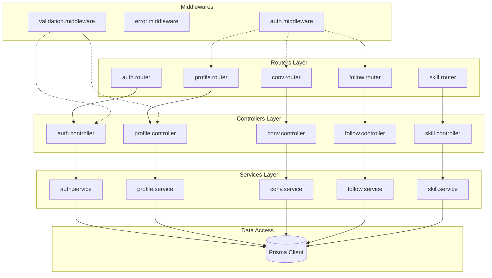

# 5.3 Backend

## Architecture en couches


```mermaid
graph TB
    subgraph "Routers Layer"
        R1[auth.router]
        R2[profile.router]
        R3[conv.router]
        R4[follow.router]
        R5[skill.router]
    end

    subgraph "Controllers Layer"
        C1[auth.controller]
        C2[profile.controller]
        C3[conv.controller]
        C4[follow.controller]
        C5[skill.controller]
    end

    subgraph "Services Layer"
        S1[auth.service]
        S2[profile.service]
        S3[conv.service]
        S4[follow.service]
        S5[skill.service]
    end

    subgraph "Middlewares"
        M1[auth.middleware]
        M2[error.middleware]
        M3[validation.middleware]
    end

    subgraph "Data Access"
        DB[(Prisma Client)]
    end

    R1 --> C1
    R2 --> C2
    R3 --> C3
    R4 --> C4
    R5 --> C5

    C1 --> S1
    C2 --> S2
    C3 --> S3
    C4 --> S4
    C5 --> S5

    S1 --> DB
    S2 --> DB
    S3 --> DB
    S4 --> DB
    S5 --> DB

    M1 -.-> R2
    M1 -.-> R3
    M1 -.-> R4
    M3 -.-> C1
    M3 -.-> C2
```

---

## Structure des dossiers

```plaintext
backend/
├── src/
│   ├── routers/              # Routes Express
│   │   ├── auth.router.ts
│   │   ├── profile.router.ts
│   │   ├── conversation.router.ts
│   │   ├── follow.router.ts
│   │   └── skill.router.ts
│   │
│   ├── controllers/          # Logique HTTP
│   │   ├── auth.controller.ts
│   │   ├── profile.controller.ts
│   │   └── ...
│   │
│   ├── services/             # Logique métier
│   │   ├── auth.service.ts
│   │   ├── profile.service.ts
│   │   └── ...
│   │
│   ├── middlewares/          # Intercepteurs
│   │   ├── auth.middleware.ts
│   │   ├── error.middleware.ts
│   │   └── validation.middleware.ts
│   │
│   ├── validators/           # Schémas Zod
│   │   ├── auth.validator.ts
│   │   └── profile.validator.ts
│   │
│   └── utils/                # Utilitaires
│       ├── jwt.ts
│       └── password.ts
│
└── prisma/
    ├── schema.prisma         # Schéma BDD
    └── seed.ts               # Données initiales
```

---

## Endpoints API (31 routes)

| Route | Méthode | Auth | Description |
| ----- | ------- | ---- | ----------- |
| **Authentification** | | | |
| `/auth/register` | POST | Non | Inscription |
| `/auth/login` | POST | Non | Connexion |
| `/auth/logout` | POST | Oui | Déconnexion |
| `/auth/refresh` | POST | Non | Renouveler token |
| `/auth/me` | GET | Oui | Profil connecté |
| **Profils** | | | |
| `/profiles` | GET | Non | Liste des membres |
| `/profiles/:id` | GET | Non | Détail d'un profil |
| `/profiles/:id` | PATCH | Oui | Modifier son profil |
| `/profiles/:id/skills` | GET | Non | Compétences d'un membre |
| `/profiles/:id/interests` | GET | Non | Intérêts d'un membre |
| **Recherche** | | | |
| `/search/members` | GET | Non | Recherche de membres |
| `/search/skills` | GET | Non | Recherche de compétences |
| **Conversations** | | | |
| `/conversations` | GET | Oui | Mes conversations |
| `/conversations` | POST | Oui | Créer conversation |
| `/conversations/:id` | GET | Oui | Détail conversation |
| `/conversations/:id/messages` | GET | Oui | Messages |
| `/conversations/:id/messages` | POST | Oui | Envoyer message |
| **Abonnements** | | | |
| `/follow/:userId` | POST | Oui | Suivre un membre |
| `/follow/:userId` | DELETE | Oui | Ne plus suivre |
| `/followers` | GET | Oui | Mes abonnés |
| `/following` | GET | Oui | Mes abonnements |

---

## Middlewares

### Auth Middleware

```typescript
// middlewares/auth.middleware.ts
export const authMiddleware = async (
  req: Request,
  res: Response,
  next: NextFunction
) => {
  const token = req.cookies.accessToken;

  if (!token) {
    return res.status(401).json({ error: 'Non authentifié' });
  }

  try {
    const payload = verifyAccessToken(token);
    req.user = payload;
    next();
  } catch (error) {
    return res.status(401).json({ error: 'Token invalide' });
  }
};
```

### Validation Middleware

```typescript
// backend/src/middlewares/auth.middleware.ts (extrait simplifié)
export const validate =
  (source: 'body' | 'query' | 'params', schema: ZodSchema) =>
  (req: Request, res: Response, next: NextFunction) => {
    const result = schema.safeParse(req[source]);
    if (!result.success) {
      return next(result.error); // ZodError → middleware errorHandler → 422
    }
    req[source] = result.data;
    next();
  };
```

> En cas d'échec, on délègue au middleware `errorHandler` qui mappe le
> `ZodError` en réponse `422 { error: prettifyZodError(...) }`. Détails :
> [`06-runtime/error-handling.md`](../06-runtime/error-handling.md).

### Error Middleware

```typescript
// backend/src/middlewares/error.middleware.ts (extrait représentatif)
export const errorHandler = (
  err: Error,
  _req: Request,
  res: Response,
  _next: NextFunction,
) => {
  if (err instanceof HttpError) {
    return res.status(err.statusCode).json({ error: err.message });
  }
  if (err instanceof z.ZodError) {
    return res.status(422).json({ error: prettifyZodError(err.issues) });
  }
  // … JWT, Prisma, Multer, FileValidationError (cf. error-handling.md)
  console.error(err);
  return res.status(500).json({ error: 'Unexpected server error' });
};
```

> Hiérarchie réelle : `HttpError` (classe parente) + 6 sous-classes
> (`UnauthorizedError`, `ForbiddenError`, `NotFoundError`,
> `BadRequestError`, `ConflictError`, `UnprocessableEntityError`) +
> `FileValidationError` (classe indépendante pour les uploads). Cf.
> [`backend/src/lib/error.ts`](https://github.com/Sojeremy/documentation-skillswap/blob/main/backend/src/lib/error.ts)
> et tableau complet dans
> [`06-runtime/error-handling.md`](../06-runtime/error-handling.md).

---

## Module : `realtime/`

| Path                                  | LOC | Exports principaux | Liens                                                                                                                |
|---------------------------------------|-----|--------------------|----------------------------------------------------------------------------------------------------------------------|
| `backend/src/realtime/socket.ts`      | 446 | `initSocket(httpServer)` | [GitHub](https://github.com/Sojeremy/documentation-skillswap/blob/main/backend/src/realtime/socket.ts)            |

Initialise le serveur Socket.IO sur le **même `httpServer` qu'Express**
(monté depuis `backend/src/index.ts`). Authentifie chaque socket au handshake
via le cookie HTTP-only `accessToken` (middleware `io.use()` qui appelle
`jwt.verify`). Implémente le pattern « rooms » : chaque socket rejoint
automatiquement `user:${userId}` à la connexion, et peut rejoindre
`conversation:${id}` à la demande via `conversation:join`.

Les handlers `message:send` et `conversation:close` exécutent leur logique
métier en direct (lecture + persistance Prisma + diffusion d'events) sans
passer par les services REST. La justification du choix de Socket.IO est
documentée dans [ADR-011](../09-decisions/011-socket-io.md), et le
catalogue exhaustif des events (4 client→serveur, 6 serveur→client) avec
diagramme de séquence se trouve dans
[`06-runtime/messaging.md`](../06-runtime/messaging.md).

---

## Module : `mappers/`

| Path                                          | LOC | Exports principaux                             | Liens                                                                                                                       |
|-----------------------------------------------|-----|------------------------------------------------|-----------------------------------------------------------------------------------------------------------------------------|
| `backend/src/mappers/member.mapper.ts`        | 55  | `userToDocument(userId)`, `calculateAverageRating` (interne) | [GitHub](https://github.com/Sojeremy/documentation-skillswap/blob/main/backend/src/mappers/member.mapper.ts) |

Pivot d'**indexation Meilisearch** : transforme un `User` Prisma (avec ses
relations `skills.skill.category` et `evaluationsReceived`) en un
`MemberDocument` plat consommable par Meilisearch. Le mapper :

- aplatit les compétences en `skills` (noms), `skillIds`, `categoryIds`,
  `categorySlugs` — listes dédupliquées via `new Set()` ;
- calcule la moyenne `rating` (arrondie à une décimale) et le compteur
  `evaluationCount` à partir de `evaluationsReceived` ;
- expose `createdAt` en timestamp numérique (compatible filtres et tri
  Meilisearch) ;
- lance `NotFoundError('User not found')` si l'utilisateur cible est absent.

Appelé par `services/profile.service.ts` (réindexation à l'ajout/suppression
d'un profil, d'une compétence ou d'une notation) et indirectement par
`services/search.service.ts` (`indexAllMembers` itère sur tous les users via
ce mapper).

---

## Module : `scripts/`

| Path                                      | LOC | Trigger npm                                                              | Liens                                                                                                                  |
|-------------------------------------------|-----|--------------------------------------------------------------------------|------------------------------------------------------------------------------------------------------------------------|
| `backend/src/scripts/reindex-search.ts`   | 25  | `npm run search:reindex` / `setup:meilisearch` (cf. `backend/package.json`) | [GitHub](https://github.com/Sojeremy/documentation-skillswap/blob/main/backend/src/scripts/reindex-search.ts) |

Script CLI bootstrap **Meilisearch**. Séquence (cf. `reindex-search.ts:4-20`) :

1. `testMeiliConnexion()` — exit 1 si le serveur n'est pas joignable.
2. `setupMembersIndex()` — crée/configure l'index `members` (champs
   recherchables, filtrables, triables).
3. `indexAllMembers()` — itère sur tous les users et pousse leur
   `MemberDocument` (via `mappers/member.mapper.ts`).
4. `process.exit(0)` en succès, `exit 1` en cas d'erreur attrapée.

Invoqué automatiquement par `npm run docker:init` (lancement initial du
Docker dev) et `npm run docker:prod:init` (cf. `package.json` racine
l.18 et l.30) ; relançable manuellement à tout moment pour reconstruire
l'index from scratch après une migration.

---

## Module : `middlewares/response.middleware.ts` + augmentations TypeScript

| Path                                                  | LOC | Exports principaux                                                                                | Liens                                                                                                                            |
|-------------------------------------------------------|-----|---------------------------------------------------------------------------------------------------|----------------------------------------------------------------------------------------------------------------------------------|
| `backend/src/middlewares/response.middleware.ts`      | 21  | `addResponseMethodsMiddleware`                                                                    | [GitHub](https://github.com/Sojeremy/documentation-skillswap/blob/main/backend/src/middlewares/response.middleware.ts)         |
| `backend/src/@types/express.d.ts`                     | 21  | Augmentations globales `Express.Request` (`userId`, `userRole`, `paramsId`, `cookies`) et `Express.Response` (`success`, `created`, `deleted`) | [GitHub](https://github.com/Sojeremy/documentation-skillswap/blob/main/backend/src/@types/express.d.ts) |

Le middleware `addResponseMethodsMiddleware` (monté tôt dans `app.ts:23`)
**injecte trois helpers** sur l'objet `Response`, utilisés par tous les
contrôleurs pour produire un format de succès canonique :

| Helper                          | Status | Body                                                                |
|---------------------------------|--------|---------------------------------------------------------------------|
| `res.success<T>(data)`          | 200    | `{ success: true, data, count }` — `count = data.length` si tableau, sinon `1` |
| `res.created<T>(data)`          | 201    | `{ success: true, data, count }`                                    |
| `res.deleted()`                 | 204    | (aucun body)                                                        |

!!! warning "Format de succès `{success, data, count}` ≠ format d'erreur"
    Le format de **succès** ci-dessus (`{success: true, data, count}`) ne
    doit pas être confondu avec le format d'**erreur** réel
    `{ error: "string" }` documenté dans
    [`06-runtime/error-handling.md`](../06-runtime/error-handling.md). Les
    deux formats coexistent : le premier est produit par ces helpers, le
    second par le middleware `errorHandler`.

Les **augmentations TypeScript globales** dans `backend/src/@types/express.d.ts`
typent à la fois ces helpers (côté `Response`) et les champs ajoutés à la
`Request` par les middlewares d'authentification :

```ts
// backend/src/@types/express.d.ts
declare global {
  namespace Express {
    interface Request {
      userId: number;       // posé par checkAuth
      userRole: number;     // posé par checkAuth
      paramsId: number;     // posé par certains validateurs
      cookies: Record<string, string>; // typé via cookie-parser
    }
    interface Response {
      success<T>(data: T): this;
      created<T>(data: T): this;
      deleted(): void;
    }
  }
}
```

Ces augmentations expliquent pourquoi `req.userId` (entier) est utilisable
sans cast partout dans les contrôleurs.

---

## Format de réponse API

### Succès

```json
{
  "success": true,
  "data": {
    "id": 1,
    "email": "user@example.com"
  },
  "count": 1
}
```

> Produit par `res.success(data)` / `res.created(data)` (cf.
> `middlewares/response.middleware.ts`). `count` vaut `data.length` lorsque
> `data` est un tableau, sinon `1`.

### Erreur

```json
{
  "error": "string"
}
```

> Produit par `errorHandler` (cf.
> [`06-runtime/error-handling.md`](../06-runtime/error-handling.md) et
> [`api-reference/errors.md`](../../api-reference/errors.md)). Une seule clé
> `error` (chaîne) — pas de `success`, pas de `code`, pas de `details`.

---

## Navigation

| Précédent | Suivant |
| --------- | ------- |
| [Frontend](./frontend.md) | [Database](./database.md) |
