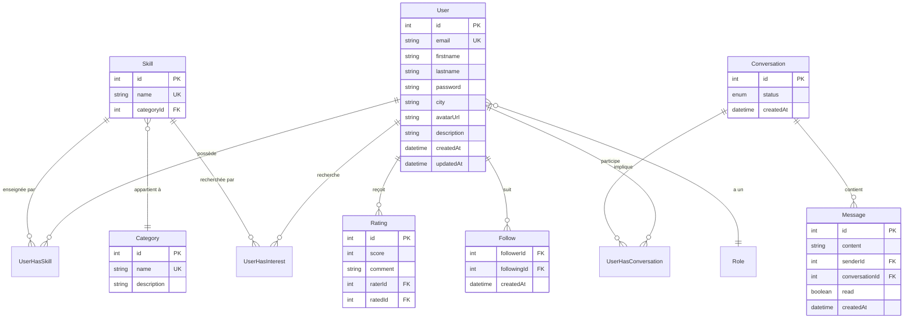

# 5.4 Base de données

## Modèle conceptuel (14 modèles)



---

## Tables de jonction

| Table | Colonnes | Rôle |
| ----- | -------- | ---- |
| `UserHasSkill` | `userId`, `skillId`, `level` | Compétences d'un utilisateur |
| `UserHasInterest` | `userId`, `skillId` | Intérêts d'un utilisateur |
| `UserHasConversation` | `userId`, `conversationId`, `role` | Participants d'une conversation |

---

## Enums Prisma

```prisma
enum Role {
  USER
  ADMIN
}

enum SkillLevel {
  DEBUTANT
  INTERMEDIAIRE
  CONFIRME
  EXPERT
}

enum ConversationStatus {
  ACTIVE
  ARCHIVED
  DELETED
}

enum ParticipantRole {
  INITIATOR
  RECEIVER
}
```

---

## Documentation détaillée

Pour plus de détails sur la base de données, consultez :

- [Vue d'ensemble](../../database/index.md) - ERD complet et structure
- [Relations](../../database/relations.md) - Détail des relations entre modèles
- [Enums](../../database/enums.md) - Documentation des énumérations
- [Migrations](../../database/migrations.md) - Guide des migrations Prisma
- [Modèles](../../database/models/user.md) - Documentation par modèle

---

## Navigation

| Précédent | Suivant |
| --------- | ------- |
| [Backend](./backend.md) | [6. Runtime](../06-runtime/index.md) |
