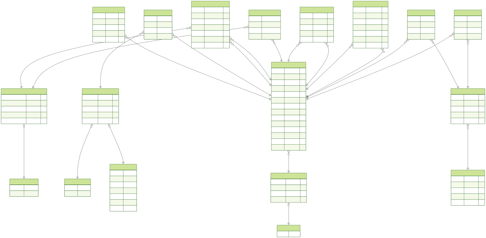

# 5.4 Base de données

## Modèle conceptuel

Le diagramme ci-dessous est **généré automatiquement** depuis `backend/prisma/schema.prisma`
via [`prisma-erd-generator`](https://github.com/keonik/prisma-erd-generator). Il reflète
fidèlement la structure réelle de la base en production.

{ loading=lazy }

> Pour régénérer ce diagramme après une modification du schéma :
> ```bash
> cd backend && npx prisma generate
> ```

---

## Double niveau : modèles Prisma ↔ tables SQL

Le schéma vit à deux niveaux :

- **Niveau code (Prisma)** — modèles en `CamelCase` manipulés par le client TypeScript.
- **Niveau base (PostgreSQL)** — tables en `snake_case lowercase`, exposées via `@@map()` (tables) et `@map()` (colonnes).

Le mot `user` est un mot-clé réservé en SQL ; pour cette raison, toutes les requêtes brutes ciblent la table entre guillemets : `"user"`.

### Mapping des 14 modèles

| Modèle Prisma         | Table SQL                | Type             |
| --------------------- | ------------------------ | ---------------- |
| `User`                | `user`                   | Entité           |
| `Role`                | `role`                   | Entité           |
| `Skill`               | `skill`                  | Entité           |
| `Category`            | `category`               | Entité           |
| `Conversation`        | `conversation`           | Entité           |
| `Message`             | `message`                | Entité           |
| `Available`           | `available`              | Entité           |
| `Follow`              | `follow`                 | Entité           |
| `Rating`              | `evaluation`             | Entité (⚠ dette) |
| `RefreshToken`        | `refresh_token`          | Entité           |
| `UserHasSkill`        | `user_has_skill`         | Jonction         |
| `UserHasInterest`     | `user_has_interest`      | Jonction         |
| `UserHasAvailable`    | `user_has_available`     | Jonction         |
| `UserHasConversation` | `user_has_conversation`  | Jonction         |

Côté colonnes, le pattern est systématique : `firstName` reste tel quel, mais
`postalCode → postal_code`, `avatarUrl → avatar_url`, `roleId → role_id`,
`createdAt → created_at`, `updatedAt → updated_at`, etc.

!!! warning "Dette technique — `Rating` ↔ `evaluation`"
    Le modèle Prisma `Rating` est mappé sur la table SQL `evaluation`
    (`@@map("evaluation")`). Les noms de relation côté code (`evaluator`,
    `evaluated`, `evaluationsGiven`, `evaluationsReceived`) renforcent cette
    confusion : on parle d'« évaluations » dans le code mais de « rating »
    dans le nom du modèle. **À uniformiser en V2** (renommer le modèle en
    `Evaluation` ou la table en `rating`, sur une seule des deux faces).

---

## Tables de jonction

Toutes les jonctions suivent le même pattern : **clé primaire composite** sur les deux FK,
suppression en cascade des deux côtés, et timestamps `created_at` / `updated_at`. Aucune
ne porte de colonne métier supplémentaire (pas de `level`, pas de `role` participant).

| Modèle Prisma         | Table SQL                | Clé primaire                    | Rôle                                       |
| --------------------- | ------------------------ | ------------------------------- | ------------------------------------------ |
| `UserHasSkill`        | `user_has_skill`         | (`user_id`, `skill_id`)         | Compétences enseignées par un utilisateur  |
| `UserHasInterest`     | `user_has_interest`      | (`user_id`, `skill_id`)         | Compétences recherchées par un utilisateur |
| `UserHasAvailable`    | `user_has_available`     | (`user_id`, `available_id`)     | Créneaux de disponibilité d'un utilisateur |
| `UserHasConversation` | `user_has_conversation`  | (`user_id`, `conversation_id`)  | Participants à une conversation            |

---

## Enums Prisma

Le schéma définit **quatre** enums, tous présents dans le code de production :

```prisma
enum RoleOfUser {
  Membre
}

enum StatusOfConversation {
  Open
  Close
}

enum Time {
  Morning
  Afternoon
}

enum dayInAWeek {
  Lundi
  Mardi
  Mercredi
  Jeudi
  Vendredi
  Samedi
  Dimanche
}
```

!!! note "À propos de `RoleOfUser`"
    L'enum ne contient aujourd'hui qu'**une seule valeur** (`Membre`).
    Le modèle `Role` reste pourtant une table à part entière reliée à `User`
    par une FK : la structure est prête à accueillir d'autres rôles
    (`Admin`, `Moderator`…) sans modification du modèle relationnel.

---

## Migrations

Les migrations sont versionnées dans `backend/prisma/migrations/` et appliquées via
`prisma migrate deploy`. Six migrations composent l'historique de production :

| Ordre | Identifiant                                                      | Effet                                                                                              |
| :---: | ---------------------------------------------------------------- | -------------------------------------------------------------------------------------------------- |
|   1   | `20260112133206_init_db`                                         | Création initiale des 14 tables, enums, FK et index — l'ensemble du schéma de base                 |
|   2   | `20260114134738_add_category_slug`                               | Ajout de la colonne `slug` sur `category` + index unique pour les URLs canoniques                  |
|   3   | `20260116161218_create_relation_table_user_available`            | Introduction de la jonction `user_has_available` reliant utilisateurs et créneaux                  |
|   4   | `20260117012249_fix_snake_case`                                  | Renommage `avatarUrl → avatar_url` sur `user` (oubli de `@map()` lors de l'init)                   |
|   5   | `20260118042859_add_unique_constrain`                            | Contraintes uniques `(evaluator_id, evaluated_id)` sur `evaluation` et `(followed_id, follower_id)` sur `follow` |
|   6   | `20260120123059_make_the_comment_field_in_the_rating_table_optional` | Passage de `evaluation.comments` en nullable (commentaire d'évaluation devenu optionnel)       |

---

## Documentation détaillée

Pour plus de détails sur la base de données, consultez :

- [Vue d'ensemble](../../database/index.md) - ERD complet et structure
- [Relations](../../database/relations.md) - Détail des relations entre modèles
- [Enums](../../database/enums.md) - Documentation des énumérations
- [Migrations](../../database/migrations.md) - Guide des migrations Prisma
- [Modèles](../../database/models/user.md) - Documentation par modèle

---

## Navigation

| Précédent | Suivant |
| --------- | ------- |
| [Backend](./backend.md) | [6. Runtime](../06-runtime/index.md) |
