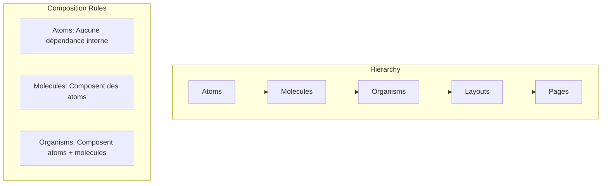
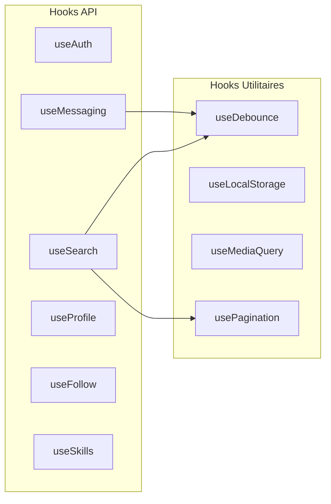
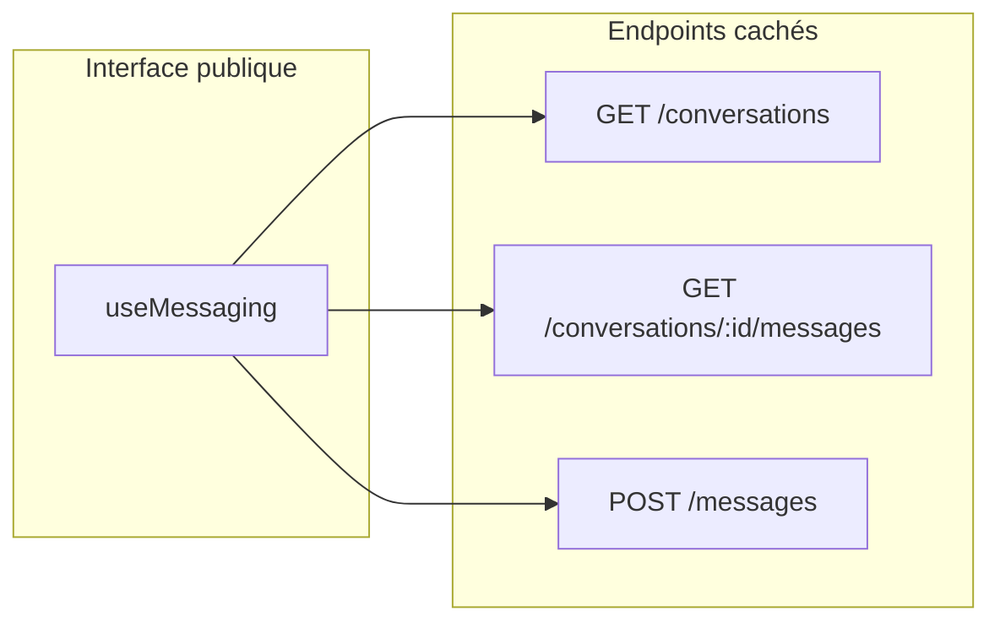

# 5.2 Frontend

## Stack technique

| Technologie | Version | Rôle |
| ----------- | ------- | ---- |
| **Next.js** | 16.x | Framework React avec App Router, SSR/SSG |
| **React** | 19.x | Bibliothèque UI avec Server Components |
| **TypeScript** | 5.x | Typage statique |
| **Tailwind CSS** | 3.4.x | Utility-first CSS |
| **shadcn/ui** | - | Composants accessibles (Radix UI) |
| **TanStack Query** | 5.x | State management serveur, cache |
| **Zod** | 3.x | Validation de schémas |
| **React Hook Form** | 7.x | Gestion des formulaires |

---

## Architecture des dossiers

```plaintext
frontend/
├── app/                      # Next.js App Router
│   ├── (app)/                # Routes authentifiées (groupe)
│   │   ├── conversation/     # Messagerie
│   │   ├── profil/[id]/      # Profil utilisateur
│   │   └── recherche/        # Recherche de membres
│   ├── (auth)/               # Routes publiques (groupe)
│   │   ├── connexion/        # Login
│   │   └── inscription/      # Register
│   ├── layout.tsx            # Layout racine
│   └── page.tsx              # Page d'accueil
│
├── components/               # Composants React (Atomic Design)
│   ├── atoms/                # 16 composants de base
│   ├── molecules/            # 9 composants composés
│   ├── organisms/            # 30 composants complexes
│   ├── layouts/              # 1 layout (MainLayout)
│   ├── providers/            # 1 provider (AuthProvider)
│   └── ui/                   # Composants shadcn/ui
│
├── hooks/                    # 10 hooks personnalisés
│   ├── useAuth.ts
│   ├── useSearch.ts
│   ├── useMessaging.ts
│   └── ...
│
└── lib/                      # Utilitaires
    ├── api-client.ts         # Client HTTP
    ├── api-types.ts          # Types API
    └── utils.ts              # Fonctions helper
```

---

## Composants (Atomic Design)

L'architecture frontend suit le pattern **Atomic Design** de Brad Frost, avec 57 composants organisés en 5 niveaux.



### Atoms (16 composants)

Composants de base indivisibles, sans dépendance vers d'autres composants internes.

| Composant | Fichier | Props | Description |
| --------- | ------- | ----- | ----------- |
| `Avatar` | `avatar.tsx` | `src`, `alt`, `fallback` | Image de profil avec fallback initiales |
| `Badge` | `badge.tsx` | `variant`, `children` | Label visuel (statut, catégorie) |
| `Button` | `button.tsx` | `variant`, `size`, `disabled` | Bouton d'action (shadcn/ui) |
| `Card` | `card.tsx` | `children`, `className` | Container avec ombre |
| `Checkbox` | `checkbox.tsx` | `checked`, `onCheckedChange` | Case à cocher |
| `Dialog` | `dialog.tsx` | `open`, `onOpenChange` | Modal accessible |
| `Input` | `input.tsx` | `type`, `placeholder`, `value` | Champ de saisie |
| `Label` | `label.tsx` | `htmlFor`, `children` | Label de formulaire |
| `Logo` | `Logo.tsx` | `size` | Logo SkillSwap SVG |
| `ScrollArea` | `scroll-area.tsx` | `children` | Zone scrollable stylée |
| `Select` | `select.tsx` | `options`, `value`, `onChange` | Liste déroulante |
| `Separator` | `separator.tsx` | `orientation` | Ligne de séparation |
| `Skeleton` | `skeleton.tsx` | `className` | Placeholder de chargement |
| `Spinner` | `Spinner.tsx` | `size` | Indicateur de chargement |
| `Textarea` | `textarea.tsx` | `rows`, `placeholder` | Zone de texte multiligne |
| `Tooltip` | `tooltip.tsx` | `content`, `children` | Info-bulle au survol |

### Molecules (9 composants)

Combinaisons d'atoms formant des unités fonctionnelles.

| Composant | Compose | Props clés | Description |
| --------- | ------- | ---------- | ----------- |
| `AvailabilityIndicator` | Badge | `available` | Indicateur de disponibilité |
| `ConversationItem` | Avatar, Badge | `conversation`, `isActive` | Item liste conversations |
| `FormField` | Label, Input | `name`, `error` | Champ avec label et erreur |
| `MessageBubble` | Card, Avatar | `message`, `isOwn` | Bulle de message |
| `ProfileCard` | Avatar, Badge, Button | `user`, `onFollow` | Carte profil membre |
| `RatingDisplay` | - | `rating`, `count` | Affichage étoiles |
| `SearchBar` | Input, Button | `value`, `onSearch` | Barre de recherche |
| `SkillBadge` | Badge | `skill`, `variant` | Badge de compétence |
| `SkillTag` | Badge | `name`, `onRemove` | Tag supprimable |

### Organisms (30 composants)

Composants complexes formant des sections complètes de l'interface.

| Composant | Catégorie | Responsabilité |
| --------- | --------- | -------------- |
| **Navigation** | | |
| `Header` | Layout | Navigation principale, menu utilisateur, logo |
| `Footer` | Layout | Liens légaux, réseaux sociaux |
| `MobileMenu` | Layout | Navigation responsive |
| **Authentification** | | |
| `AuthForm` | Auth | Formulaire login/register avec validation Zod |
| `LoginForm` | Auth | Formulaire de connexion |
| `RegisterForm` | Auth | Formulaire d'inscription |
| **Profil** | | |
| `ProfileHeader` | Profile | En-tête avec avatar, nom, stats |
| `ProfileInfo` | Profile | Informations détaillées |
| `ProfileSkills` | Profile | Liste des compétences |
| `ProfileInterests` | Profile | Liste des centres d'intérêt |
| `ProfileAvailability` | Profile | Calendrier de disponibilité |
| `ProfileRatings` | Profile | Historique des évaluations |
| `EditProfileModal` | Profile | Modal d'édition du profil |
| **Recherche** | | |
| `SearchPage` | Search | Page complète de recherche |
| `SearchFilters` | Search | Filtres par catégorie, ville, disponibilité |
| `SearchResults` | Search | Grille de résultats paginés |
| `MemberGrid` | Search | Affichage grille des membres |
| `Pagination` | Search | Navigation entre pages |
| **Messagerie** | | |
| `ConversationSection` | Messaging | Section complète de messagerie |
| `ConversationList` | Messaging | Liste des conversations |
| `ConversationView` | Messaging | Vue d'une conversation |
| `MessageList` | Messaging | Liste des messages |
| `MessageInput` | Messaging | Saisie de message |
| **Composants partagés** | | |
| `CategorySelector` | Shared | Sélection de catégorie |
| `SkillSelector` | Shared | Sélection de compétences |
| `CityAutocomplete` | Shared | Autocomplétion ville |
| `ErrorBoundary` | Shared | Gestion d'erreurs React |
| `LoadingState` | Shared | États de chargement |
| `EmptyState` | Shared | États vides |
| `ConfirmDialog` | Shared | Dialog de confirmation |

### Layouts (1 composant)

| Composant | Fichier | Description |
| --------- | ------- | ----------- |
| `MainLayout` | `MainLayout.tsx` | Layout principal avec Header, Footer, zones responsive |

### Providers (1 composant)

| Composant | Contexte | Description |
| --------- | -------- | ----------- |
| `AuthProvider` | `AuthContext` | Gestion de l'état d'authentification global |

---

## Hooks personnalisés

10 hooks encapsulent la logique métier réutilisable.



### Hooks API (avec TanStack Query)

| Hook | Queries/Mutations | Description |
| ---- | ----------------- | ----------- |
| `useAuth` | `login`, `logout`, `register`, `me` | Authentification complète |
| `useSearch` | `searchMembers` | Recherche avec debounce et pagination |
| `useMessaging` | `conversations`, `messages`, `sendMessage` | Facade pour la messagerie |
| `useProfile` | `profile`, `updateProfile` | Lecture/édition de profil |
| `useFollow` | `follow`, `unfollow`, `followers` | Gestion des abonnements |
| `useSkills` | `skills`, `categories` | Récupération des compétences |

### Exemple : useSearch (Factory Pattern)

```typescript
// hooks/useSearch.ts
export function useSearch(initialFilters?: SearchFilters) {
  const [filters, setFilters] = useState<SearchFilters>(initialFilters ?? {});
  const debouncedQuery = useDebounce(filters.query, 300);

  const { data, isLoading, error } = useQuery({
    queryKey: ['members', 'search', { ...filters, query: debouncedQuery }],
    queryFn: () => searchMembers({ ...filters, query: debouncedQuery }),
    staleTime: 5 * 60 * 1000, // 5 minutes
  });

  return {
    members: data?.members ?? [],
    total: data?.total ?? 0,
    isLoading,
    error,
    filters,
    setFilters,
    setQuery: (query: string) => setFilters(f => ({ ...f, query })),
    setCategory: (categoryId: number) => setFilters(f => ({ ...f, categoryId })),
    setCity: (city: string) => setFilters(f => ({ ...f, city })),
  };
}
```

### Exemple : useMessaging (Facade Pattern)

```typescript
// hooks/useMessaging.ts - Facade simplifiant 3 endpoints
export function useMessaging() {
  const conversationsQuery = useQuery({
    queryKey: ['conversations'],
    queryFn: getConversations,
  });

  const messagesQuery = (conversationId: number) => useQuery({
    queryKey: ['messages', conversationId],
    queryFn: () => getMessages(conversationId),
    enabled: !!conversationId,
  });

  const sendMessageMutation = useMutation({
    mutationFn: sendMessage,
    onSuccess: () => {
      queryClient.invalidateQueries({ queryKey: ['messages'] });
    },
  });

  return {
    // Conversations
    conversations: conversationsQuery.data ?? [],
    isLoadingConversations: conversationsQuery.isLoading,

    // Messages (factory)
    useMessages: messagesQuery,

    // Actions
    sendMessage: sendMessageMutation.mutate,
    isSending: sendMessageMutation.isPending,
  };
}
```

### Hooks utilitaires

| Hook | Paramètres | Retour | Usage |
| ---- | ---------- | ------ | ----- |
| `useDebounce` | `value`, `delay` | `debouncedValue` | Retarder les appels API |
| `useLocalStorage` | `key`, `initialValue` | `[value, setValue]` | Persistance locale |
| `useMediaQuery` | `query` | `boolean` | Responsive design |
| `usePagination` | `totalItems`, `pageSize` | `{ page, totalPages, ... }` | Gestion pagination |

---

## Design Patterns

### Factory Pattern (Création d'instances)

Utilisé pour créer des composants ou hooks avec configuration variable.

```typescript
// Exemple : createSearchHook factory
function createSearchHook(endpoint: string, defaultFilters: SearchFilters) {
  return function useSearch(initialFilters?: SearchFilters) {
    const filters = { ...defaultFilters, ...initialFilters };
    // ... logique commune
  };
}

export const useSearchMembers = createSearchHook('/api/members/search', {});
export const useSearchSkills = createSearchHook('/api/skills/search', {});
```

### Facade Pattern (Simplification d'API)

Le hook `useMessaging` masque la complexité de 3 endpoints derrière une interface unifiée.



### Compound Components

Utilisé pour les composants complexes avec sous-composants liés.

```tsx
// Exemple : Dialog compound component
<Dialog>
  <Dialog.Trigger asChild>
    <Button>Ouvrir</Button>
  </Dialog.Trigger>
  <Dialog.Content>
    <Dialog.Title>Titre</Dialog.Title>
    <Dialog.Description>Description</Dialog.Description>
  </Dialog.Content>
</Dialog>
```

### CVA (Class Variance Authority)

Gestion des variantes de style de manière type-safe.

```typescript
// components/atoms/button.tsx
import { cva, type VariantProps } from 'class-variance-authority';

const buttonVariants = cva(
  'inline-flex items-center justify-center rounded-md font-medium transition-colors',
  {
    variants: {
      variant: {
        default: 'bg-primary text-primary-foreground hover:bg-primary/90',
        destructive: 'bg-destructive text-destructive-foreground',
        outline: 'border border-input bg-background hover:bg-accent',
        ghost: 'hover:bg-accent hover:text-accent-foreground',
      },
      size: {
        default: 'h-10 px-4 py-2',
        sm: 'h-9 px-3',
        lg: 'h-11 px-8',
        icon: 'h-10 w-10',
      },
    },
    defaultVariants: {
      variant: 'default',
      size: 'default',
    },
  }
);

export interface ButtonProps extends VariantProps<typeof buttonVariants> {}
```

### Barrel Exports

Organisation des exports pour simplifier les imports.

```typescript
// components/atoms/index.ts
export { Avatar } from './avatar';
export { Badge } from './badge';
export { Button, buttonVariants } from './button';
// ...

// Usage simplifié
import { Avatar, Badge, Button } from '@/components/atoms';
```

---

## Navigation

| Précédent | Suivant |
| --------- | ------- |
| [Vue d'ensemble](./index.md) | [Backend](./backend.md) |
