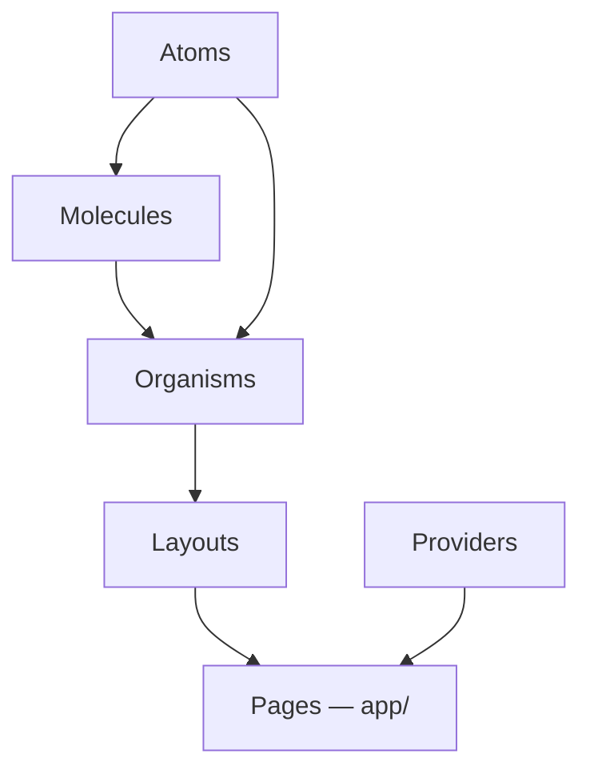

# 5.2 Frontend

## Stack technique

Versions lues dans `frontend/package.json` au **2026-05-07**.
Source canonique : [12.4 Stack technique & métriques](../12-glossary/index.md#124-stack-technique--métriques).

| Technologie         | Version  | Rôle                                       |
| ------------------- | -------- | ------------------------------------------ |
| **Next.js**         | 16.1.1   | Framework React avec App Router, SSR/ISR   |
| **React**           | 19.2.3   | Bibliothèque UI avec Server Components     |
| **TypeScript**      | ^5       | Typage statique                            |
| **Tailwind CSS**    | ^4.1.18  | Utility-first CSS                          |
| **shadcn/ui**       | -        | Composants accessibles (Radix UI)          |
| **React Hook Form** | ^7.71.1  | Gestion des formulaires                    |
| **Zod**             | ^4.3.5   | Validation de schémas                      |
| **socket.io-client**| ^4.8.3   | Temps réel (messagerie)                    |
| **lucide-react**    | ^0.562.0 | Icônes                                     |
| **sonner**          | ^2.0.7   | Toasts/notifications                       |

!!! info "Pas de state management externe"
    Le frontend SkillSwap n'utilise **aucune** librairie de cache de
    requêtes ni de store global externe — vérifié par absence dans
    `frontend/package.json`. La gestion d'état repose sur les hooks
    React natifs (`useState`, `useEffect`, `useCallback`, `useRef`) plus un
    `Context` unique (`AuthProvider`). Les fetchs annulables utilisent
    `AbortController`.

---

## Architecture des dossiers

```plaintext
frontend/src/
├── app/                       # Next.js App Router
│   ├── (app)/                 # Routes authentifiées (groupe)
│   │   ├── conversation/      # Messagerie
│   │   ├── mon-profil/        # Profil de l'utilisateur courant
│   │   ├── profil/[id]/       # Profil public d'un autre user (ISR)
│   │   └── recherche/         # Recherche de membres
│   ├── (auth)/                # Routes publiques (groupe)
│   │   ├── connexion/
│   │   └── inscription/
│   ├── layout.tsx             # Root layout
│   ├── page.tsx               # Page d'accueil (Server Component, revalidate=3600)
│   ├── robots.ts              # SEO — robots metadata
│   └── sitemap.ts             # SEO — sitemap dynamique
│
├── middleware.ts              # Auth gate Next.js (redirige selon refreshToken)
│
├── components/                # Composants React (Atomic Design)
│   ├── atoms/                 # 18 composants de base
│   ├── molecules/             # 9 composants composés
│   ├── organisms/             # Sections complexes (AuthForm + Footer + 5 sous-familles)
│   ├── layouts/               # 1 layout (MainLayout)
│   └── providers/             # 1 provider (AuthProvider)
│
├── hooks/                     # 21 hooks personnalisés (8 racine + 7 messaging + 6 profile)
│
└── lib/
    ├── api-client.ts          # Singleton fetch + retry refresh-token
    ├── api-types.ts           # Types TS partagés
    ├── socket-client.ts       # Singleton Socket.IO
    ├── utils.ts               # Helpers (displayError, logError, isEqual, …)
    └── validation/            # Schémas Zod (auth, conversation, updatePassword, updateProfile)
```

---

## Composants (Atomic Design)

L'architecture frontend suit le pattern **Atomic Design** de Brad Frost,
avec une stricte règle de composition : un atom ne dépend de rien, un
molecule ne compose que des atoms, un organism compose atoms et molecules.


```mermaid
graph TB
    A["Atoms"] --> M["Molecules"]
    M --> O["Organisms"]
    A --> O
    O --> L["Layouts"]
    L --> P["Pages — app/"]
    PR["Providers"] --> P
```

### Atoms (18 composants)

Composants indivisibles, sans dépendance vers d'autres composants internes.
Comptés via `ls frontend/src/components/atoms/*.tsx | grep -v stories | wc -l`.

| Composant         | Rôle                                                  |
|-------------------|-------------------------------------------------------|
| `Avatar`          | Image de profil avec fallback initiales (Radix)       |
| `Badge`           | Label visuel (statut, catégorie)                      |
| `Button`          | Bouton d'action shadcn/ui (variantes via CVA)         |
| `Card`            | Container avec ombre/bordure                          |
| `Dialog`          | Modal accessible (Radix)                              |
| `DropdownMenu`    | Menu déroulant accessible (Radix)                     |
| `Form`            | Wrapper React Hook Form (`Form`, `FormField`, …)      |
| `Icons`           | Re-export typé des icônes lucide-react utilisées      |
| `Input`           | Champ de saisie texte                                 |
| `Label`           | Label de formulaire                                   |
| `Link`            | Wrapper `next/link` stylé                             |
| `Logo`            | Logo SkillSwap SVG                                    |
| `PasswordInput`   | Input mot de passe avec toggle visibilité             |
| `Rating`          | Affichage/saisie d'étoiles                            |
| `Select`          | Liste déroulante accessible (Radix)                   |
| `Separator`       | Ligne de séparation (Radix)                           |
| `Textarea`        | Zone de texte multiligne                              |
| `Toast`           | Wrapper `sonner` (`<Toaster />`)                      |

### Molecules (9 composants)

| Composant              | Compose                | Rôle                                                  |
|------------------------|------------------------|-------------------------------------------------------|
| `ConfirmDialog`        | Dialog, Button         | Dialog générique de confirmation                      |
| `ConversationItem`     | Avatar, Badge          | Item de la liste de conversations                     |
| `ConversationSkeleton` | Card, Avatar, Skeleton | Squelette pendant chargement de la liste              |
| `EmptyState`           | Icons, Button          | État vide générique (liste/recherche/conversation)    |
| `MessageBubble`        | Card, Avatar           | Bulle d'un message (variante propre/destinataire)     |
| `Pagination`           | Button, Icons          | Navigation entre pages des résultats                  |
| `ProfileCard`          | Avatar, Badge, Button  | Carte profil membre (résultats de recherche)          |
| `StepHowItWorks`       | Card, Icons            | Étape illustrée (section « Comment ça marche »)       |
| `UserDropdown`         | Avatar, DropdownMenu   | Menu utilisateur du Header                            |

### Organisms (par sous-famille)

Les organismes sont organisés par **page de destination** plutôt qu'à plat.
Compte des fichiers via `find frontend/src/components/organisms -type f`.

#### `HomePage/` (5 fichiers)

| Fichier                      | Rôle                                            |
|------------------------------|-------------------------------------------------|
| `index.ts`                   | Barrel export                                   |
| `HeroSection.tsx`            | Hero du landing (CTA + visuels)                 |
| `HowItWorksSection.tsx`      | 3 étapes de fonctionnement                      |
| `CategoriesSection.tsx`      | Top catégories (issues de `useTopCategories`)   |
| `MembersSection.tsx`         | Membres mis en avant                            |

#### `Header/` (6 fichiers)

| Fichier                       | Rôle                                                                |
|-------------------------------|---------------------------------------------------------------------|
| `index.tsx`                   | Header racine (logo, nav, settings, auth buttons)                   |
| `DesktopNav.tsx`              | Navigation horizontale ≥ md                                          |
| `MobileNav.tsx`               | Navigation drawer < md                                              |
| `AuthButtons.tsx`             | Boutons « Se connecter / S'inscrire » ou avatar (selon AuthProvider)|
| `SettingsPanel.tsx`           | Panneau réglages (thème, langue, etc.)                              |
| `AccountSettingsDialog.tsx`   | Dialog de modification des réglages compte                          |

#### `ConversationPage/` (12 fichiers)

| Fichier                                       | Rôle                                                                  |
|-----------------------------------------------|-----------------------------------------------------------------------|
| `index.ts`                                    | Barrel export                                                         |
| `ConversationSection.tsx`                     | Layout 2 colonnes : liste à gauche, MessageThread à droite            |
| `NewConversationDialog.tsx`                   | Dialog de création (sélection followed user + titre)                  |
| `NewMessageDialog.tsx`                        | Dialog d'envoi du premier message                                     |
| `RatingDialog.tsx`                            | Dialog de notation post-conversation                                  |
| `useConversationState.ts`                     | State local de l'UI conversation (dialogs, panneau actif)             |
| `MessageThread/index.tsx`                     | Thread complet pour la conversation sélectionnée                      |
| `MessageThread/ThreadHeader.tsx`              | En-tête (participant, actions : fermer/évaluer/supprimer)             |
| `MessageThread/MessageList.tsx`               | Liste des messages (scroll inversé + pagination cursor)               |
| `MessageThread/MessageInput.tsx`              | Saisie + bouton envoyer (déclenche `handleSendMessage`)               |
| `MessageThread/ThreadDialogs.tsx`             | Regroupe les dialogs propres au thread                                |
| `MessageThread/useThreadState.ts`             | State UI du thread (dialogs ouverts, etc.)                            |

#### `ProfilePage/` (14 fichiers)

| Fichier                                              | Rôle                                                                  |
|------------------------------------------------------|-----------------------------------------------------------------------|
| `index.ts`                                           | Barrel export                                                         |
| `ProfileClient.tsx`                                  | Orchestrateur : choisit entre `ProfileTeaser` (public) et `ProfileFull` (auth) |
| `ProfileTeaser.tsx`                                  | Mode public (SEO) — données limitées issues de `/profiles/public/:id` |
| `ProfileFull.tsx`                                    | Mode authentifié — vue complète + actions (follow, message, …)        |
| `ProfileHeader.tsx`                                  | Avatar + nom + statistiques + actions principales                     |
| `SkillsSection.tsx`                                  | Compétences offertes/recherchées                                       |
| `InterestsSection.tsx`                               | Centres d'intérêt                                                     |
| `AvailabilitySection.tsx`                            | Disponibilités hebdomadaires                                          |
| `ReviewsSection.tsx`                                 | Évaluations reçues                                                    |
| `EditPage/ProfileUpdateHeader.tsx`                   | En-tête de la page d'édition (mon-profil)                             |
| `EditPage/UpdateAvatarDialog.tsx`                    | Dialog upload avatar (multipart, Multer côté backend)                 |
| `EditPage/AddSkillDialog.tsx`                        | Dialog d'ajout d'une compétence                                       |
| `EditPage/AddAvailabilityDialog.tsx`                 | Dialog d'ajout d'une plage de disponibilité                           |
| `EditPage/PrivateSettingSection.tsx`                 | Section réglages privés (visibilité)                                  |

#### `SearchPage/` (5 fichiers)

| Fichier                       | Rôle                                                              |
|-------------------------------|-------------------------------------------------------------------|
| `index.tsx`                   | Page de recherche complète (compose les sous-organismes)          |
| `SearchBar.tsx`               | Barre de recherche (binding sur `useSearch.query`)                |
| `CategoryFilter.tsx`          | Filtre catégorie                                                  |
| `SearchResults.tsx`           | Grille de `ProfileCard` + `Pagination`                            |
| `SearchResultSkeleton.tsx`    | Skeleton pendant le chargement                                    |

#### Organismes au niveau racine

| Fichier         | Rôle                                                                            |
|-----------------|---------------------------------------------------------------------------------|
| `AuthForm.tsx`  | Formulaire unifié connexion/inscription (variante via prop), validation Zod     |
| `Footer.tsx`    | Pied de page (liens légaux, social)                                             |

### Layouts

| Composant     | Fichier                                  | Rôle                                                                |
|---------------|------------------------------------------|---------------------------------------------------------------------|
| `MainLayout`  | `components/layouts/MainLayout.tsx`      | Skip-link a11y → `Header` + `<main id="main-content">` + `Footer` (optionnel via `isFullHeight`) |

### Providers

| Composant       | Contexte           | Rôle                                                                                                                                |
|-----------------|--------------------|-------------------------------------------------------------------------------------------------------------------------------------|
| `AuthProvider`  | `AuthContext`      | État global utilisateur (`user`, `isAuthenticated`, `isLoading`) + méthodes `login`, `register`, `logout`, `refresh`. Auto-fetch `/auth/me` au mount via `refresh()` |

---

## Hooks personnalisés (21)

Compte total : 8 hooks à la racine + 7 dans `hooks/messaging/` + 6 dans
`hooks/profile/`. **Aucun ne dépend d'une librairie externe de cache de
requêtes** : tous reposent sur `useState`/`useEffect`/`useCallback`/`useRef`
natifs et `AbortController` pour le cancel-on-unmount des fetchs.

### Hooks racine (8)

| Hook                | Rôle                                                                          |
|---------------------|-------------------------------------------------------------------------------|
| `useAccount`        | Gestion compte courant (suppression, mise à jour mot de passe)                |
| `useAutoScroll`     | Scroll automatique vers le bas quand un nouvel item est ajouté (messages)     |
| `useFormState`      | Wrapper d'état pour formulaires multi-champs avec helpers                     |
| `useIsMobile`       | Détection viewport mobile via `matchMedia`                                    |
| `useMessaging`      | Façade messagerie (compose 6 hooks `messaging/`)                              |
| `useSearch`         | Recherche membres avec debounce manuel + pagination + cancel via AbortController |
| `useSocket`         | Connexion Socket.IO scopée à un `conversationId` (join/leave + listeners)     |
| `useTopCategories`  | Charge les catégories mises en avant pour la HomePage                         |

### Hooks `messaging/` (7)

| Hook                          | Rôle                                                                      |
|-------------------------------|---------------------------------------------------------------------------|
| `useConversationActions`      | Handlers UI (envoyer, fermer, supprimer, créer, voir profil, noter)       |
| `useConversationList`         | Charge et mute la liste des conversations                                 |
| `useConversationMessages`     | Pagination cursor-based + optimistic UI                                   |
| `useFollowedUsers`            | Liste des utilisateurs suivis (création de nouvelle conversation)         |
| `useGlobalSocket`             | Listeners Socket.IO globaux (`conversation:updated/closed/new`)            |
| `useMessagingScroll`          | Maintien du scroll lors de l'arrivée de nouveaux messages                 |
| `useSelectedConversation`     | Mémorise l'id sélectionné, dérive l'objet conversation                    |

### Hooks `profile/` (6)

| Hook                | Rôle                                                                       |
|---------------------|----------------------------------------------------------------------------|
| `useAvailabilities` | CRUD des disponibilités du user courant                                    |
| `useDialogs`        | State centralisé des dialogs de la page d'édition de profil                |
| `useInterests`      | CRUD des centres d'intérêt                                                 |
| `useProfile`        | Charge le profil complet du user courant                                   |
| `useProfileUpdate`  | Mutation des champs profil (firstname, bio, city, …) + upload avatar       |
| `useSkills`         | CRUD des compétences (offertes/recherchées)                                |

---

## Pattern de composition — `useMessaging`

`useMessaging` illustre la stratégie de composition : aucune librairie de
cache, mais un assemblage de hooks spécialisés réutilisables.

```ts
// frontend/src/hooks/useMessaging.ts (extrait)
export function useMessaging() {
  const { user } = useAuth();

  const { conversations, addConversation, updateConversationLastMessage,
          updateConversationStatus, removeConversation, ... } = useConversationList();

  const { selectedConvId, setSelectedConvId,
          selectedConv, clearSelection } = useSelectedConversation(conversations);

  const { messages, isLoading: isLoadingMessages,
          hasMore: hasMoreMessages, loadMore: loadMoreMessages,
          addMessage, addOptimisticMessage } = useConversationMessages({
    conversationId: selectedConvId, limit: 30,
  });

  const { followedUsers, fetchFollowedUsers } = useFollowedUsers();

  const { onConversationUpdate, onConversationClosed,
          onConversationNew } = useGlobalSocket();

  // Listeners globaux branchés via useEffect
  useEffect(() => { onConversationUpdate((id, lm) => updateConversationLastMessage(id, lm)); }, [...]);
  useEffect(() => { onConversationClosed((id, by) => { /* … */ }); }, [...]);
  useEffect(() => { onConversationNew((c) => { addConversation(c); /* toast */ }); }, [...]);

  const actions = useConversationActions({ /* selectedConvId, addMessage, addOptimisticMessage, … */ });

  return { conversations, selectedConv, messages, ...actions };
}
```

Cet arbitrage explicite (un hook par responsabilité, branchement par
`useEffect`) reste plus verbeux que l'équivalent qu'apporterait une librairie
de cache de requêtes, mais évite la dépendance et garde la propagation des
events Socket.IO au niveau React natif.

---

## Routes Next.js (App Router)

| Chemin                                  | Type                                       | Notes                                                         |
|-----------------------------------------|--------------------------------------------|---------------------------------------------------------------|
| `/`                                     | Server Component, ISR `revalidate=3600`    | Compose les sections `HomePage/` ; pré-fetch top categories   |
| `/connexion`, `/inscription`            | Client Components (group `(auth)/`)        | Réutilisent `AuthForm` ; layout dédié                         |
| `/recherche`                            | Client Component (group `(app)/`)          | `SearchPage` organism + `useSearch`                           |
| `/conversation`                         | Client Component (group `(app)/`)          | `ConversationSection` + façade `useMessaging`                 |
| `/mon-profil`                           | Client Component (group `(app)/`)          | Compose les hooks `profile/` (édition)                        |
| `/profil/[id]`                          | Server Component (group `(app)/`)          | ISR via `/profiles/public/:id`, rendu par `ProfileTeaser` puis `ProfileClient` côté client |
| `/robots.txt`                           | `app/robots.ts`                            | Metadata SEO                                                  |
| `/sitemap.xml`                          | `app/sitemap.ts`                           | Sitemap dynamique                                             |

### `middleware.ts` — auth gate

Implémentation dans `frontend/src/middleware.ts`. Le middleware :

- détecte l'authentification via la **présence du cookie `refreshToken`**
  (HTTP-only, posé par le backend) ;
- redirige vers `/connexion?redirect=<path>` les routes protégées
  (`/recherche`, `/conversation`, `/mon-profil`) si non authentifié ;
- redirige vers `/recherche` (ou `redirect`) les routes auth
  (`/connexion`, `/inscription`) si déjà authentifié ;
- exclut du matcher les routes `/api`, `/_next/*`, `/favicon.ico` et tout
  fichier statique.

!!! note "Pourquoi `/profil/[id]` n'est pas protégé"
    La page profil public est volontairement laissée accessible aux
    utilisateurs non authentifiés (et donc aux crawlers) pour le SEO.
    Le rendu en mode public (`ProfileTeaser`) limite les données exposées.

---

## Tooling et qualité

| Outil           | Usage                                                                                       |
|-----------------|---------------------------------------------------------------------------------------------|
| TypeScript      | `tsconfig.json` strict, alias `@/*` vers `src/`                                              |
| ESLint          | Flat config, plugins React/Next/a11y/storybook                                              |
| Prettier        | Formatage automatique (intégré aux hooks pre-commit)                                        |
| Vitest          | Tests unitaires (utils, schémas Zod) — scripts `test`, `test:run`, `test:coverage`           |
| Playwright      | Tests e2e — scripts `test:e2e`, `test:e2e:ui`                                               |
| Storybook       | Visualisation isolée des atoms/molecules — script `storybook` (port 6006)                   |
| TypeDoc         | Génération de la documentation API des hooks/utils — scripts `docs`, `docs:watch`           |

---

## Navigation

| Précédent | Suivant |
| --------- | ------- |
| [Vue d'ensemble](./index.md) | [Backend](./backend.md) |
