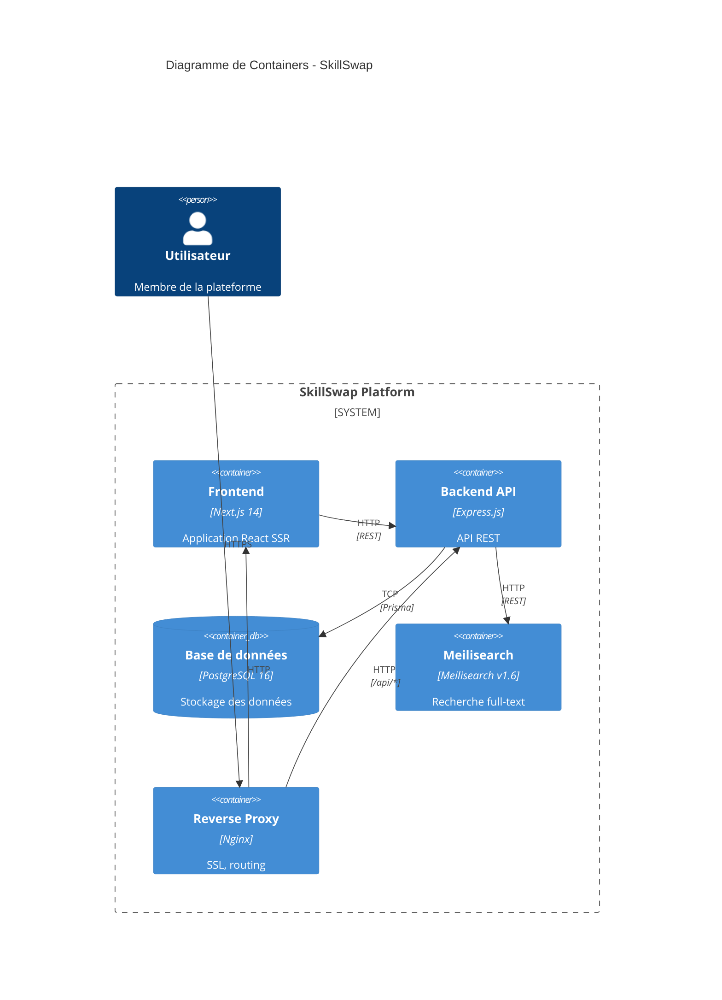

# 5. Vue des Building Blocks

Ce chapitre décrit la décomposition statique du système en blocs de construction (modules, composants, packages) ainsi que leurs dépendances.

---

## Vue d'ensemble (Niveau 1)

---

## Blocs principaux

| Bloc | Technologie | Documentation détaillée |
| ---- | ----------- | ----------------------- |
| **Frontend** | Next.js 14, React 19, TypeScript | [Frontend](./frontend.md) |
| **Backend** | Express.js, Node.js 20 | [Backend](./backend.md) |
| **Base de données** | PostgreSQL 16, Prisma ORM | [Database](./database.md) |

---

## Statistiques du projet

| Métrique | Valeur |
| -------- | ------ |
| Composants React | 57 |
| Hooks personnalisés | 10 |
| Endpoints API | 31 |
| Modèles Prisma | 14 |
| Enums | 4 |

---

## Sous-sections

- [5.2 Frontend](./frontend.md) - Architecture frontend avec Atomic Design (57 composants, 10 hooks)
- [5.3 Backend](./backend.md) - Architecture en couches (routers, controllers, services)
- [5.4 Database](./database.md) - Schéma PostgreSQL avec 14 modèles Prisma

---

## Navigation

| Précédent | Suivant |
| --------- | ------- |
| [4. Stratégie](../04-solution-strategy/index.md) | [6. Runtime](../06-runtime/index.md) |
