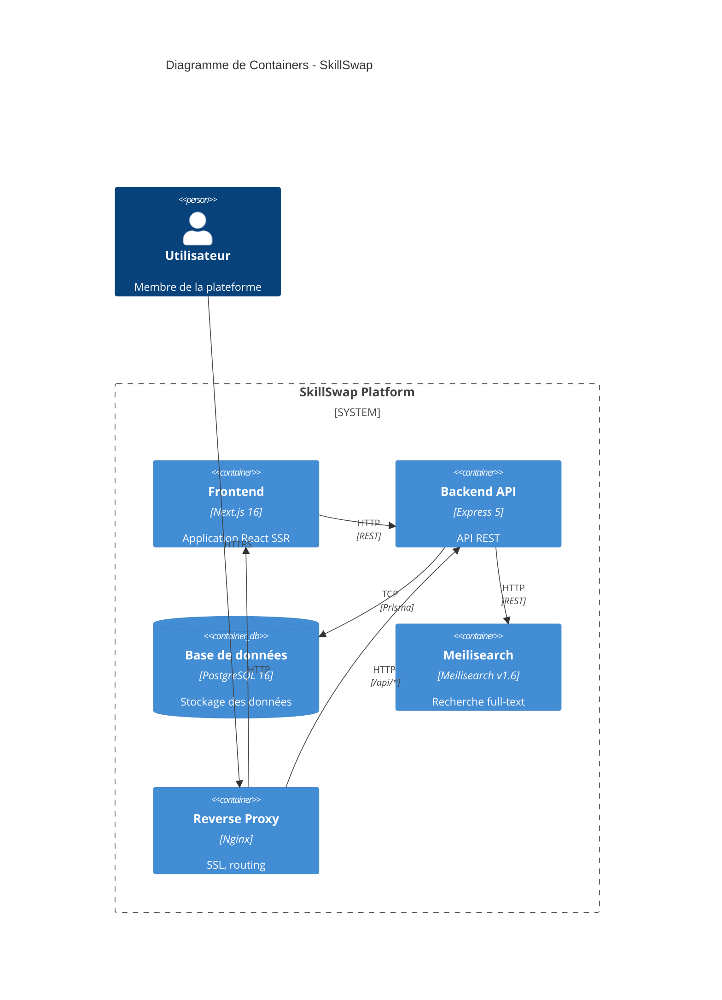

# 5. Vue des Building Blocks

Ce chapitre décrit la décomposition statique du système en blocs de construction (modules, composants, packages) ainsi que leurs dépendances.

---

## Vue d'ensemble (Niveau 1)

```mermaid
C4Container
    title Diagramme de Containers - SkillSwap

    Person(user, "Utilisateur", "Membre de la plateforme")

    System_Boundary(skillswap, "SkillSwap Platform") {
        Container(spa, "Frontend", "Next.js 16", "Application React SSR")
        Container(api, "Backend API", "Express 5", "API REST")
        ContainerDb(db, "Base de données", "PostgreSQL 16", "Stockage des données")
        Container(search, "Meilisearch", "Meilisearch v1.6", "Recherche full-text")
        Container(nginx, "Reverse Proxy", "Nginx", "SSL, routing")
    }

    Rel(user, nginx, "HTTPS")
    Rel(nginx, spa, "HTTP")
    Rel(nginx, api, "HTTP", "/api/*")
    Rel(spa, api, "HTTP", "REST")
    Rel(api, db, "TCP", "Prisma")
    Rel(api, search, "HTTP", "REST")
```

---

## Blocs principaux

| Bloc | Technologie | Documentation détaillée |
| ---- | ----------- | ----------------------- |
| **Frontend** | Next.js 16, React 19, TypeScript 5 | [Frontend](./frontend.md) |
| **Backend** | Express 5, Node.js 24 | [Backend](./backend.md) |
| **Base de données** | PostgreSQL 16, Prisma 7 | [Database](./database.md) |

---

## Statistiques du projet

Snapshot du **2026-05-07**. Source canonique et procédure de rafraîchissement :
[12.4 Stack technique & métriques](../12-glossary/index.md#124-stack-technique--métriques).

| Métrique             | Valeur |
| -------------------- | -----: |
| Composants React     |     58 |
| Hooks personnalisés  |     21 |
| Endpoints HTTP       |     37 |
| Modèles Prisma       |     14 |
| Enums Prisma         |      4 |
| Migrations Prisma    |      6 |

---

## Sous-sections

- [5.2 Frontend](./frontend.md) - Architecture frontend avec Atomic Design (58 composants, 21 hooks)
- [5.3 Backend](./backend.md) - Architecture en couches (routers, controllers, services)
- [5.4 Database](./database.md) - Schéma PostgreSQL avec 14 modèles Prisma

---

## Navigation

| Précédent | Suivant |
| --------- | ------- |
| [4. Stratégie](../04-solution-strategy/index.md) | [6. Runtime](../06-runtime/index.md) |
