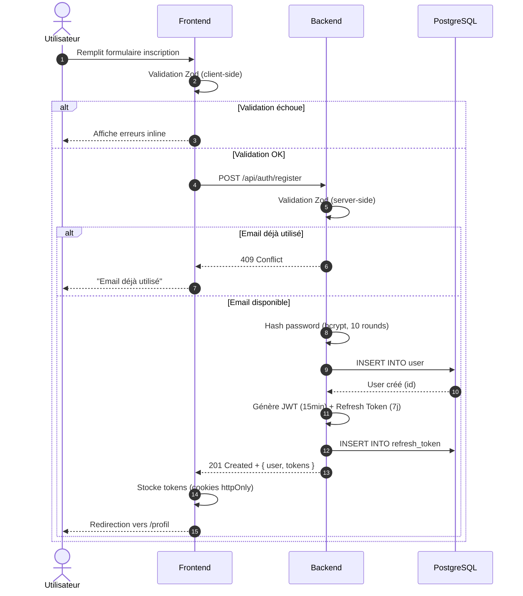
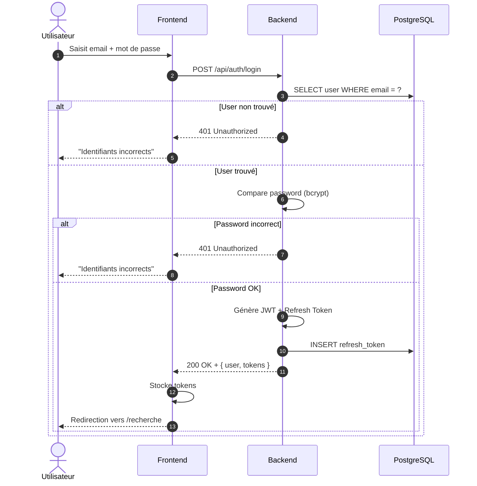
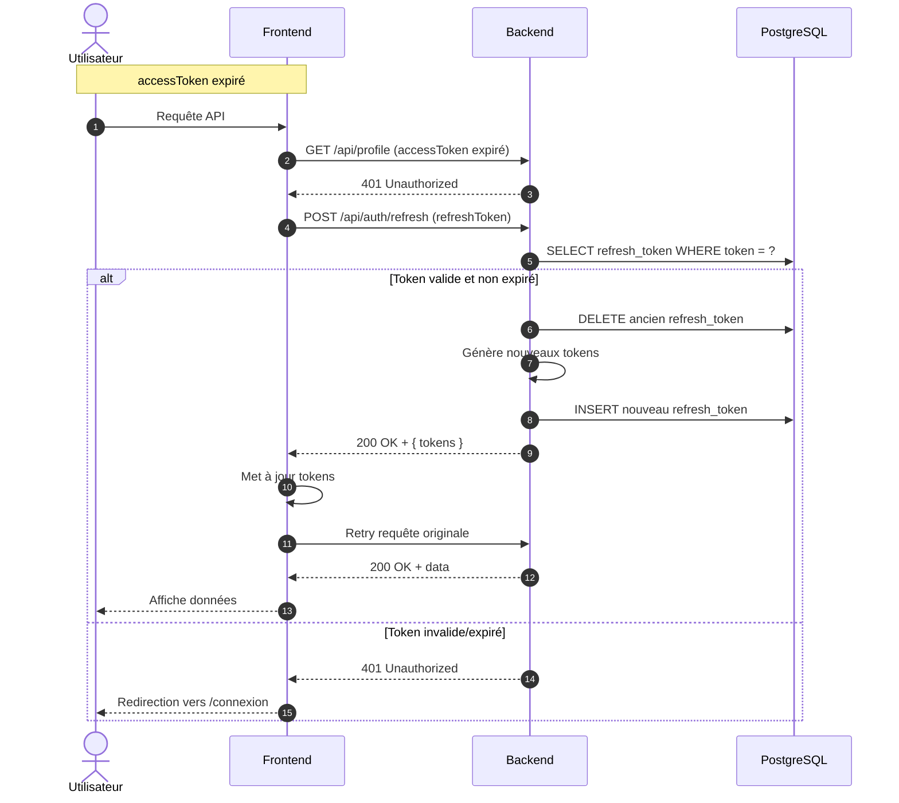
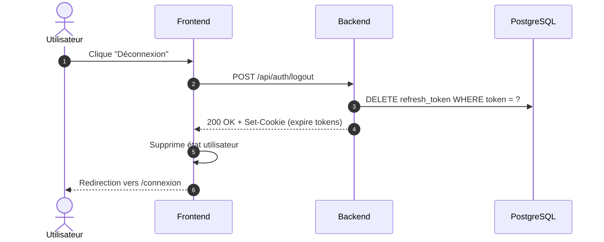

# 6.1 Authentification

## Inscription (Register)

### Points clés

- **Double validation** : Zod côté client ET serveur
- **Hash sécurisé** : bcrypt avec 10 rounds
- **Tokens séparés** : accessToken (15min) + refreshToken (7j)
- **Stockage sécurisé** : Cookies HTTP-only

---

## Connexion (Login)

### Points clés

- **Message d'erreur générique** : "Identifiants incorrects" (ne pas révéler si l'email existe)
- **Génération de tokens** : Nouveaux tokens à chaque connexion
- **Refresh token en BDD** : Pour révocation si nécessaire

---

## Refresh Token

---

## Déconnexion (Logout)

---

[← Retour à l'index](./index.md)
