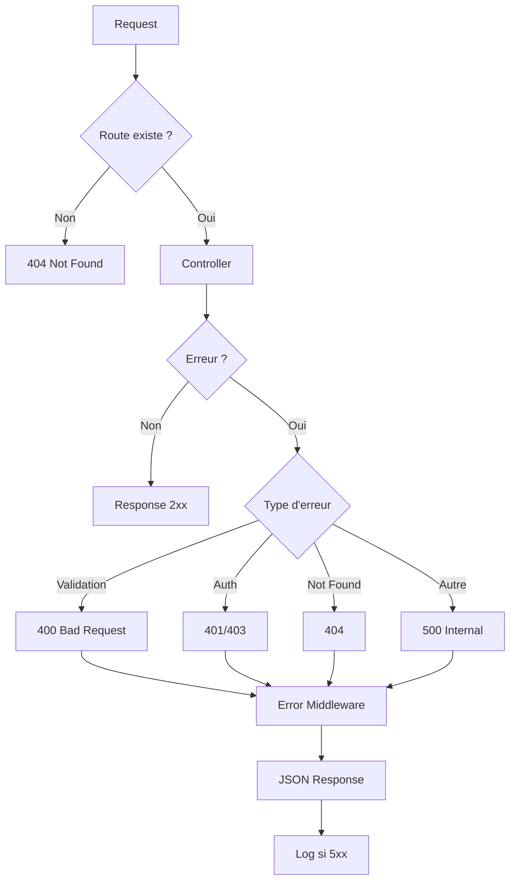

# 6.4 Gestion des erreurs

## Middleware d'erreur



---

## Hiérarchie des erreurs

```typescript
// Base error
class AppError extends Error {
  constructor(
    public statusCode: number,
    public message: string,
    public code?: string
  ) {
    super(message);
  }
}

// Erreurs spécifiques
class ValidationError extends AppError {
  constructor(errors: ZodError) {
    super(400, "Validation failed", "VALIDATION_ERROR");
    this.details = errors.flatten().fieldErrors;
  }
}

class AuthenticationError extends AppError {
  constructor() {
    super(401, "Non authentifié", "AUTH_ERROR");
  }
}

class ForbiddenError extends AppError {
  constructor() {
    super(403, "Accès interdit", "FORBIDDEN");
  }
}

class NotFoundError extends AppError {
  constructor(resource: string) {
    super(404, `${resource} non trouvé`, "NOT_FOUND");
  }
}
```

---

## Format de réponse d'erreur

### Erreur de validation (400)

```json
{
  "success": false,
  "error": {
    "code": "VALIDATION_ERROR",
    "message": "Validation failed",
    "details": {
      "email": ["Email invalide"],
      "password": ["Minimum 8 caractères"]
    }
  }
}
```

### Erreur d'authentification (401)

```json
{
  "success": false,
  "error": {
    "code": "AUTH_ERROR",
    "message": "Non authentifié"
  }
}
```

### Ressource non trouvée (404)

```json
{
  "success": false,
  "error": {
    "code": "NOT_FOUND",
    "message": "Utilisateur non trouvé"
  }
}
```

### Erreur serveur (500)

```json
{
  "success": false,
  "error": {
    "code": "INTERNAL_ERROR",
    "message": "Erreur serveur"
  }
}
```

---

## Implémentation du middleware

```typescript
// middlewares/error.middleware.ts
export const errorMiddleware = (
  error: Error,
  req: Request,
  res: Response,
  next: NextFunction
) => {
  // Erreur applicative connue
  if (error instanceof AppError) {
    return res.status(error.statusCode).json({
      success: false,
      error: {
        code: error.code,
        message: error.message,
        details: error.details,
      },
    });
  }

  // Erreur Zod
  if (error instanceof ZodError) {
    return res.status(400).json({
      success: false,
      error: {
        code: 'VALIDATION_ERROR',
        message: 'Validation failed',
        details: error.flatten().fieldErrors,
      },
    });
  }

  // Erreur inattendue
  console.error('[ERROR]', error);
  return res.status(500).json({
    success: false,
    error: {
      code: 'INTERNAL_ERROR',
      message: 'Erreur serveur',
    },
  });
};
```

---

## Gestion côté frontend

```typescript
// Intercepteur d'erreurs global
const handleApiError = (error: ApiError) => {
  switch (error.code) {
    case 'AUTH_ERROR':
      // Redirection vers login
      router.push('/connexion');
      break;
    case 'VALIDATION_ERROR':
      // Afficher erreurs dans le formulaire
      setFormErrors(error.details);
      break;
    case 'NOT_FOUND':
      // Afficher page 404
      router.push('/404');
      break;
    default:
      // Toast d'erreur générique
      toast.error('Une erreur est survenue');
  }
};
```

---

[← Retour à l'index](./index.md)
