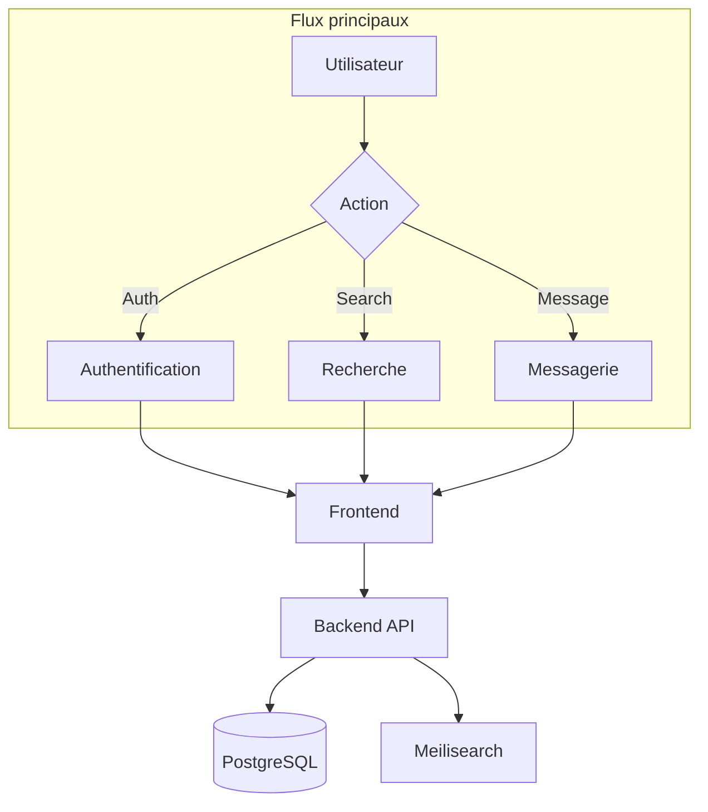

# 6. Vue Runtime

Ce chapitre décrit les principaux scénarios d'exécution du système, illustrant comment les différents composants interagissent lors de cas d'usage typiques.

---

## Scénarios documentés

| Scénario | Description | Lien |
| -------- | ----------- | ---- |
| **Authentification** | Inscription et connexion des utilisateurs | [→](./authentication.md) |
| **Recherche** | Recherche de compétences avec debounce | [→](./search.md) |
| **Messagerie** | Envoi de messages et création de conversations | [→](./messaging.md) |
| **Gestion d'erreurs** | Middleware et flux d'erreurs | [→](./error-handling.md) |

---

## Vue d'ensemble des flux

---

## Participants communs

| Composant | Rôle | Technologies |
| --------- | ---- | ------------ |
| **Frontend** | Interface utilisateur, validation client | Next.js, React, Zod |
| **Backend** | Logique métier, validation serveur | Express.js, Prisma |
| **PostgreSQL** | Persistance des données | PostgreSQL 16 |
| **Meilisearch** | Recherche full-text | Meilisearch v1.6 |

---

## Sous-sections

- [6.1 Authentification](./authentication.md) - Inscription et connexion
- [6.2 Recherche](./search.md) - Recherche avec debounce et Meilisearch
- [6.3 Messagerie](./messaging.md) - Conversations et messages
- [6.4 Gestion d'erreurs](./error-handling.md) - Middleware d'erreur

---

## Navigation

| Précédent | Suivant |
| --------- | ------- |
| [← 5. Building Blocks](../05-building-blocks/index.md) | [7. Déploiement →](../07-deployment/index.md) |
