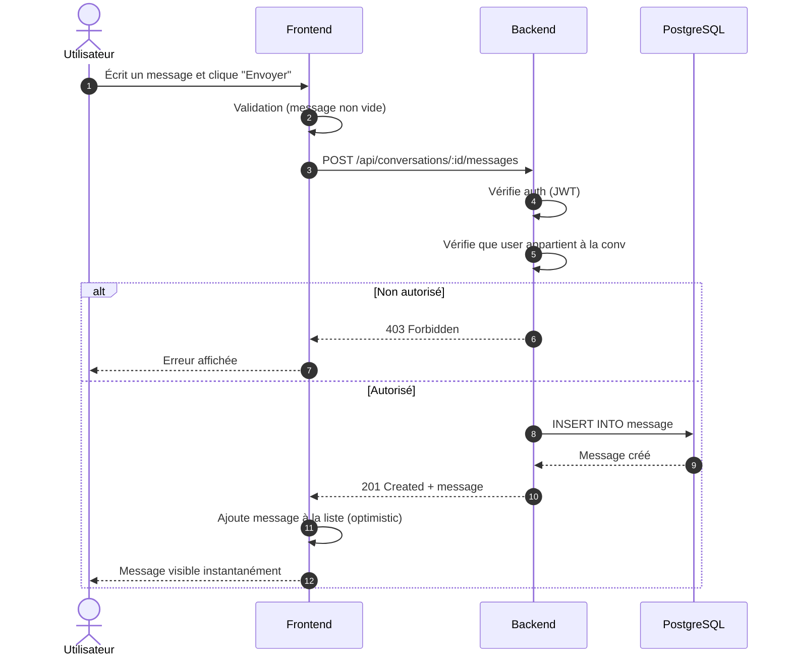
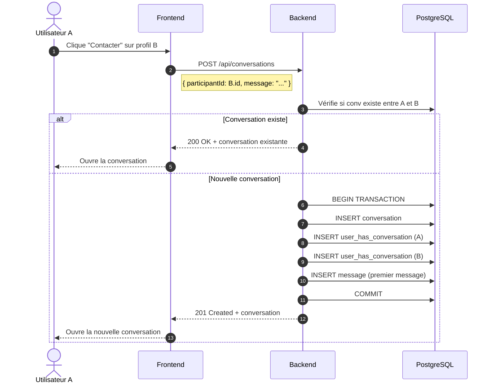
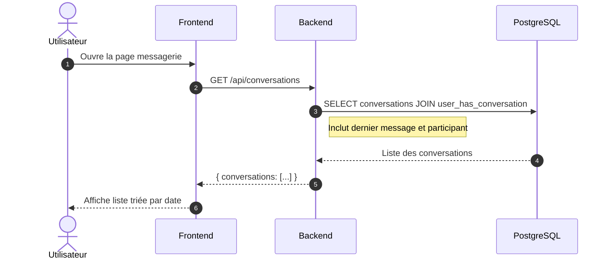

# 6.3 Messagerie

## Envoi d'un message



### Points clés

- **Validation d'autorisation** : Seuls les participants peuvent envoyer
- **Update optimiste** : Message affiché immédiatement côté client
- **Invalidation cache** : TanStack Query invalide la liste des messages

---

## Création d'une conversation



### Points clés

- **Éviter les doublons** : Vérifie si une conversation existe déjà
- **Transaction** : Création atomique (conversation + participants + message)
- **Premier message** : Obligatoire pour créer une conversation

---

## Récupération des conversations



### Données retournées

```typescript
interface ConversationListItem {
  id: number;
  participant: {
    id: number;
    firstname: string;
    avatarUrl: string;
  };
  lastMessage: {
    content: string;
    createdAt: string;
    isOwn: boolean;
  };
  unreadCount: number;
}
```

---

## Hook useMessaging

```typescript
// Facade simplifiant 3 endpoints
export function useMessaging() {
  const conversationsQuery = useQuery({
    queryKey: ['conversations'],
    queryFn: getConversations,
  });

  const sendMessageMutation = useMutation({
    mutationFn: sendMessage,
    onSuccess: () => {
      queryClient.invalidateQueries({ queryKey: ['messages'] });
      queryClient.invalidateQueries({ queryKey: ['conversations'] });
    },
  });

  return {
    conversations: conversationsQuery.data ?? [],
    isLoading: conversationsQuery.isLoading,
    sendMessage: sendMessageMutation.mutate,
    isSending: sendMessageMutation.isPending,
  };
}
```

---

[← Retour à l'index](./index.md)
