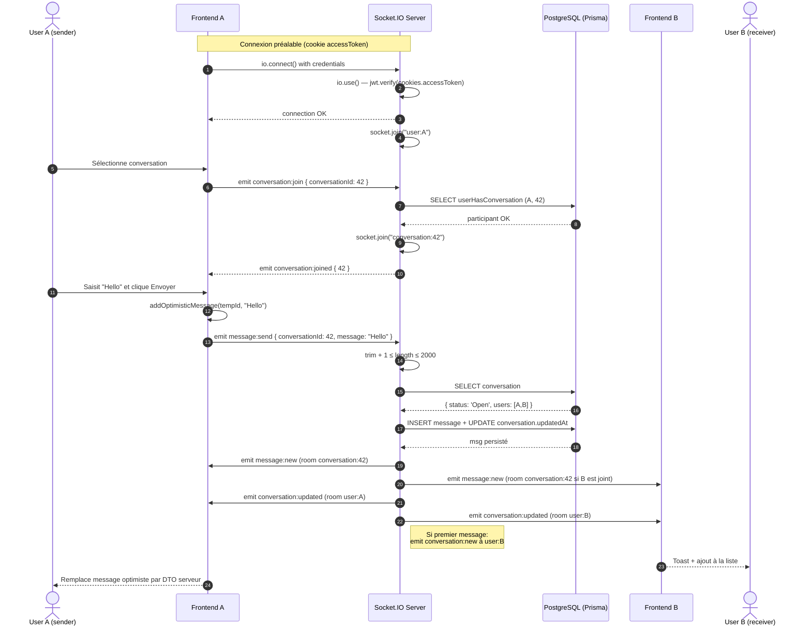

# 6.3 Messagerie

## Vue d'ensemble

SkillSwap utilise une **architecture hybride REST + WebSocket** pour la
messagerie :

- **REST** (`/api/v1/conversations/*`) pour les opérations CRUD non-temps-réel :
  création/listing/lecture/suppression de conversations, listing paginé des
  messages, édition/suppression d'un message.
- **Socket.IO** (`path: /socket.io`) pour les opérations temps réel : envoi
  d'un message, fermeture d'une conversation, et diffusion des notifications
  associées (`message:new`, `conversation:updated`, `conversation:closed`,
  `conversation:new`).

Côté serveur, l'instance Socket.IO est initialisée par `initSocket()` et
montée sur le même serveur HTTP qu'Express
(cf. [`backend/src/realtime/socket.ts`](https://github.com/Squellie/projet-skillswap/blob/main/backend/src/realtime/socket.ts)).
Côté client, un singleton `io()` est exposé par
[`frontend/src/lib/socket-client.ts`](https://github.com/Squellie/projet-skillswap/blob/main/frontend/src/lib/socket-client.ts)
(`autoConnect: false`, `withCredentials: true`).

!!! info "Pourquoi ce choix ?"
    Le REST sert l'état stable (liste des conversations à l'ouverture, pagination
    de l'historique). Socket.IO sert les événements pousés par le serveur
    (nouveau message, conversation fermée, nouvelle conversation reçue) qui
    seraient coûteux à polliner.

---

## Authentification Socket.IO

La connexion Socket.IO est authentifiée via le **même cookie HTTP-only
`accessToken`** que les routes REST. Aucun token n'est passé en query string.

```ts
// backend/src/realtime/socket.ts (extrait, l.88-122)
io.use((socket, next) => {
  const cookieHeader = socket.handshake.headers.cookie ?? '';
  const cookies = cookie.parse(cookieHeader);
  const token = cookies.accessToken;
  if (!token) return next(new Error('Unauthorized'));
  const decoded = jwt.verify(token, secret) as jwt.JwtPayload;
  // accepte id | userId | sub
  socket.data.userId = userId;
  next();
});
```

Le middleware refuse la connexion si :

- aucun cookie `accessToken` n'est présent ;
- le JWT est invalide ou expiré ;
- l'identifiant déchiffré n'est pas un entier positif.

---

## Modèle de rooms

À la connexion, chaque socket rejoint **automatiquement sa room personnelle**
`user:${userId}` (cf. `socket.ts:128`). Cette room sert aux notifications
globales (mise à jour d'une conversation, nouvelle conversation reçue) qui
doivent atteindre l'utilisateur même quand il n'est pas en train de regarder
la conversation concernée.

Une room secondaire `conversation:${conversationId}` est rejointe à la demande
via l'event `conversation:join` ; elle sert à diffuser les nouveaux messages
aux participants **actuellement en train de visualiser** la conversation
(cf. `socket.ts:155` et le helper `room()` l.444).

| Room                          | Membres                                           | Usage                                                |
|-------------------------------|---------------------------------------------------|------------------------------------------------------|
| `user:${userId}`              | Toutes les sockets connectées de l'utilisateur    | `conversation:updated`, `conversation:closed`, `conversation:new` |
| `conversation:${id}`          | Participants ayant émis `conversation:join`       | `message:new`, `conversation:joined`, `conversation:closed` |

---

## Catalogue des events

### Client → Server (4)

| Event                  | Payload                                                  | Validation serveur                                             | Comportement attendu                                              |
|------------------------|----------------------------------------------------------|----------------------------------------------------------------|-------------------------------------------------------------------|
| `conversation:join`    | `{ conversationId: number }`                             | `conversationId` entier > 0 + l'utilisateur est participant    | Rejoint la room `conversation:${id}` puis émet `conversation:joined` |
| `conversation:leave`   | `{ conversationId: number }`                             | `conversationId` entier > 0                                     | Quitte la room `conversation:${id}` (silencieux)                  |
| `message:send`         | `{ conversationId: number, message: string }`            | `conversationId` entier > 0, contenu trim ∈ [1..2000], conversation `Open`, expéditeur participant | Persiste le message, émet `message:new` à la room conversation, émet `conversation:updated` aux user rooms participantes, émet éventuellement `conversation:new` si premier message |
| `conversation:close`   | `{ conversationId: number }`                             | `conversationId` entier > 0 + utilisateur participant           | Passe la conversation à `status='Close'`, émet `conversation:closed` à la room conversation et aux user rooms |

En cas d'échec de validation ou de droits, le serveur émet un event
`error` au seul client émetteur (cf. section suivante).

### Server → Client (6)

| Event                    | Payload                                                                                                                                                                  | Déclencheur                                              | Destinataire (room ciblée)                                       |
|--------------------------|--------------------------------------------------------------------------------------------------------------------------------------------------------------------------|----------------------------------------------------------|-------------------------------------------------------------------|
| `conversation:joined`    | `{ conversationId: number }`                                                                                                                                             | Acquittement après `conversation:join` validé           | Le socket émetteur uniquement                                    |
| `message:new`            | `{ conversationId: number, message: MessageDTO }`                                                                                                                        | Persistance d'un message via `message:send`             | Room `conversation:${id}`                                        |
| `conversation:updated`   | `{ conversationId: number, lastMessage: MessageDTO }`                                                                                                                    | Persistance d'un message (mise à jour `lastMessage`)    | Toutes les rooms `user:${participantId}` (chaque participant)    |
| `conversation:closed`    | `{ conversationId: number, closedBy: { id, firstname, lastname } \| null }`                                                                                              | `conversation:close` validé                             | Room `conversation:${id}` **et** chaque `user:${participantId}` |
| `conversation:new`       | `{ conversation: { id, title, status, participant: { id, firstname, lastname, avatarUrl?, isFollowing, isRated }, lastMessage: MessageDTO } }`                           | Premier message envoyé dans une conversation            | Room `user:${receiverId}` (destinataire uniquement)              |
| `error`                  | `{ code: 'FORBIDDEN' \| 'VALIDATION', message: string }`                                                                                                                  | Validation/droits KO sur un event entrant               | Le socket émetteur uniquement                                    |

Le DTO message émis sur le réseau est unifié :

```ts
// backend/src/realtime/socket.ts (l.62-72)
type MessageDTO = {
  id: number;
  sender?: {
    id: number;
    firstname: string;
    lastname: string;
    avatarUrl?: string;
  };
  content: string;
  timestamp: string; // ISO 8601
};
```

---

## Diagramme de séquence — envoi d'un message


```mermaid
sequenceDiagram
    autonumber
    actor UA as User A (sender)
    participant FA as Frontend A
    participant SS as Socket.IO Server
    participant DB as PostgreSQL (Prisma)
    participant FB as Frontend B
    actor UB as User B (receiver)

    Note over FA,SS: Connexion préalable (cookie accessToken)
    FA->>SS: io.connect() with credentials
    SS->>SS: io.use() — jwt.verify(cookies.accessToken)
    SS-->>FA: connection OK
    SS->>SS: socket.join("user:A")

    UA->>FA: Sélectionne conversation #42
    FA->>SS: emit conversation:join { conversationId: 42 }
    SS->>DB: SELECT userHasConversation (A, 42)
    DB-->>SS: participant OK
    SS->>SS: socket.join("conversation:42")
    SS-->>FA: emit conversation:joined { 42 }

    UA->>FA: Saisit "Hello" et clique Envoyer
    FA->>FA: addOptimisticMessage(tempId, "Hello")
    FA->>SS: emit message:send { conversationId: 42, message: "Hello" }
    SS->>SS: trim + 1 ≤ length ≤ 2000
    SS->>DB: SELECT conversation #42 + participants + _count
    DB-->>SS: { status: 'Open', users: [A,B] }
    SS->>DB: INSERT message + UPDATE conversation.updatedAt
    DB-->>SS: msg persisté
    SS->>FA: emit message:new (room conversation:42)
    SS->>FB: emit message:new (room conversation:42 si B est joint)
    SS->>FA: emit conversation:updated (room user:A)
    SS->>FB: emit conversation:updated (room user:B)
    Note right of SS: Si premier message:<br/>emit conversation:new à user:B
    FB-->>UB: Toast + ajout à la liste
    FA-->>UA: Remplace message optimiste par DTO serveur
```

---

## Endpoints REST conservés

Les endpoints REST du module conversation (préfixe
`/api/v1/conversations`) restent indispensables aux opérations qui ne
relèvent pas du temps réel. Routage défini dans
[`backend/src/routers/conv.router.ts`](https://github.com/Squellie/projet-skillswap/blob/main/backend/src/routers/conv.router.ts).

| Méthode | Chemin                                  | Rôle                                                          | Notes                                                              |
|---------|-----------------------------------------|---------------------------------------------------------------|--------------------------------------------------------------------|
| GET     | `/api/v1/conversations`                 | Liste des conversations de l'utilisateur authentifié          | Rendu initial de la page messagerie                                |
| POST    | `/api/v1/conversations`                 | Création d'une conversation (sans premier message)            | Middleware `requireSimpleFollow` (A doit suivre B)                 |
| GET     | `/api/v1/conversations/:id`             | Détail d'une conversation                                     | Voir aussi `GET /:id/messages` pour l'historique paginé            |
| DELETE  | `/api/v1/conversations/:id`             | Quitte/supprime la conversation pour l'utilisateur            | Service `leaveConversationService`                                 |
| GET     | `/api/v1/conversations/:id/messages`    | Historique paginé avec `cursor` + `limit`                     | Cursor-based pagination ; appelé au scroll-up depuis le frontend   |
| POST    | `/api/v1/conversations/:id/messages`    | Création d'un message en REST                                  | **Doublon legacy** : le frontend prod envoie via Socket.IO `message:send`. Conservé pour clients tiers / scripts d'admin |
| PATCH   | `/api/v1/conversations/:id/message/:mid`| Édition du contenu d'un message                                | Pas exposé en Socket.IO                                            |
| DELETE  | `/api/v1/conversations/:id/message/:mid`| Suppression d'un message                                       | Pas exposé en Socket.IO                                            |
| PATCH   | `/api/v1/conversations/:id/close`       | Ferme la conversation (passage `status='Close'`)               | Doublon de l'event Socket.IO `conversation:close` ; le frontend prod utilise l'event. Conservé pour parité API |

!!! warning "Dette technique — doublons REST/Socket"
    `POST /api/v1/conversations/:id/messages` et `PATCH /:id/close` existent
    en REST mais le frontend de production utilise les events Socket.IO
    correspondants (`message:send`, `conversation:close`). Ces doublons sont
    conservés pour la parité d'API et l'intégration de clients tiers, mais ne
    constituent pas le chemin chaud côté UI.

---

## Côté frontend — composition de hooks

Le module messagerie ne s'appuie sur aucune librairie de cache de requêtes
(pas de TanStack Query, pas de Redux). Il repose sur une **composition de
hooks React natifs** (`useState`, `useEffect`, `useCallback`, `useRef`,
`AbortController` pour les fetchs cancellables).

Le point d'entrée est la façade
[`useMessaging`](https://github.com/Squellie/projet-skillswap/blob/main/frontend/src/hooks/useMessaging.ts)
qui compose six hooks spécialisés :

```ts
// frontend/src/hooks/useMessaging.ts (extrait simplifié)
export function useMessaging() {
  const { conversations, addConversation,
          updateConversationLastMessage,
          updateConversationStatus, ... }    = useConversationList();
  const { selectedConvId, selectedConv, ... } = useSelectedConversation(conversations);
  const { messages, hasMore, loadMore, ... }  = useConversationMessages({
    conversationId: selectedConvId, limit: 30,
  });
  const { followedUsers, fetchFollowedUsers } = useFollowedUsers();
  const { onConversationUpdate,
          onConversationClosed,
          onConversationNew }                 = useGlobalSocket();
  const actions                               = useConversationActions({ /* ... */ });
  return { conversations, selectedConv, messages, ...actions };
}
```

| Hook                              | Fichier                                            | Rôle                                                                |
|-----------------------------------|----------------------------------------------------|---------------------------------------------------------------------|
| `useConversationList`             | `hooks/messaging/useConversationList.ts`           | Charge la liste, expose mutateurs (`addConversation`, `updateConversationLastMessage`, etc.) |
| `useSelectedConversation`         | `hooks/messaging/useSelectedConversation.ts`       | Mémorise l'id sélectionné, dérive l'objet conversation depuis la liste |
| `useConversationMessages`         | `hooks/messaging/useConversationMessages.ts`       | Pagination cursor-based, optimistic UI (ajout temporaire avant DTO serveur) |
| `useFollowedUsers`                | `hooks/messaging/useFollowedUsers.ts`              | Liste des utilisateurs suivis (pour la création de nouvelle conversation) |
| `useGlobalSocket`                 | `hooks/messaging/useGlobalSocket.ts` (95 LOC)      | Listeners globaux : `conversation:updated`, `conversation:closed`, `conversation:new` |
| `useConversationActions`          | `hooks/messaging/useConversationActions.ts` (185 LOC) | Handlers UI ; instancie `useSocket(selectedConvId)` pour `message:send` et `conversation:close` |

`useSocket(conversationId)`
([`hooks/useSocket.ts`](https://github.com/Squellie/projet-skillswap/blob/main/frontend/src/hooks/useSocket.ts), 136 LOC) gère :

- la connexion paresseuse au socket singleton (`socket.connect()` si non connecté) ;
- l'émission `conversation:join` à l'entrée et `conversation:leave` au cleanup
  (cf. `useSocket.ts:38-90`) ;
- l'enregistrement scopé des listeners `message:new`, `conversation:updated`,
  `conversation:closed`, `error` filtrés par `conversationId`.

### Optimistic UI

`handleSendMessage` (cf.
[`useConversationActions.ts:100-118`](https://github.com/Squellie/projet-skillswap/blob/main/frontend/src/hooks/messaging/useConversationActions.ts))
ajoute le message à l'état local avec un `tempId` négatif (`-Date.now()`) avant
l'aller-retour serveur. Quand le serveur émet `message:new`, le hook ignore
l'event si `sender.id === user.id` (évite la duplication avec l'optimistic
déjà inséré par `addOptimisticMessage`). Le DTO « définitif » remplace le
message optimiste lorsque le serveur répond — le filtre `tempId < 0` permet
de l'identifier dans la liste.

---

## Sécurité Socket.IO

| Contrôle                                       | Emplacement                                  | Comportement                                    |
|------------------------------------------------|----------------------------------------------|-------------------------------------------------|
| Authentification par cookie HTTP-only          | `socket.ts:88-122` (`io.use`)                | Refuse la connexion si JWT absent/invalide      |
| Vérification participant à `conversation:join` | `socket.ts:135-152`                          | Émet `error: FORBIDDEN` si non participant      |
| Vérification participant à `message:send`      | `socket.ts:222-230`                          | Émet `error: FORBIDDEN` si non participant      |
| Vérification participant à `conversation:close`| `socket.ts:361-390`                          | Émet `error: FORBIDDEN` si conversation introuvable pour ce user |
| Validation longueur message                    | `socket.ts:180-186`                          | Trim puis `1 ≤ length ≤ 2000`, sinon `error: VALIDATION` |
| Refus d'envoi si conversation fermée           | `socket.ts:214-220`                          | `error: FORBIDDEN — Conversation closed`        |

Les events `error` côté serveur n'utilisent que **deux codes** : `FORBIDDEN`
et `VALIDATION` (cf. type `ServerToClientEvents.error` dans
`socket.ts:56-59`). Toute évolution doit étendre cette union.

---

[← Retour à l'index](./index.md)
