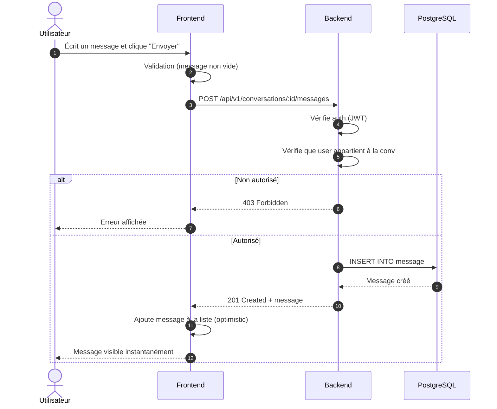
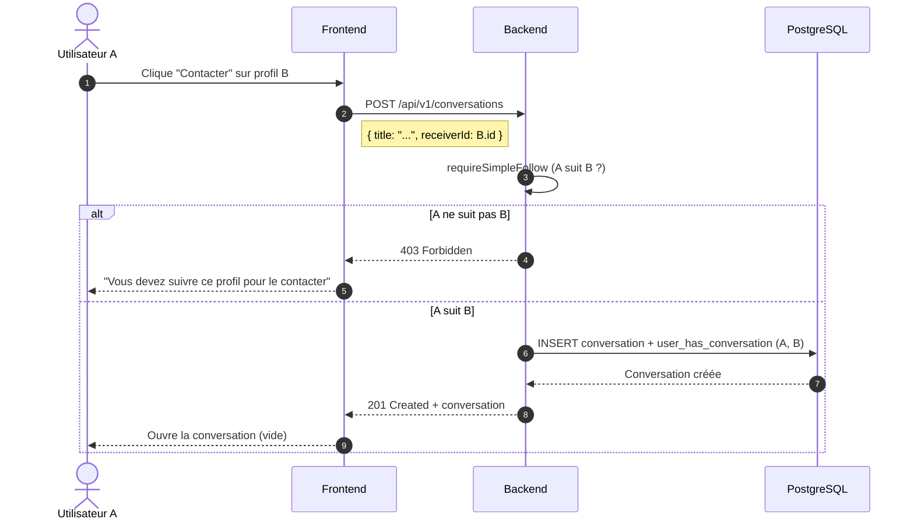
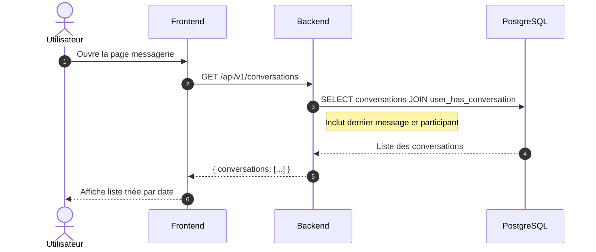

# 6.3 Messagerie

## Envoi d'un message


```mermaid
sequenceDiagram
    autonumber
    actor U as Utilisateur
    participant F as Frontend
    participant B as Backend
    participant DB as PostgreSQL

    U->>F: Écrit un message et clique "Envoyer"
    F->>F: Validation (message non vide)
    F->>B: POST /api/v1/conversations/:id/messages
    B->>B: Vérifie auth (JWT)
    B->>B: Vérifie que user appartient à la conv
    alt Non autorisé
        B-->>F: 403 Forbidden
        F-->>U: Erreur affichée
    else Autorisé
        B->>DB: INSERT INTO message
        DB-->>B: Message créé
        B-->>F: 201 Created + message
        F->>F: Ajoute message à la liste (optimistic)
        F-->>U: Message visible instantanément
    end
```

### Points clés

- **Validation d'autorisation** : Seuls les participants peuvent envoyer
- **Update optimiste** : Message affiché immédiatement côté client
- **Invalidation cache** : TanStack Query invalide la liste des messages

---

## Création d'une conversation


```mermaid
sequenceDiagram
    autonumber
    actor U as Utilisateur A
    participant F as Frontend
    participant B as Backend
    participant DB as PostgreSQL

    U->>F: Clique "Contacter" sur profil B
    F->>B: POST /api/v1/conversations
    Note right of F: { title: "...", receiverId: B.id }
    B->>B: requireSimpleFollow (A suit B ?)
    alt A ne suit pas B
        B-->>F: 403 Forbidden
        F-->>U: "Vous devez suivre ce profil pour le contacter"
    else A suit B
        B->>DB: INSERT conversation + user_has_conversation (A, B)
        DB-->>B: Conversation créée
        B-->>F: 201 Created + conversation
        F-->>U: Ouvre la conversation (vide)
    end
```

### Points clés

- **Validation du follow** : Le créateur doit suivre le destinataire (middleware `requireSimpleFollow`, vérification unidirectionnelle A → B). 403 Forbidden si non.
- **Validation Zod** : `CreateConversationSchema` valide `{ title: string (1-256), receiverId: number }`. Aucun champ `message` ou `content` au moment de la création.
- **Pas de premier message inclus** : La création de conversation crée la conversation + le rattachement des deux participants, mais **pas** de message. L'envoi du premier message se fait via un appel séparé `POST /api/v1/conversations/:id/messages` (cf. section "Envoi d'un message" plus haut).

---

## Récupération des conversations


```mermaid
sequenceDiagram
    autonumber
    actor U as Utilisateur
    participant F as Frontend
    participant B as Backend
    participant DB as PostgreSQL

    U->>F: Ouvre la page messagerie
    F->>B: GET /api/v1/conversations
    B->>DB: SELECT conversations JOIN user_has_conversation
    Note right of B: Inclut dernier message et participant
    DB-->>B: Liste des conversations
    B-->>F: { conversations: [...] }
    F-->>U: Affiche liste triée par date
```

### Données retournées

```typescript
interface ConversationListItem {
  id: number;
  participant: {
    id: number;
    firstname: string;
    avatarUrl: string;
  };
  lastMessage: {
    content: string;
    createdAt: string;
    isOwn: boolean;
  };
  unreadCount: number;
}
```

---

## Hook useMessaging

```typescript
// Facade simplifiant 3 endpoints
export function useMessaging() {
  const conversationsQuery = useQuery({
    queryKey: ['conversations'],
    queryFn: getConversations,
  });

  const sendMessageMutation = useMutation({
    mutationFn: sendMessage,
    onSuccess: () => {
      queryClient.invalidateQueries({ queryKey: ['messages'] });
      queryClient.invalidateQueries({ queryKey: ['conversations'] });
    },
  });

  return {
    conversations: conversationsQuery.data ?? [],
    isLoading: conversationsQuery.isLoading,
    sendMessage: sendMessageMutation.mutate,
    isSending: sendMessageMutation.isPending,
  };
}
```

---

[← Retour à l'index](./index.md)
