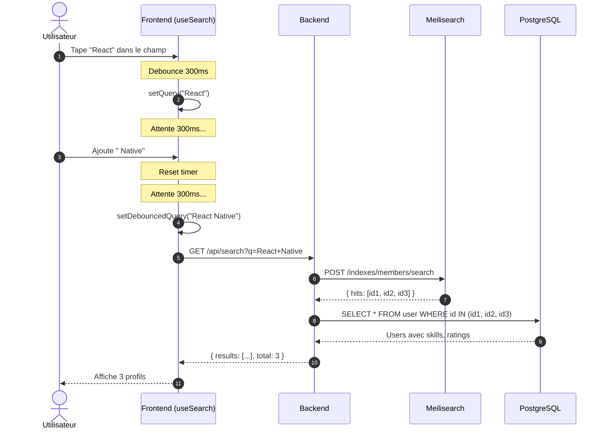
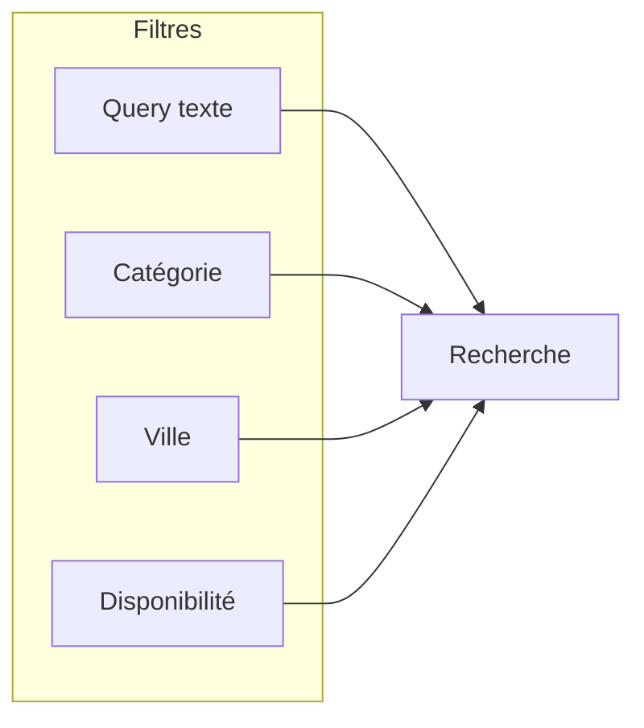

# 6.2 Recherche de compétences

## Flow de recherche avec debounce



---

## Hook useSearch

```typescript
// Simplifié pour illustration
function useSearch(initialQuery = '', debounceMs = 300) {
  const [query, setQuery] = useState(initialQuery);
  const [debouncedQuery, setDebouncedQuery] = useState(query);

  // Debounce effect
  useEffect(() => {
    const timer = setTimeout(() => {
      setDebouncedQuery(query);
    }, debounceMs);
    return () => clearTimeout(timer);
  }, [query, debounceMs]);

  // Fetch effect
  const { data, isLoading } = useQuery({
    queryKey: ['search', debouncedQuery],
    queryFn: () => searchMembers(debouncedQuery),
    enabled: debouncedQuery.length > 0,
  });

  return { query, setQuery, results: data, isLoading };
}
```

---

## Points clés

| Aspect | Implémentation |
| ------ | -------------- |
| **Debounce** | 300ms pour éviter les requêtes inutiles |
| **Meilisearch** | Recherche full-text avec typo-tolerance |
| **Hydratation** | IDs de Meilisearch → données complètes de PostgreSQL |
| **Cache** | TanStack Query avec staleTime de 5 minutes |

---

## Filtres disponibles



| Filtre | Paramètre | Exemple |
| ------ | --------- | ------- |
| Texte libre | `q` | `React Native` |
| Catégorie | `categoryId` | `1` (Développement) |
| Ville | `city` | `Paris` |
| Disponibilité | `available` | `true` |

---

[← Retour à l'index](./index.md)
