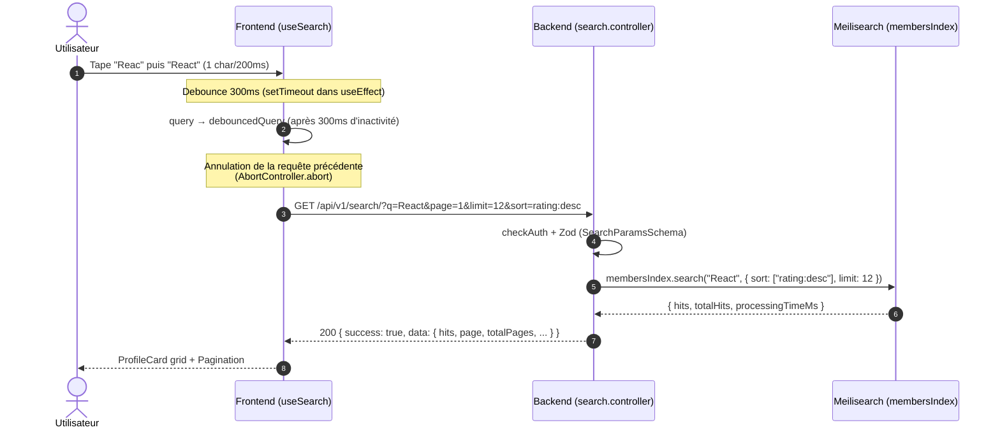

# 6.2 Recherche de membres

## Vue d'ensemble

La recherche full-text de membres combine :

- côté **frontend**, le hook
  [`useSearch`](https://github.com/Sojeremy/documentation-skillswap/blob/main/frontend/src/hooks/useSearch.ts)
  (202 LOC, **hooks React natifs uniquement** — pas de librairie de cache),
  qui gère debounce, pagination, filtre par catégorie et annulation des
  requêtes obsolètes via `AbortController` ;
- côté **backend**, le contrôleur `searchController` →
  `getUserSearchService` qui interroge **Meilisearch** (`membersIndex.search`)
  et renvoie un DTO paginé.


```mermaid
sequenceDiagram
    autonumber
    actor U as Utilisateur
    participant F as Frontend (useSearch)
    participant B as Backend (search.controller)
    participant MS as Meilisearch (membersIndex)

    U->>F: Tape "Reac" puis "React" (1 char/200ms)
    Note over F: Debounce 300ms (setTimeout dans useEffect)
    F->>F: query → debouncedQuery (après 300ms d'inactivité)
    Note over F: Annulation de la requête précédente<br/>(AbortController.abort)
    F->>B: GET /api/v1/search/?q=React&page=1&limit=12&sort=rating:desc
    B->>B: checkAuth + Zod (SearchParamsSchema)
    B->>MS: membersIndex.search("React", { sort: ["rating:desc"], limit: 12 })
    MS-->>B: { hits, totalHits, processingTimeMs }
    B-->>F: 200 { success: true, data: { hits, page, totalPages, ... } }
    F-->>U: ProfileCard grid + Pagination
```

---

## Côté frontend — hook `useSearch`

`useSearch` n'utilise **aucune** librairie de cache de requêtes (cf.
[ADR-004](../09-decisions/004-tanstack-query.md)). Il s'appuie sur :

- `useState` pour `query`, `debouncedQuery`, `category`, `page`, `results`,
  `isLoading` ;
- `useEffect` pour le debounce (`setTimeout` cancellé au cleanup) et pour
  l'appel API quand `debouncedQuery`/`category`/`page` changent ;
- `useRef<AbortController>` pour annuler la requête en cours dès qu'une
  nouvelle frappe arrive ;
- `useCallback` pour stabiliser les setters exposés (`setQuery`,
  `setCategory`).

### Extrait représentatif

```ts
// frontend/src/hooks/useSearch.ts (extrait simplifié — voir source pour le détail)
export function useSearch(options: UseSearchOptions = {}) {
  const { debounceMs = 300, limit = 12, minChars = 3 } = options;
  const [query, setQuery] = useState('');
  const [debouncedQuery, setDebouncedQuery] = useState('');
  const [category, setCategory] = useState<string | null>(null);
  const [page, setPage] = useState(1);
  const [results, setResults] = useState<SearchResults | null>(null);
  const [isLoading, setIsLoading] = useState(false);
  const abortControllerRef = useRef<AbortController | null>(null);

  // Debounce manuel (300ms par défaut)
  useEffect(() => {
    const shouldDebounce = query.length >= minChars || query.length === 0;
    if (!shouldDebounce) return;
    const timer = setTimeout(() => setDebouncedQuery(query), debounceMs);
    return () => clearTimeout(timer);
  }, [query, debounceMs, minChars]);

  // Fetch + cancel-on-unmount/replay
  useEffect(() => {
    const performSearch = async () => {
      abortControllerRef.current?.abort();
      abortControllerRef.current = new AbortController();
      setIsLoading(true);
      try {
        const response = await api.searchMembers({
          q: debouncedQuery,
          category: category ?? undefined,
          page, limit,
        });
        setResults(response.data!);
      } catch (err) {
        logError(err);
        toast.error('Une erreur est survenue');
      } finally {
        setIsLoading(false);
      }
    };
    performSearch();
  }, [debouncedQuery, category, page, limit, minChars]);

  return { query, setQuery, category, setCategory, page, setPage, results, isLoading };
}
```

### Composants UI consommateurs

L'organism `SearchPage` compose les sous-composants suivants (cf.
`frontend/src/components/organisms/SearchPage/`) :

| Composant                | Rôle                                                                    |
|--------------------------|-------------------------------------------------------------------------|
| `SearchBar.tsx`          | Champ texte, binding sur `query` → `setQuery`                           |
| `CategoryFilter.tsx`     | Sélecteur de catégorie, binding sur `category` → `setCategory`          |
| `SearchResults.tsx`      | Grille de `ProfileCard` + composant `Pagination` (`molecules/`)         |
| `SearchResultSkeleton.tsx` | Squelette d'attente (affiché pendant `isLoading`)                     |

---

## Côté backend — Meilisearch via `membersIndex`

Routage : `GET /api/v1/search/` (cf.
[`search.router.ts`](https://github.com/Sojeremy/documentation-skillswap/blob/main/backend/src/routers/search.router.ts), 2 routes).

| Étape                                | Emplacement                                              |
|--------------------------------------|----------------------------------------------------------|
| `checkAuth`                          | `backend/src/middlewares/auth.middleware.ts`             |
| Validation `SearchParamsSchema`      | `backend/src/validation/search.validation.ts`            |
| Contrôleur `getUserSearch`           | `backend/src/controllers/search.controller.ts`           |
| Service `getUserSearchService`       | `backend/src/services/search.service.ts:30+`             |
| Appel `membersIndex.search()`        | `backend/src/services/search.service.ts:49`              |
| Index Meilisearch `membersIndex`     | `backend/src/lib/mailisearch.ts`                         |

L'indexation est alimentée :

- en temps réel par `services/profile.service.ts` (réindex sur add/delete
  profil/skills/rating) via `mappers/member.mapper.ts:userToDocument` ;
- en batch par le script CLI `backend/src/scripts/reindex-search.ts`
  (cf. [`05-building-blocks/backend.md`](../05-building-blocks/backend.md)
  section *Module : `scripts/`*).

---

## Filtres disponibles

| Filtre        | Paramètre   | Exemple             | Notes                                                             |
|---------------|-------------|---------------------|-------------------------------------------------------------------|
| Texte libre   | `q`         | `React`             | Optionnel, full-text Meilisearch (typo-tolérant)                  |
| Catégorie     | `category`  | `informatique`      | **Slug** Meilisearch (filtre `categorySlugs = "<slug>"`)          |
| Pagination    | `page`      | `1`                 | Optionnel, défaut 1 (clamped à `Math.max(1, page)`)               |
| Limite        | `limit`     | `20`                | Optionnel, défaut 12, max 50 (`Math.min(50, Math.max(1, limit))`) |
| Tri           | `sort`      | `rating:desc`       | Optionnel, défaut `rating:desc`                                   |

!!! note "Source de vérité — paramètres"
    Validateur Zod : `SearchParamsSchema` dans
    `backend/src/validation/search.validation.ts`. Les paramètres `city` et
    `available` mentionnés dans des itérations antérieures de la doc
    **ne sont pas implémentés** en prod.

---

## Pourquoi pas TanStack Query ?

Cette architecture s'appuie sur des hooks natifs et `AbortController` plutôt
qu'une librairie de cache de requêtes. Les raisons (bundle, double emploi
avec Socket.IO, courbe d'apprentissage) sont détaillées dans
[ADR-004](../09-decisions/004-tanstack-query.md).

L'optimisation principale (annulation de requête sur frappe rapide) est
**native** au pattern `AbortController` et n'a pas besoin d'une lib externe.

---

[← Retour à l'index](./index.md)
