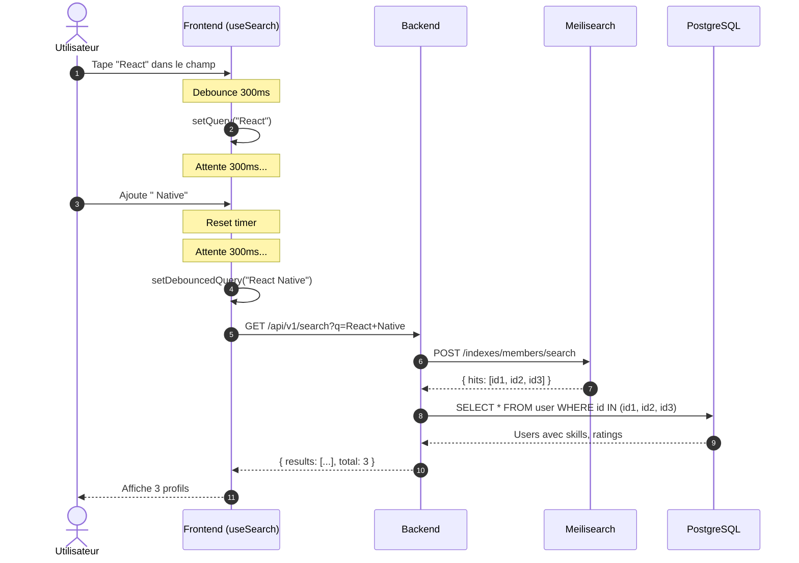
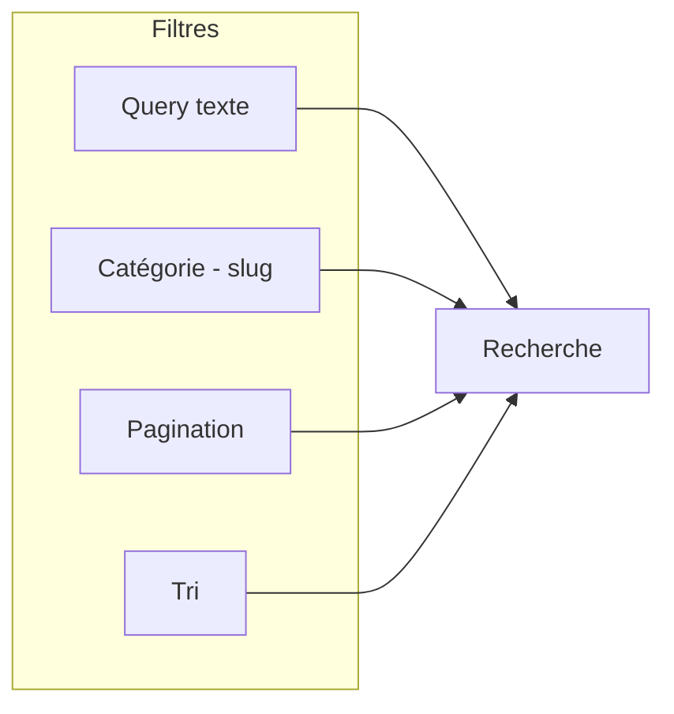

# 6.2 Recherche de compétences

## Flow de recherche avec debounce


```mermaid
sequenceDiagram
    autonumber
    actor U as Utilisateur
    participant F as Frontend (useSearch)
    participant B as Backend
    participant MS as Meilisearch
    participant DB as PostgreSQL

    U->>F: Tape "React" dans le champ
    Note over F: Debounce 300ms
    F->>F: setQuery("React")
    Note over F: Attente 300ms...
    U->>F: Ajoute " Native"
    Note over F: Reset timer
    Note over F: Attente 300ms...
    F->>F: setDebouncedQuery("React Native")
    F->>B: GET /api/v1/search?q=React+Native
    B->>MS: POST /indexes/members/search
    MS-->>B: { hits: [id1, id2, id3] }
    B->>DB: SELECT * FROM user WHERE id IN (id1, id2, id3)
    DB-->>B: Users avec skills, ratings
    B-->>F: { results: [...], total: 3 }
    F-->>U: Affiche 3 profils
```

---

## Hook useSearch

```typescript
// Simplifié pour illustration
function useSearch(initialQuery = '', debounceMs = 300) {
  const [query, setQuery] = useState(initialQuery);
  const [debouncedQuery, setDebouncedQuery] = useState(query);

  // Debounce effect
  useEffect(() => {
    const timer = setTimeout(() => {
      setDebouncedQuery(query);
    }, debounceMs);
    return () => clearTimeout(timer);
  }, [query, debounceMs]);

  // Fetch effect
  const { data, isLoading } = useQuery({
    queryKey: ['search', debouncedQuery],
    queryFn: () => searchMembers(debouncedQuery),
    enabled: debouncedQuery.length > 0,
  });

  return { query, setQuery, results: data, isLoading };
}
```

---

## Points clés

| Aspect | Implémentation |
| ------ | -------------- |
| **Debounce** | 300ms pour éviter les requêtes inutiles |
| **Meilisearch** | Recherche full-text avec typo-tolerance |
| **Hydratation** | IDs de Meilisearch → données complètes de PostgreSQL |
| **Cache** | TanStack Query avec staleTime de 5 minutes |

---

## Filtres disponibles


```mermaid
graph LR
    subgraph "Filtres"
        A[Query texte]
        B[Catégorie - slug]
        C[Pagination]
        D[Tri]
    end

    A --> E[Recherche]
    B --> E
    C --> E
    D --> E
```

| Filtre | Paramètre | Exemple | Notes |
| ------ | --------- | ------- | ----- |
| Texte libre | `q` | `React Native` | Optionnel, full-text Meilisearch |
| Catégorie | `category` | `dev-web` | **Slug** (pas l'id) ; cf. fiche `models/category.md` pour la liste des slugs |
| Pagination | `page` | `1` | Optionnel, entier |
| Limite | `limit` | `20` | Optionnel, entier |
| Tri | `sort` | `rating:desc` | Optionnel |

!!! note "Source de vérité"
    Validateur Zod : `SearchParamsSchema` (`backend/src/validation/search.validation.ts`). Les paramètres `city` et `available` mentionnés dans des itérations antérieures de cette doc **ne sont pas implémentés** en prod.

---

[← Retour à l'index](./index.md)
