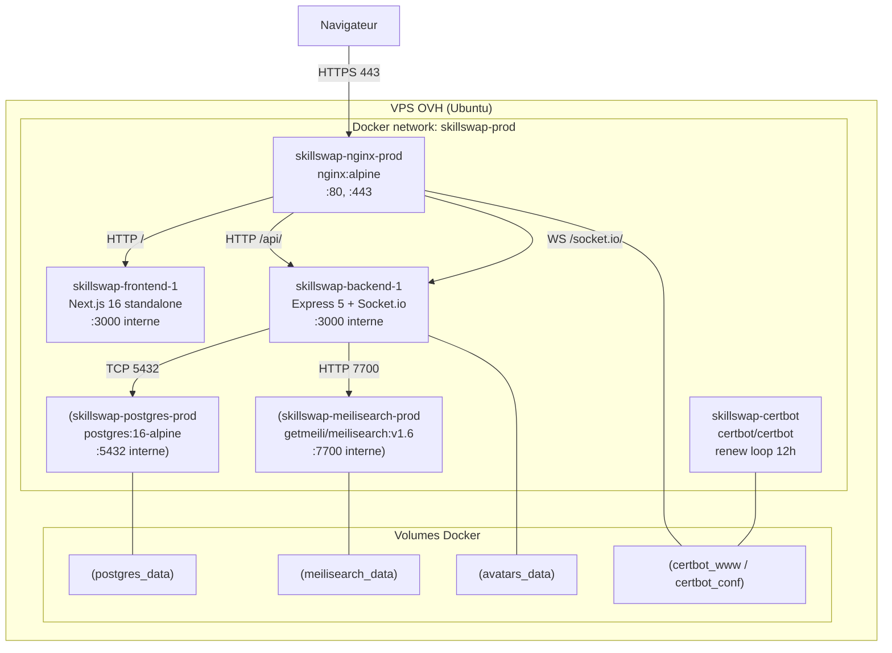

# 7. Vue Déploiement

Cette page décrit l'**état réel** de la production SkillSwap au **2026-05-07** :
hébergement, topologie Docker, pipeline CI/CD applicatif et procédure de
déploiement manuel. Les valeurs sont lues dans `devops/docker-compose.prod.yml`,
`devops/nginx/prod.conf`, les `Dockerfile.prod` et le workflow
`.github/workflows/deploy-prod.yml`.

---

## 7.1 Hébergement et topologie

### Plate-forme

- **VPS OVH** sous Linux (Ubuntu, kernel `6.8.0-x`, hostname interne `vps-2b6c4aed`).
- **Docker Compose** orchestre l'ensemble des services applicatifs.
- **Domaine** : `skill-swap.fr` / `www.skill-swap.fr` (DNS pointant sur le VPS).
- **TLS** : Let's Encrypt via Certbot, en *side-container* qui renouvelle les certificats automatiquement.

### Cinq containers en production


```mermaid
graph TB
    subgraph "VPS OVH (Ubuntu)"
        subgraph "Docker network: skillswap-prod"
            NGINX["skillswap-nginx-prod<br/>nginx:alpine<br/>:80, :443"]
            FRONT["skillswap-frontend-1<br/>Next.js 16 standalone<br/>:3000 interne"]
            BACK["skillswap-backend-1<br/>Express 5 + Socket.io<br/>:3000 interne"]
            PG["(skillswap-postgres-prod<br/>postgres:16-alpine<br/>:5432 interne)"]
            MEILI["(skillswap-meilisearch-prod<br/>getmeili/meilisearch:v1.6<br/>:7700 interne)"]
            CERT["skillswap-certbot<br/>certbot/certbot<br/>renew loop 12h"]
        end
        subgraph "Volumes Docker"
            V1["(postgres_data)"]
            V2["(meilisearch_data)"]
            V3["(avatars_data)"]
            V4["(certbot_www / certbot_conf)"]
        end
    end

    USER["Navigateur"]
    USER -->|"HTTPS 443"| NGINX
    NGINX -->|"HTTP /"| FRONT
    NGINX -->|"HTTP /api/"| BACK
    NGINX -->|"WS /socket.io/"| BACK
    BACK -->|"TCP 5432"| PG
    BACK -->|"HTTP 7700"| MEILI
    PG --- V1
    MEILI --- V2
    BACK --- V3
    NGINX --- V4
    CERT --- V4
```

> Une version PlantUML du diagramme est versionnée dans
> [`docs/uml/deployement/deployement.puml`](../../../uml/deployement/deployement.puml).

### Tableau de référence des containers

| Nom du container               | Image                          | Port interne | Exposition externe   | Restart      |
| ------------------------------ | ------------------------------ | :----------: | -------------------- | ------------ |
| `skillswap-nginx-prod`         | `nginx:alpine`                 | 80, 443      | **80 + 443** (host)  | `always`     |
| `skillswap-frontend-1`         | (build local) `node:24` runner | 3000         | non exposé (interne) | `always`     |
| `skillswap-backend-1`          | (build local) `node:24` runner | 3000         | non exposé (interne) | `always`     |
| `skillswap-postgres-prod`      | `postgres:16-alpine`           | 5432         | non exposé           | `always`     |
| `skillswap-meilisearch-prod`   | `getmeili/meilisearch:v1.6`    | 7700         | non exposé           | `always`     |
| `skillswap-certbot`            | `certbot/certbot`              | -            | -                    | (loop 12 h)  |

!!! info "Pas d'Adminer en production"
    Le `docker-compose.dev.yml` inclut un service **Adminer** (interface
    web PostgreSQL) sur `:8080`. Ce service n'est **pas** déployé en
    production : `docker-compose.prod.yml` n'en fait pas mention. Bonne
    pratique de sécurité (réduction de la surface d'attaque) à conserver.

---

## 7.2 Routage HTTPS (Nginx)

Le reverse proxy Nginx (`devops/nginx/prod.conf`) :

- redirige tout `:80` vers `:443` (sauf `/.well-known/acme-challenge/` pour Let's Encrypt) ;
- termine le TLS avec les certificats Let's Encrypt (`/etc/letsencrypt/live/skill-swap.fr/`) ;
- accepte uniquement `TLSv1.2` et `TLSv1.3`, ciphers ECDHE-only ;
- ajoute les headers `Strict-Transport-Security`, `X-Frame-Options`, `X-Content-Type-Options`, `X-XSS-Protection` ;
- route vers le frontend par défaut, vers le backend pour `/api/`, et propage `Upgrade`/`Connection` pour `/socket.io/` (WebSocket).

---

## 7.3 Healthchecks et état observé

| Container                    | Healthcheck                                         | État au 2026-05-07 |
| ---------------------------- | --------------------------------------------------- | ------------------ |
| `skillswap-backend-1`        | `nc -z localhost 3000` (30s / 10s / 3 retries)       | `healthy`          |
| `skillswap-frontend-1`       | `nc -z localhost 3000`                              | `healthy`          |
| `skillswap-postgres-prod`    | `pg_isready -U $POSTGRES_USER -d $POSTGRES_DB`      | `healthy`          |
| `skillswap-meilisearch-prod` | (aucun)                                             | `running`          |
| `skillswap-nginx-prod`       | `nc -z localhost 80` (30s / 10s / 3 retries)         | ⚠ `unhealthy` mais le site répond `200`  |

!!! warning "Dette mineure : healthcheck Nginx"
    Le container `skillswap-nginx-prod` est marqué `unhealthy` alors que
    `https://skill-swap.fr` répond bien `200`. Probable mauvais paramétrage
    du `nc -z localhost 80` (timing de démarrage / résolution intra-container).
    À ré-instrumenter en V2 avec une sonde `wget --spider` sur l'URL HTTPS
    publique ou un endpoint de health dédié.

---

## 7.4 Pipeline CI/CD applicatif

### Workflow GitHub Actions

Fichier : `.github/workflows/deploy-prod.yml`.

| Élément                | Valeur réelle                                                                              |
| ---------------------- | ------------------------------------------------------------------------------------------ |
| Triggers               | `push` sur `main` **+** `workflow_dispatch` (manuel)                                       |
| Concurrency            | `group: deploy-prod`, `cancel-in-progress: true` (un seul déploiement à la fois)            |
| Runner                 | `ubuntu-latest`                                                                            |
| Action                 | `appleboy/ssh-action@v1.0.3`                                                               |
| Cible                  | VPS OVH, accès SSH par clé                                                                  |

### Secrets GitHub Actions utilisés

Référencés via `${{ secrets.* }}`, valeurs jamais exposées dans le repo :

- `VPS_HOST` — adresse IP / FQDN du VPS
- `VPS_USER` — utilisateur SSH (compte de déploiement, non-root)
- `VPS_SSH_KEY` — clé privée SSH (déposée dans Settings → Secrets → Actions)
- `VPS_PORT` — port SSH (généralement non standard)
- `VPS_PROJECT_PATH` — chemin absolu du clone Git sur le VPS

### Étapes exécutées sur le VPS

```sh
set -euo pipefail
cd "$VPS_PROJECT_PATH"

git fetch --all --prune
git reset --hard origin/main

docker compose -p skillswap -f devops/docker-compose.prod.yml build --no-cache backend
docker compose -p skillswap -f devops/docker-compose.prod.yml up    -d           backend

docker compose -p skillswap -f devops/docker-compose.prod.yml build --no-cache frontend
docker compose -p skillswap -f devops/docker-compose.prod.yml up    -d           frontend

docker compose -p skillswap -f devops/docker-compose.prod.yml ps
docker compose -p skillswap -f devops/docker-compose.prod.yml logs --tail=80 backend frontend
```

> Les services `postgres`, `meilisearch`, `nginx` et `certbot` ne sont **pas
> redémarrés** par le workflow : ils restent up entre déploiements
> applicatifs. Un changement d'image Postgres ou Nginx implique un
> redémarrage manuel.

!!! danger "Dette : pas de tests dans la CI applicative"
    Le workflow `deploy-prod.yml` ne lance **aucun test** (ni `node --test`
    backend, ni lint, ni format check) avant le déploiement. Cf. dette
    documentée dans [10.2 Tests & Qualité de code — Roadmap §8](../10-quality/testing.md#roadmap-v2).
    Action V2 : ajouter un job `lint + test:spec` en *required check* sur
    `main`, qui bloque le déploiement en cas d'échec.

---

## 7.5 Pipeline documentaire

La documentation est déployée sur Vercel via **3 projets distincts** connectés
au repo `documentation-skillswap` en auto-deploy GitHub natif :

| Projet Vercel              | URL publique                            | Source dans le repo | Stack             |
| -------------------------- | --------------------------------------- | ------------------- | ----------------- |
| `skillswap-docs`           | <https://skillswap-docs.vercel.app>       | `docs/`             | MkDocs Material   |
| `skillswap-guide`          | <https://skillswap-guide.vercel.app>      | `user-docs/`        | Docusaurus        |
| `skillswap-storybook`      | <https://skillswap-storybook.vercel.app>  | `storybook/`        | Storybook 10      |

Chaque projet a un fichier `vercel.json` qui définit son build (commande,
output directory, headers de sécurité). Tout `push` sur `main` déclenche
automatiquement un build sur les projets dont les fichiers ont changé.

Un workflow GitHub Actions de fallback (`deploy-docs.yml`, `workflow_dispatch`)
est conservé pour permettre un déploiement manuel en cas de problème avec
l'intégration Vercel.

> Ce pipeline documentaire est indépendant du déploiement applicatif :
> écrire dans `docs/`, `user-docs/` ou `storybook/` ne déclenche **pas** un
> redéploiement de l'application SkillSwap.

---

## 7.6 Procédures de déploiement

### Déclenchement automatique

Tout `push` sur `main` (merge de PR ou push direct) lance `deploy-prod.yml`.
Suivre l'avancement dans GitHub → onglet **Actions**.

### Déclenchement manuel

1. Aller sur GitHub → **Actions** → workflow **« Deploy PROD to VPS (Docker) »**.
2. Cliquer sur **Run workflow** → branche `main` → **Run workflow**.
3. Suivre les logs en direct.

### Procédure d'urgence (workflow indisponible)

Si GitHub Actions est en panne ou si le déploiement a laissé la prod dans un état
incohérent, le déploiement peut être joué à la main depuis le VPS :

```sh
# 1. SSH vers le VPS
ssh -p $VPS_PORT $VPS_USER@$VPS_HOST

# 2. Aller dans le projet
cd $VPS_PROJECT_PATH

# 3. Synchroniser sur main
git fetch --all --prune
git reset --hard origin/main

# 4. Rebuild + restart applicatif (équivalent du workflow)
docker compose -p skillswap -f devops/docker-compose.prod.yml build --no-cache backend frontend
docker compose -p skillswap -f devops/docker-compose.prod.yml up    -d           backend frontend

# 5. Vérifications
docker compose -p skillswap -f devops/docker-compose.prod.yml ps
curl -I https://skill-swap.fr
```

### Rollback rapide

```sh
# Revenir à un commit antérieur connu comme stable
cd $VPS_PROJECT_PATH
git fetch --all --prune
git reset --hard <sha_stable>
docker compose -p skillswap -f devops/docker-compose.prod.yml build --no-cache backend frontend
docker compose -p skillswap -f devops/docker-compose.prod.yml up    -d           backend frontend
```

> Les **migrations Prisma** ne sont pas réversibles automatiquement : en cas
> de rollback applicatif, vérifier la compatibilité du schéma DB ou jouer
> manuellement une migration de compensation.

---

## 7.7 Différences dev / prod

| Aspect                        | `docker-compose.dev.yml`             | `docker-compose.prod.yml`                                |
| ----------------------------- | ------------------------------------ | -------------------------------------------------------- |
| Restart policy                | `unless-stopped`                     | `always`                                                 |
| Ports DB exposés              | `${DATABASE_PORT:-5433}:5432`        | aucun (interne uniquement)                                |
| Ports Meilisearch exposés     | `7700:7700`                          | aucun                                                     |
| **Adminer**                   | inclus (`:8080`)                     | **absent**                                                |
| Build context                 | `Dockerfile.dev` (hot-reload)        | `Dockerfile.prod` (multi-stage, build standalone)         |
| Source                        | bind-mount du code (`../backend:/app`) | code copié dans l'image                                  |
| `MEILI_ENV`                   | `development`                        | `production`                                              |
| `MEILI_NO_ANALYTICS`          | (par défaut)                         | `true`                                                    |
| TLS                           | aucun                                | Nginx + Let's Encrypt (Certbot side-container)            |
| Healthchecks                  | Postgres uniquement                  | Postgres, backend, frontend, nginx                        |

---

## 7.8 Volumes et persistance

| Volume              | Container                  | Chemin (in-container)              | Description                                  |
| ------------------- | -------------------------- | ---------------------------------- | -------------------------------------------- |
| `postgres_data`     | `skillswap-postgres-prod`  | `/var/lib/postgresql/data`         | Données PostgreSQL                           |
| `meilisearch_data`  | `skillswap-meilisearch-prod` | `/meili_data`                    | Index Meilisearch                            |
| `avatars_data`      | `skillswap-backend-1`      | `/app/public/avatars`              | Avatars utilisateurs uploadés                |
| `certbot_www`       | `skillswap-nginx-prod`     | `/var/www/certbot`                 | Challenge ACME Let's Encrypt                 |
| `certbot_conf`      | `skillswap-nginx-prod`     | `/etc/letsencrypt`                 | Certificats SSL                              |

---

## 7.9 Volumétrie observée

Pour la photographie applicative en base de production (utilisateurs, skills,
conversations, etc.) et la mesure des images Docker, voir
[12.4 Stack technique & métriques — Photographie de la production](../12-glossary/index.md#124-stack-technique--métriques).

---

## Navigation

| Précédent | Suivant |
| --------- | ------- |
| [← 6. Runtime](../06-runtime/index.md) | [8. Crosscutting →](../08-crosscutting/index.md) |
