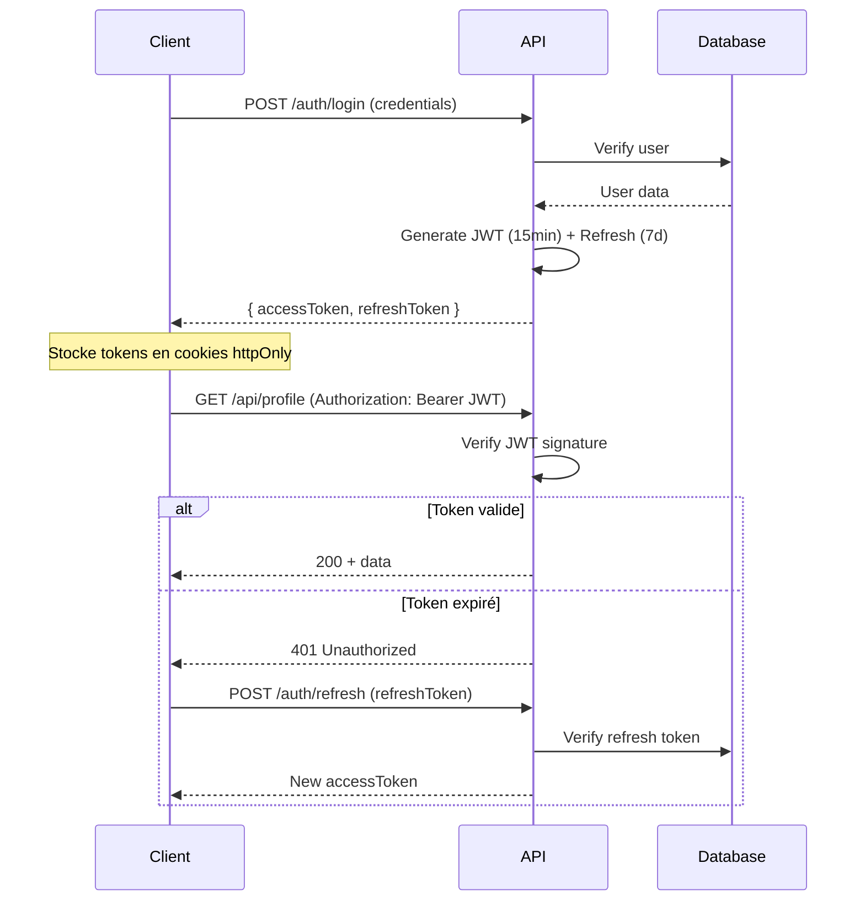

# 8.1 Authentification et Autorisation

## Flow JWT



---

## Structure du JWT

```typescript
interface JWTPayload {
  sub: number;      // User ID
  email: string;
  role: string;
  iat: number;      // Issued at
  exp: number;      // Expiration
}
```

---

## Configuration des tokens

| Token | Durée | Stockage | Usage |
| ----- | ----- | -------- | ----- |
| `accessToken` | 15 min | Cookie HTTP-only | Authentifier les requêtes |
| `refreshToken` | 7 jours | Cookie HTTP-only + BDD | Renouveler l'accessToken |

---

## Middleware d'authentification

```typescript
// middlewares/auth.middleware.ts
export const authMiddleware = async (
  req: Request,
  res: Response,
  next: NextFunction
) => {
  const token = req.cookies.accessToken;

  if (!token) {
    return res.status(401).json({ error: 'Non authentifié' });
  }

  try {
    const payload = verifyAccessToken(token);
    req.user = payload;
    next();
  } catch (error) {
    return res.status(401).json({ error: 'Token invalide' });
  }
};
```

---

[← Retour à l'index](./index.md)
