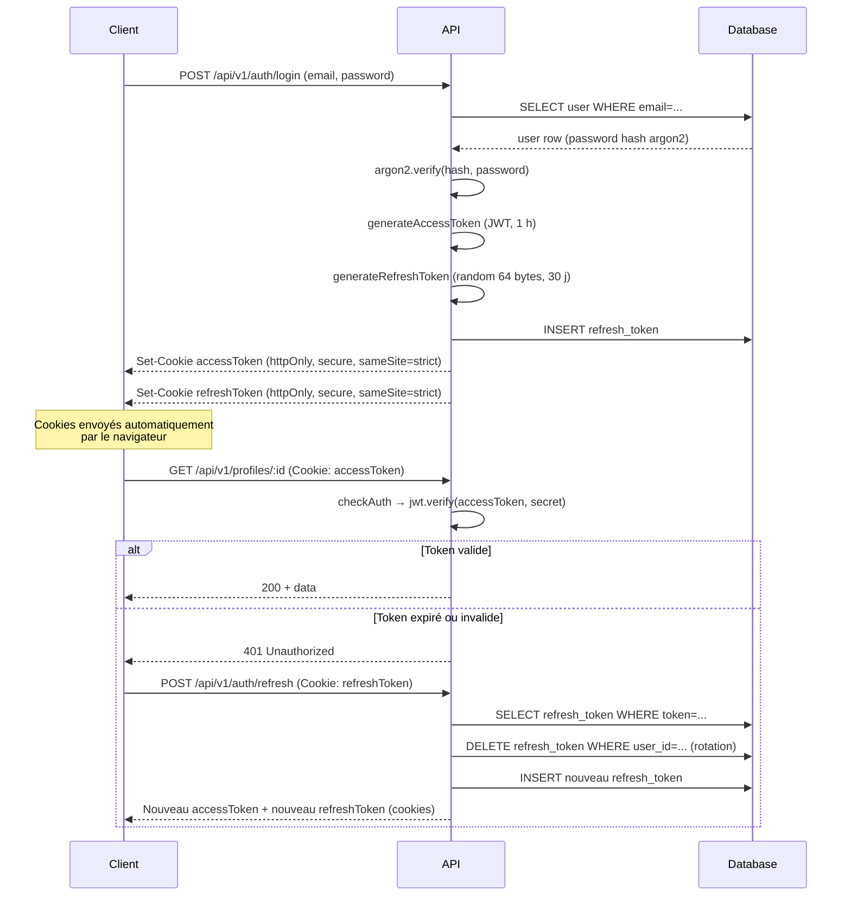

# 8.1 Authentification et Autorisation

Cette page reflète le comportement réel du backend au **2026-05-07** (sources :
`backend/src/lib/auth.ts`, `backend/src/services/auth.service.ts`,
`backend/src/controllers/auth.controller.ts`, `backend/src/middlewares/auth.middleware.ts`).

---

## Flow JWT (login → requêtes protégées → refresh)


```mermaid
sequenceDiagram
    participant C as Client
    participant A as API
    participant DB as Database

    C->>A: POST /api/v1/auth/login (email, password)
    A->>DB: SELECT user WHERE email=...
    DB-->>A: user row (password hash argon2)
    A->>A: argon2.verify(hash, password)
    A->>A: generateAccessToken (JWT, 1 h)
    A->>A: generateRefreshToken (random 64 bytes, 30 j)
    A->>DB: INSERT refresh_token
    A-->>C: Set-Cookie accessToken (httpOnly, secure, sameSite=strict)
    A-->>C: Set-Cookie refreshToken (httpOnly, secure, sameSite=strict)

    Note over C: Cookies envoyés automatiquement<br/>par le navigateur

    C->>A: GET /api/v1/profiles/:id (Cookie: accessToken)
    A->>A: checkAuth → jwt.verify(accessToken, secret)
    alt Token valide
        A-->>C: 200 + data
    else Token expiré ou invalide
        A-->>C: 401 Unauthorized
        C->>A: POST /api/v1/auth/refresh (Cookie: refreshToken)
        A->>DB: SELECT refresh_token WHERE token=...
        A->>DB: DELETE refresh_token WHERE user_id=... (rotation)
        A->>DB: INSERT nouveau refresh_token
        A-->>C: Nouveau accessToken + nouveau refreshToken (cookies)
    end
```

---

## Structure réelle du JWT

Le payload est minimal et **ne contient ni email ni rôle textuel** : seul l'`id`
utilisateur et l'`id` de rôle (FK vers la table `role`). Le rôle textuel est
récupéré côté API via Prisma quand nécessaire.

```typescript
// backend/src/lib/auth.ts
export interface UserPayload extends JwtPayload {
  userId: number;   // user.id
  userRole: number; // user.roleId  (FK vers role.id)
}
```

Algorithme de signature : **HS256** (par défaut `jsonwebtoken`).
Secret : `config.jwtSecret` (variable d'environnement `JWT_SECRET`).

---

## Configuration des tokens

Valeurs lues dans `backend/config.ts` et `backend/src/lib/auth.ts`.

| Token          | Durée                                  | Stockage                              | Usage                          |
| -------------- | -------------------------------------- | ------------------------------------- | ------------------------------ |
| `accessToken`  | `TOKEN_EXPIRE` env (défaut **3600 s = 1 h**) | Cookie `httpOnly` (+ `secure`+`sameSite=strict` en prod) | Authentifier les requêtes API |
| `refreshToken` | **30 jours** (`30*24*60*60*1000` ms en dur) | Cookie `httpOnly` + ligne en table `refresh_token`        | Renouveler l'accessToken      |

!!! note "Différence avec les itérations précédentes"
    Les versions antérieures de cette doc indiquaient `15 min / 7 j`. Les
    valeurs ci-dessus sont celles **réellement appliquées** en production.

---

## Cookies — paramètres exacts

```typescript
// backend/src/controllers/auth.controller.ts (extrait fidèle)
const isProduction = process.env.NODE_ENV === 'production';

res.cookie('accessToken', accessToken, {
  expires: new Date(Date.now() + accessTokenExpires * 1000),
  httpOnly: true,
  secure: isProduction,                          // true en prod uniquement
  sameSite: isProduction ? 'strict' : 'lax',
});

res.cookie('refreshToken', refreshToken, {
  expires: new Date(Date.now() + 30 * 24 * 60 * 60 * 1000),
  httpOnly: true,
  secure: isProduction,
  sameSite: isProduction ? 'strict' : 'lax',
});
```

À la déconnexion (`POST /auth/logout`), les trois cookies (`accessToken`,
`accessTokenExpires`, `refreshToken`) sont effacés via `res.clearCookie(...)`
et la ligne correspondante est supprimée en base.

---

## Middleware d'authentification

```typescript
// backend/src/middlewares/auth.middleware.ts (extrait fidèle)
export const checkAuth = (req: Request, res: Response, next: NextFunction) => {
  try {
    const accessToken = extractAccessTokenFromReq(req);   // lit req.cookies.accessToken
    const decoded = decodeAccesToken(accessToken);        // jwt.verify(...)
    req.userId = decoded.userId;
    req.userRole = decoded.userRole;
    next();
  } catch {
    next(new UnauthorizedError('Acces denied'));
  }
};
```

### Vérification d'ownership

Pour les routes en lecture/écriture sur une ressource possédée par un
utilisateur, un middleware complémentaire compare l'`userId` du token au
paramètre `:id` de l'URL :

```typescript
// backend/src/middlewares/auth.middleware.ts (extrait fidèle)
export const isOwner = (req: Request, res: Response, next: NextFunction) => {
  const authentifiedUser = req.userId;
  const paramsId = Number(req.params.id);
  if (authentifiedUser !== paramsId) {
    next(new ForbiddenError("Vous n'avez pas accès à cette ressource"));
  } else {
    next();
  }
};
```

---

## Rotation du refresh token

À chaque appel `/auth/refresh`, le service supprime **tous** les refresh tokens
de l'utilisateur avant d'en émettre un nouveau (stratégie « one-shot ») :

```typescript
// backend/src/services/auth.service.ts (extrait fidèle)
await prisma.refreshToken.deleteMany({
  where: { userId: user.id },
});
const accessToken = generateAccessToken(user);
const refreshToken = await generateRefreshToken(user);
```

Cette stratégie invalide tout token volé dès qu'un refresh légitime se
produit ; elle a pour contrepartie qu'un même utilisateur connecté sur deux
appareils sera déconnecté de l'un dès que l'autre rafraîchit.

---

## Navigation

| Retour |
| ------ |
| [🏠 Vue d'ensemble](./index.md) |
