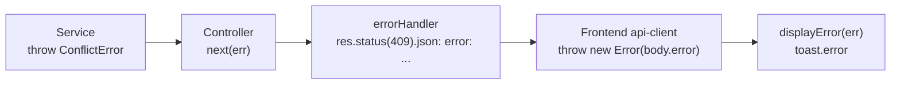

# 8.3 Gestion des erreurs

!!! info "Vue crosscutting (vs vue runtime)"
    Cette page documente la **philosophie traversante** de la gestion d'erreurs :
    qui throw, comment l'erreur remonte, comment le frontend la consomme. Pour
    le détail du dispositif backend (cas pris en charge, mapping, format de
    réponse exhaustif), voir
    [`06-runtime/error-handling.md`](../06-runtime/error-handling.md).

## Philosophie centralisée

SkillSwap applique une règle simple :

1. **Les services lèvent** les erreurs métier explicites
   (`throw new ConflictError(...)`, `throw new NotFoundError(...)`).
2. **Les contrôleurs ne `catch` pas** — ils encapsulent juste l'appel dans
   un `try/catch` qui appelle `next(err)` pour déléguer au middleware.
3. **Le middleware `errorHandler`** (`backend/src/middlewares/error.middleware.ts`,
   monté en dernier dans `app.ts:34`) est **le seul endroit** où une erreur
   est traduite en réponse HTTP. Il est aussi le seul à logger via
   `console.error` pour les erreurs inattendues (5xx).
4. **Le frontend reconstruit** un `Error` JS depuis la réponse via
   `frontend/src/lib/api-client.ts`, puis l'UI appelle
   `displayError(err)` (cf. `frontend/src/lib/utils.ts:216`) pour afficher
   un toast `sonner`.



---

## Hiérarchie d'erreurs réelle

Définie dans
[`backend/src/lib/error.ts`](https://github.com/Sojeremy/documentation-skillswap/blob/main/backend/src/lib/error.ts) (44 LOC) :

```ts
export class HttpError extends Error {
  statusCode: number;
  constructor(message: string, statusCode: number) {
    super(message);
    this.statusCode = statusCode;
  }
}

export class UnauthorizedError       extends HttpError { /* 401 */ }
export class ForbiddenError          extends HttpError { /* 403 */ }
export class NotFoundError           extends HttpError { /* 404 */ }
export class BadRequestError         extends HttpError { /* 400 */ }
export class ConflictError           extends HttpError { /* 409 */ }
export class UnprocessableEntityError extends HttpError { /* 422 */ }

export class FileValidationError extends Error {} // pas de statusCode
```

| Classe                    | Status | Usage typique                                                    |
|---------------------------|--------|------------------------------------------------------------------|
| `UnauthorizedError`       | 401    | Pas authentifié, JWT absent/invalide/expiré                      |
| `ForbiddenError`          | 403    | Authentifié mais pas autorisé (non participant, ressource d'un autre user) |
| `NotFoundError`           | 404    | Ressource introuvable                                            |
| `BadRequestError`         | 400    | Requête mal formée hors validation Zod                           |
| `ConflictError`           | 409    | Conflit applicatif (email pris, follow déjà existant)            |
| `UnprocessableEntityError`| 422    | Règle métier non satisfaite indétectable par Zod                 |
| `FileValidationError`     | 400    | Upload invalide (MIME/extension non autorisé)                    |

---

## Format de réponse unique

Toutes les erreurs HTTP renvoient :

```json
{
  "error": "string"
}
```

Une **seule clé `error`** (chaîne). Aucune clé `success`, `code`, `details`, ni
objet imbriqué. Détail complet (mappings, exemples par statut) dans
[`api-reference/errors.md`](../../api-reference/errors.md).

!!! warning "Cohabitation avec le format de succès"
    Le format **succès** `{ success: true, data, count }` (produit par
    `response.middleware.ts`) ne doit pas être confondu avec le format
    **erreur** ci-dessus. Les deux coexistent : succès via les helpers
    `res.success()` / `res.created()` ; erreur via `errorHandler`.

---

## Propagation côté backend — exemples concrets

```ts
// backend/src/services/auth.service.ts
if (existingUser) throw new ConflictError('Email address already in use');     // 409

// backend/src/services/message.service.ts
if (!conv) throw new NotFoundError('Conversation not found');                   // 404
if (conv.status === 'Close') throw new ForbiddenError('Conversation closed');   // 403

// backend/src/services/follow.service.ts
if (sameUser) throw new ConflictError('Vous ne pouvez pas vous suivre vous-même'); // 409
```

Les contrôleurs ne font **que** `next(err)` :

```ts
// pattern dans tous les *.controller.ts
try {
  const data = await someService(...);
  return res.success(data);
} catch (err) {
  next(err); // → errorHandler
}
```

---

## Consommation côté frontend

```ts
// frontend/src/lib/utils.ts (l.216-221)
export function displayError(err: unknown) {
  const errorMessage =
    err instanceof Error ? err.message : 'Une erreur inconnue est survenue';
  toast.error(errorMessage);
}
```

`api-client.ts` lit `response.json().error` (chaîne) et lance un `new Error(message)`
JavaScript standard. Les composants n'ont qu'à `catch` et passer à
`displayError(err)`.

---

## Anti-patterns à éviter

| Anti-pattern                                                                 | Pourquoi c'est faux                                                        |
|------------------------------------------------------------------------------|----------------------------------------------------------------------------|
| Hériter d'une classe d'erreur applicative générique fictive                  | Seuls `HttpError` + ses 6 sous-classes existent dans `lib/error.ts`        |
| Format imbriqué avec clés `success` / `code` / `details`                     | Le backend ne renvoie que `{ error: "string" }`                            |
| `console.error(...)` éparpillé dans services/contrôleurs                     | Le log est centralisé dans `errorHandler` (5xx uniquement)                 |
| `try/catch` dans les contrôleurs avec mapping erreur→statut                  | Casser le routage central ; dupliquer la logique de `errorHandler`         |
| Renvoyer un statut HTTP générique (500) pour une erreur métier              | Utiliser la sous-classe adéquate (404/409/422) pour que le frontend distingue |

---

## Liens

- Source backend : [`error.middleware.ts`](https://github.com/Sojeremy/documentation-skillswap/blob/main/backend/src/middlewares/error.middleware.ts) (96 LOC), [`error.ts`](https://github.com/Sojeremy/documentation-skillswap/blob/main/backend/src/lib/error.ts) (44 LOC), [`formatZodError.ts`](https://github.com/Sojeremy/documentation-skillswap/blob/main/backend/src/lib/formatZodError.ts)
- Vue runtime détaillée : [`06-runtime/error-handling.md`](../06-runtime/error-handling.md)
- API consumer : [`api-reference/errors.md`](../../api-reference/errors.md)

---

[← Retour à l'index](./index.md)
