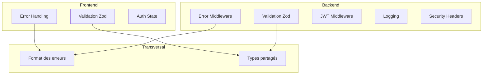

# 8. Concepts Transversaux

Ce chapitre documente les concepts qui s'appliquent à travers l'ensemble du système, affectant plusieurs composants et couches.

---

## Vue d'ensemble

| Concept | Description | Documentation |
| ------- | ----------- | ------------- |
| **Authentification** | JWT, tokens, sessions | [→](./authentication.md) |
| **Validation** | Double validation Zod client/serveur | [→](./validation.md) |
| **Gestion d'erreurs** | Hiérarchie et format des erreurs | [→](./error-handling.md) |
| **Logging** | Niveaux et structure des logs | [→](./logging.md) |
| **Sécurité** | Mesures de protection | [→](./security.md) |
| **Internationalisation** | État actuel et évolution | [→](./i18n.md) |

---

## Carte des concepts

---

## Sous-sections

- [8.1 Authentification](./authentication.md) - Flow JWT et gestion des sessions
- [8.2 Validation](./validation.md) - Schémas Zod partagés
- [8.3 Gestion d'erreurs](./error-handling.md) - Hiérarchie et format
- [8.4 Logging](./logging.md) - Niveaux et structure
- [8.5 Sécurité](./security.md) - Mesures de protection
- [8.6 Internationalisation](./i18n.md) - État actuel et évolution

---

## Navigation

| Précédent | Suivant |
| --------- | ------- |
| [← 7. Déploiement](../07-deployment/index.md) | [9. Décisions →](../09-decisions/index.md) |
