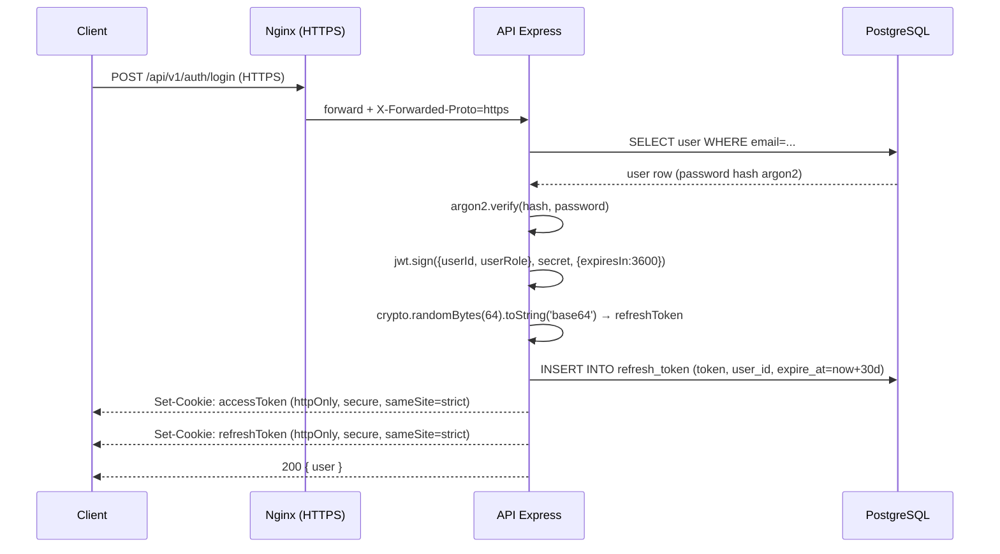

# 8.5 Sécurité

Cette page distingue **explicitement** ce qui est implémenté en production de
ce qui est planifié. Toutes les références de code pointent vers le dépôt
`backend/` et `devops/nginx/` à la date du **2026-05-07**.

---

## Mesures en place (MVP)

| Mesure                          | Implémentation                                                                 | Référence                                                |
| ------------------------------- | ------------------------------------------------------------------------------ | -------------------------------------------------------- |
| Hash de mots de passe           | `argon2.hash()` (paramètres par défaut, variante `argon2id`)                   | `backend/src/services/auth.service.ts:21` (hash), `:62` (verify) |
| JWT en cookie httpOnly          | `accessToken` en cookie `httpOnly`, `secure` en prod, `sameSite=strict` en prod | `backend/src/controllers/auth.controller.ts:69-74`       |
| Rotation du refresh token       | À chaque `/refresh`, **tous** les refresh de l'utilisateur sont supprimés puis un nouveau est créé | `backend/src/services/auth.service.ts:103-108`           |
| Refresh token persistant        | Stocké en BDD (table `refresh_token`) avec `expire_at`                          | `backend/src/lib/auth.ts:20-32`, modèle Prisma `RefreshToken` |
| Middleware d'authentification   | `checkAuth` extrait le cookie `accessToken`, vérifie la signature JWT, attache `userId`/`userRole` | `backend/src/middlewares/auth.middleware.ts:15-26`       |
| Vérification d'ownership        | Middleware `isOwner` compare `req.userId` au `:id` d'URL avant accès          | `backend/src/middlewares/auth.middleware.ts:28-36`       |
| Validation des entrées (Zod)    | Middleware `validate('body'\|'params'\|'query', schema)` ; **5 schémas** : `auth`, `category`, `conversation`, `profile`, `search` | `backend/src/middlewares/auth.middleware.ts:8-13`, `backend/src/validation/`     |
| CORS                            | `origin: config.allowedOrigin`, `credentials: true`                            | `backend/src/app.ts:12-17`                               |
| HTTPS / TLS                     | Let's Encrypt + Nginx, `TLSv1.2`/`TLSv1.3` uniquement, ciphers ECDHE-only      | `devops/nginx/prod.conf`                                 |
| Redirection HTTP → HTTPS        | Bloc `:80` qui retourne `301`, sauf challenge ACME                              | `devops/nginx/prod.conf`                                 |
| Headers de sécurité (Nginx)     | `Strict-Transport-Security` (1 an, includeSubDomains), `X-Frame-Options: SAMEORIGIN`, `X-Content-Type-Options: nosniff`, `X-XSS-Protection: 1; mode=block` | `devops/nginx/prod.conf`                                 |

### Détail du flux d'authentification



### Cookies — paramètres exacts

```typescript
// backend/src/controllers/auth.controller.ts (extrait fidèle)
res.cookie('accessToken', accessToken, {
  expires: new Date(Date.now() + accessTokenExpires * 1000),  // 3600 s
  httpOnly: true,
  secure: isProduction,                          // true en prod uniquement
  sameSite: isProduction ? 'strict' : 'lax',     // strict en prod
});
```

### Validation Zod — couverture par domaine

| Domaine        | Fichier                              | Schémas                     |
| -------------- | ------------------------------------ | --------------------------- |
| Authentification | `validation/auth.validation.ts`     | `register`, `login`, …      |
| Catégories     | `validation/category.validation.ts`  | recherche, filtres          |
| Conversations  | `validation/conversation.validation.ts` | création, message          |
| Profil         | `validation/profile.validation.ts`   | mise à jour profil          |
| Recherche      | `validation/search.validation.ts`    | requête, filtres            |

---

## Améliorations priorisées V2

Mesures **annoncées dans des itérations précédentes de la doc** mais qui ne
sont **pas effectives** en production à la date du 2026-05-07. Listées ici
pour ne pas masquer la dette technique et permettre un priorisation
explicite après la soutenance.

| # | Sujet | État réel | Action V2 |
| :-: | ----- | --------- | --------- |
| 1 | **Helmet** | `helmet@^8.1.0` est **déclaré dans `backend/package.json`** mais **n'est ni importé ni monté** comme middleware Express (`grep -rn "helmet" backend/src/` → 0 résultat). Les seuls headers de sécurité présents viennent de Nginx. | Activer Helmet dans `app.ts` (1 ligne) ; régler `contentSecurityPolicy` selon les origines réellement utilisées |
| 2 | **Rate limiting** | `express-rate-limit` **n'est pas dans le `package.json`**. Aucune limitation côté API. Aucune limitation côté Nginx (pas de `limit_req_zone`). | Installer `express-rate-limit` ; `windowMs: 15min`, `max: 100` ; doubler avec `limit_req_zone` Nginx pour les endpoints `/auth/*` |
| 3 | **CSP custom** | Aucune Content-Security-Policy n'est émise. Seul `X-XSS-Protection` (déprécié) est positionné par Nginx. | Définir une CSP stricte (probablement via Helmet) après inventaire des origines (Meilisearch, fonts, sockets) |
| 4 | **Audit de sécurité formel** | Aucun audit externe ; `npm audit --omit=dev` rapporte au 2026-05-07 : 18 vulns backend (12 high), 3 vulns frontend (2 high). Pas de pipeline automatisé de détection. | Ajouter `npm audit` à la CI ; planifier un pentest externe avant la sortie publique |
| 5 | **CSRF explicite** | Pas de token CSRF. La défense actuelle repose sur `sameSite=strict` (en prod) + cookie `httpOnly` + CORS. Suffisant pour les requêtes mutantes simples ; insuffisant si une intégration cross-origin est ajoutée. | Évaluer `csrf-csrf` ou `csurf` dès qu'une origine tierce sera autorisée |
| 6 | **Politique de mots de passe** | Validation Zod assure une longueur minimale ; pas de check contre listes de mots de passe compromis (HaveIBeenPwned, etc.). | Intégrer un check API à l'inscription |
| 7 | **Journalisation sécurité** | Aucun log structuré des tentatives de login échouées, refresh invalides, accès non autorisés. | Ajouter un logger dédié (winston/pino) et un compteur sur les events sensibles |

---

## OWASP Top 10 — couverture actuelle

Les cases « ✅ » couvrent la défense **mesurable** au 2026-05-07.
Les cases « ⚠ » signalent une mesure partielle ou à compléter (renvoie au tableau V2 ci-dessus).

| Vulnérabilité                          | Mesure actuelle                                            | État |
| -------------------------------------- | ---------------------------------------------------------- | :--: |
| A01 Broken Access Control              | `checkAuth` + `isOwner` sur les routes protégées            | ✅   |
| A02 Cryptographic Failures             | TLS 1.2/1.3 only, hash `argon2id`, secrets via env          | ✅   |
| A03 Injection                          | Prisma (requêtes paramétrées) + validation Zod ; 1 requête SQL brute, paramétrée | ✅   |
| A04 Insecure Design                    | Refresh token rotation, cookies `httpOnly`+`sameSite=strict` | ✅   |
| A05 Security Misconfiguration          | Helmet déclaré mais non monté ; CSP absente                 | ⚠ V2-1, V2-3 |
| A06 Vulnerable Components              | `npm audit` non bloquant en CI                              | ⚠ V2-4 |
| A07 Identification and Auth Failures   | JWT signé HS256 (défaut implicite), refresh DB-side, expiration courte (1 h par défaut) | ✅   |
| A08 Software/Data Integrity Failures   | Lockfile `package-lock.json` versionné                      | ✅   |
| A09 Security Logging & Monitoring      | Aucun log structuré sur les events de sécurité              | ⚠ V2-7 |
| A10 Server-Side Request Forgery        | Pas d'appel sortant à URL fournie par l'utilisateur          | ✅   |

### A03 Injection — le raisonnement complet, exception comprise

La défense contre l'injection ne repose pas uniquement sur l'ORM : le projet
contient **une** requête SQL écrite à la main, et il faut pouvoir la justifier.

- **Cas nominal** — les 7 services passent par le client Prisma généré, qui émet
  des requêtes préparées à paramètres liés. Aucune concaténation de chaîne n'est
  possible via cette API.
- **Exception** — `getTopUserCategoriesService`
  (`backend/src/services/category.service.ts:34-56`) construit une agrégation
  `COUNT(DISTINCT …)` sur deux jointures en SQL brut, exécutée par
  `prisma.$queryRaw`. Elle reste **paramétrée** : la requête est bâtie avec le
  constructeur `Prisma.sql`, et la seule valeur d'origine externe — le `limit`
  interpolé ligne 52 — devient un paramètre lié, pas un fragment de SQL. Ce
  `limit` est de surcroît validé en amont par Zod
  (`GetTopUserCategoriesQuerySchema`, monté dans
  `backend/src/routers/category.router.ts:9`).
- **Ce qui rendrait le verdict faux** — l'usage de `$queryRawUnsafe` ou d'un
  template assemblé par concaténation. Ni l'un ni l'autre n'apparaît dans
  `backend/src/` : le seul `$executeRawUnsafe` du dépôt est dans le harnais de
  test (`backend/src/test/config/global-setup.ts:192`).

### A07 — HS256 n'est pas un choix explicite

`generateAccessToken` appelle `jwt.sign(payload, config.jwtSecret, { expiresIn })`
(`backend/src/lib/auth.ts:15-17`) **sans** option `algorithm`. HS256 est donc
l'algorithme retenu par **défaut implicite** de la librairie `jsonwebtoken`, et
non une décision inscrite dans le code. De même, `jwt.verify`
(`backend/src/lib/auth.ts:41`) est appelé sans liste blanche `algorithms`.
La durée de validité n'est pas figée non plus : elle vaut `TOKEN_EXPIRE`
secondes, avec `3600` (1 h) pour valeur par défaut (`backend/config.ts:11`).

---

## Navigation

| Précédent | Retour |
| --------- | ------ |
| [← Validation](./validation.md) | [🏠 Vue d'ensemble](./index.md) |
