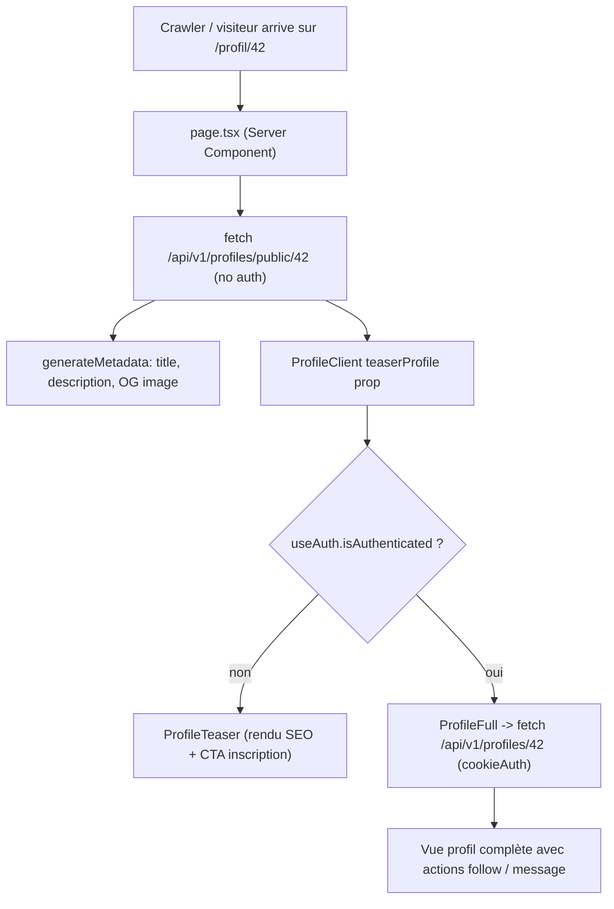

# 8.7 SEO et stratégie de rendu

## Vue d'ensemble

SkillSwap implémente une stratégie SEO multi-niveaux qui distingue le
contenu **indexable** par les moteurs de recherche (landing, profils
publics) du contenu **authentifié** (messagerie, édition de profil,
résultats de recherche).

| Page                              | Type                                     | Justification                                                   |
|-----------------------------------|------------------------------------------|-----------------------------------------------------------------|
| `/` (Home)                        | Server Component + ISR `revalidate=3600` | SEO + contenu stable + fraîcheur top membres/catégories         |
| `/connexion`, `/inscription`      | Client Component (CSR)                   | Interactif, pas de contenu à indexer                            |
| `/recherche`                      | Client Component (CSR)                   | Données dynamiques utilisateur authentifié                      |
| `/conversation`                   | Client Component (CSR)                   | Temps réel, privé, pas SEO                                      |
| `/mon-profil`                     | Client Component (CSR)                   | Privé, pas SEO                                                  |
| `/profil/[id]`                    | Server Component + ISR + **teaser**      | SEO public + données limitées (pattern teaser/full)             |

!!! info "Les routes privées sont gardées par middleware"
    `frontend/src/middleware.ts` redirige vers `/connexion` toute requête
    non authentifiée (cookie `refreshToken` absent) sur `/recherche`,
    `/conversation`, `/mon-profil`. Cf.
    [`05-building-blocks/frontend.md`](../05-building-blocks/frontend.md#middlewarets--auth-gate).

---

## Pattern Teaser/Full

La page `/profil/[id]` est volontairement **accessible sans
authentification** pour les crawlers et les visiteurs non connectés. Côté
serveur, elle ne récupère qu'un sous-ensemble limité des données
(« teaser »). Une fois l'utilisateur authentifié, l'orchestrateur
[`ProfileClient`](https://github.com/Sojeremy/documentation-skillswap/blob/main/frontend/src/components/organisms/ProfilePage/ProfileClient.tsx)
bascule sur la vue complète (`ProfileFull`) qui re-fetche les données via
l'endpoint authentifié.



### Endpoint backend dédié — `GET /api/v1/profiles/public/:id`

Routage : [`backend/src/routers/profile.router.ts:75`](https://github.com/Sojeremy/documentation-skillswap/blob/main/backend/src/routers/profile.router.ts) — **pas** de middleware `checkAuth`, juste `parseNumericParams` puis le contrôleur `getPublicProfile`.

Service : `getPublicProfileService` dans
[`backend/src/services/profile.service.ts:30-88`](https://github.com/Sojeremy/documentation-skillswap/blob/main/backend/src/services/profile.service.ts) — sélectionne uniquement les champs nécessaires
au teaser, calcule le `descriptionPreview` (troncature 150 caractères),
le `lastnameInitial` (initiale + point) et le `averageRating`.

| Champ                  | Teaser (`/profiles/public/:id`)                                  | Full (`/profiles/:id`, auth)                  |
|------------------------|------------------------------------------------------------------|-----------------------------------------------|
| `id`                   | ✅                                                                | ✅                                             |
| `firstname`            | ✅                                                                | ✅                                             |
| `lastname`             | ❌ (uniquement `lastnameInitial: "D."`)                          | ✅                                             |
| `email`                | ❌                                                                | ✅ (si propriétaire)                           |
| `city`                 | ✅                                                                | ✅                                             |
| `avatarUrl`            | ✅                                                                | ✅                                             |
| `description`          | ❌ (uniquement `descriptionPreview` tronqué à 150 chars)         | ✅ (entier)                                    |
| `skills`               | ✅ (avec relations `skill`)                                       | ✅                                             |
| `interests`            | ❌                                                                | ✅                                             |
| `availabilities`       | ❌                                                                | ✅                                             |
| `evaluationsReceived`  | ❌ (uniquement `averageRating` + `reviewCount`)                  | ✅ (détail des notes)                          |
| `address`, `postalCode`| ❌                                                                | ✅ (si propriétaire)                           |
| `dateOfBirth`          | ❌                                                                | ✅ (si propriétaire)                           |

Le teaser **ne fuite pas** d'informations à caractère personnel : le nom de
famille est réduit à son initiale, la description est tronquée, les
disponibilités et l'historique précis des évaluations restent privés.

---

## ISR (Incremental Static Regeneration)

Deux pages utilisent ISR avec une fenêtre d'1 heure (`revalidate = 3600`) :

```ts
// frontend/src/app/page.tsx (l.33)
export const revalidate = 3600;
```

```ts
// frontend/src/app/(app)/profil/[id]/page.tsx (l.39)
export const revalidate = 3600;
```

Les `fetch()` côté Server Component portent eux aussi l'option
`next: { revalidate: 3600 }`, ce qui couple le cache HTTP de Next.js sur la
même fenêtre temporelle :

```ts
// frontend/src/app/page.tsx (l.60-62)
const response = await fetch(`${apiUrl}/api/v1/search/top-rated?limit=6`, {
  next: { revalidate: 3600 },
});
```

**Effet** : le HTML est régénéré à la première requête après expiration
(stale-while-revalidate). Les autres requêtes servent la version mise en
cache, ce qui garantit une réponse sub-100 ms même sous trafic Google.

!!! note "Pourquoi 1 heure ?"
    Compromis entre fraîcheur (un nouveau membre apparaît dans la home
    dans l'heure) et coût (limite la pression sur le backend et
    Meilisearch).

---

## Sitemap dynamique — `app/sitemap.ts`

[`frontend/src/app/sitemap.ts`](https://github.com/Sojeremy/documentation-skillswap/blob/main/frontend/src/app/sitemap.ts) génère le sitemap au runtime :

- **3 URLs statiques** : `/` (priority 1, daily), `/connexion`
  (priority 0.5, monthly), `/inscription` (priority 0.6, monthly).
- **Jusqu'à 1000 profils dynamiques** récupérés via
  `GET /api/v1/search/top-rated?limit=1000` (priority 0.8, weekly,
  `lastModified` = `member.updatedAt`).
- **Fallback gracieux** : si l'API renvoie une erreur, seules les URLs
  statiques sont servies (cf. `sitemap.ts:42-44, 61-63`).

Le sitemap est exposé sur `/sitemap.xml` et référencé depuis le `robots.txt`.

---

## Robots — `app/robots.ts`

[`frontend/src/app/robots.ts`](https://github.com/Sojeremy/documentation-skillswap/blob/main/frontend/src/app/robots.ts) adapte le `robots.txt` au `NODE_ENV` :

- **Hors production** (`NODE_ENV !== 'production'`) : `Disallow: /` global,
  pour empêcher l'indexation accidentelle des environnements dev/staging.
- **Production** : `Allow: ['/', '/profil/']` ; `Disallow:` les routes
  privées (`/conversation`, `/mon-profil`, `/connexion`, `/inscription`,
  `/recherche`) et techniques (`/_next/`, `/api/`). `Sitemap:
  ${siteUrl}/sitemap.xml`.

---

## `generateMetadata` pour les profils

La page `profil/[id]` génère des metadata SEO **dynamiques** à partir du
teaser. Extrait de
[`frontend/src/app/(app)/profil/[id]/page.tsx`](https://github.com/Sojeremy/documentation-skillswap/blob/main/frontend/src/app/(app)/profil/[id]/page.tsx) (l.91-147) :

```ts
export async function generateMetadata({ params }: PageProps): Promise<Metadata> {
  const { id } = await params;
  const profile = await getProfileTeaser(id);

  if (!profile) {
    return {
      title: 'Profil non trouvé - SkillSwap',
      description: "Ce profil n'existe pas ou a été supprimé.",
    };
  }

  const skills = profile.skills?.map((s) => s.skill?.name).filter(Boolean) || [];
  const mainSkill = skills[0] || 'Membre';
  const displayName = `${profile.firstname} ${profile.lastnameInitial}`;
  const title = `${displayName} - ${mainSkill} | SkillSwap`;
  const description = profile.descriptionPreview ?? `${profile.firstname} propose ses compétences sur SkillSwap : ${skills.slice(0,3).join(', ')}.`;
  const profileUrl = `${siteUrl}/profil/${id}`;

  return {
    title,
    description,
    openGraph: {
      title, description, type: 'profile', url: profileUrl, siteName: 'SkillSwap',
      images: profile.avatarUrl ? [{ url: profile.avatarUrl, width: 400, height: 400, alt: `Photo de ${displayName}` }] : [],
    },
    alternates: { canonical: profileUrl },
  };
}
```

Points clés :

- **`title`** combine prénom + initiale + compétence principale, ce qui est
  optimal pour le ranking Google (« Marie D. - React | SkillSwap »).
- **`openGraph.type: 'profile'`** active la rich preview des réseaux
  sociaux et la carte dédiée aux profils.
- **`alternates.canonical`** lutte contre le duplicate content (un profil
  peut être atteint via plusieurs chemins de navigation interne).
- **`notFound()`** est appelé en aval (cf. l.158-160) pour servir un vrai
  404 si l'utilisateur n'existe pas — important pour ne pas polluer
  l'index Google avec des URLs mortes.

---

## Récapitulatif des contributions au SEO

| Élément                          | Source                                             | Effet                                                  |
|----------------------------------|----------------------------------------------------|--------------------------------------------------------|
| ISR `revalidate=3600`            | `app/page.tsx`, `app/(app)/profil/[id]/page.tsx`   | HTML statique à jour, réponses < 100 ms                |
| Server Components                | mêmes pages                                        | Contenu rendu côté serveur (indexable directement)     |
| `generateMetadata` dynamique     | `profil/[id]/page.tsx:91-147`                      | Title/description/OG par profil                        |
| Endpoint public dédié            | `backend.../profile.router.ts:75`                  | Pas d'auth requise, données limitées                   |
| Pattern teaser/full              | `ProfileClient.tsx`                                | SEO public + protection des PII                        |
| Sitemap dynamique                | `app/sitemap.ts`                                   | Découverte automatique de jusqu'à 1000 profils         |
| Robots adapté à l'environnement  | `app/robots.ts`                                    | Bloque dev/staging, ouvre prod                         |
| `notFound()` sur profil absent   | `profil/[id]/page.tsx:158-160`                     | Vrai 404, pas de soft-404                              |

---

## Liens

- Source — Home : [`app/page.tsx`](https://github.com/Sojeremy/documentation-skillswap/blob/main/frontend/src/app/page.tsx)
- Source — Profil dynamique : [`app/(app)/profil/[id]/page.tsx`](https://github.com/Sojeremy/documentation-skillswap/blob/main/frontend/src/app/(app)/profil/[id]/page.tsx)
- Source — Orchestrateur : [`ProfileClient.tsx`](https://github.com/Sojeremy/documentation-skillswap/blob/main/frontend/src/components/organisms/ProfilePage/ProfileClient.tsx)
- Source — Sitemap : [`app/sitemap.ts`](https://github.com/Sojeremy/documentation-skillswap/blob/main/frontend/src/app/sitemap.ts)
- Source — Robots : [`app/robots.ts`](https://github.com/Sojeremy/documentation-skillswap/blob/main/frontend/src/app/robots.ts)
- Endpoint public — Service : [`profile.service.ts:30-88`](https://github.com/Sojeremy/documentation-skillswap/blob/main/backend/src/services/profile.service.ts)
- Endpoint public — Route : [`profile.router.ts:75`](https://github.com/Sojeremy/documentation-skillswap/blob/main/backend/src/routers/profile.router.ts)

---

## Navigation

| Précédent | Suivant |
| --------- | ------- |
| [← Internationalisation](./i18n.md) | [9. Décisions →](../09-decisions/index.md) |
