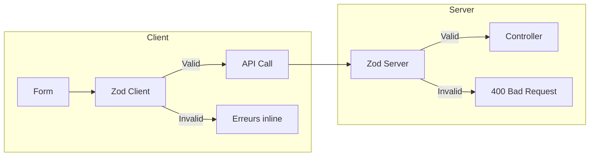

# 8.2 Validation des données

## Double validation (Client + Server)



---

## Schémas Zod partagés

```typescript
// shared/schemas/user.schema.ts
export const registerSchema = z.object({
  email: z.string().email("Email invalide"),
  password: z.string().min(8, "8 caractères minimum"),
  firstname: z.string().min(2),
  lastname: z.string().min(2),
  city: z.string().min(2),
});

// Inférence du type
export type RegisterInput = z.infer<typeof registerSchema>;
```

---

## Exemple : Schéma de profil

```typescript
// shared/schemas/profile.schema.ts
export const updateProfileSchema = z.object({
  firstname: z.string().min(2).optional(),
  lastname: z.string().min(2).optional(),
  city: z.string().min(2).optional(),
  description: z.string().max(500).optional(),
  avatarUrl: z.string().url().optional(),
});

export type UpdateProfileInput = z.infer<typeof updateProfileSchema>;
```

---

## Middleware de validation

```typescript
// middlewares/validation.middleware.ts
export const validate = (schema: ZodSchema) => {
  return (req: Request, res: Response, next: NextFunction) => {
    const result = schema.safeParse(req.body);

    if (!result.success) {
      return res.status(400).json({
        success: false,
        error: {
          code: 'VALIDATION_ERROR',
          details: result.error.flatten().fieldErrors,
        },
      });
    }

    req.body = result.data;
    next();
  };
};
```

---

## Intégration React Hook Form

```typescript
// Frontend - Formulaire avec validation Zod
import { useForm } from 'react-hook-form';
import { zodResolver } from '@hookform/resolvers/zod';
import { registerSchema, RegisterInput } from '@/schemas/user.schema';

function RegisterForm() {
  const { register, handleSubmit, formState: { errors } } = useForm<RegisterInput>({
    resolver: zodResolver(registerSchema),
  });

  const onSubmit = async (data: RegisterInput) => {
    // data est déjà validé et typé
    await api.register(data);
  };

  return (
    <form onSubmit={handleSubmit(onSubmit)}>
      <input {...register('email')} />
      {errors.email && <span>{errors.email.message}</span>}
      {/* ... */}
    </form>
  );
}
```

---

[← Retour à l'index](./index.md)
