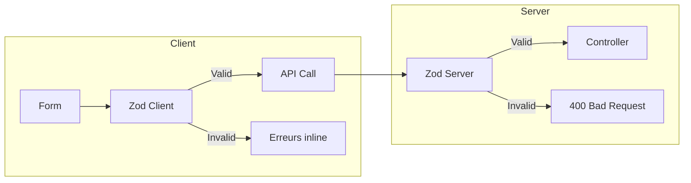

# 8.2 Validation des données

## Double validation (Client + Server)


```mermaid
flowchart LR
    subgraph Client
        F["Form"] --> ZC["Zod Client"]
        ZC -->|"Valid"| API["API Call"]
        ZC -->|"Invalid"| E1["Erreurs inline"]
    end

    subgraph Server
        API --> ZS["Zod Server"]
        ZS -->|"Valid"| C["Controller"]
        ZS -->|"Invalid"| E2["400 Bad Request"]
    end
```

---

## Schémas Zod (parallèles, non partagés)

!!! note "Pas de package partagé client/serveur"
    Les schémas Zod sont **dupliqués** entre frontend et backend (5 schémas
    backend dans `backend/src/validation/`, 4 schémas frontend dans
    `frontend/src/lib/validation/`). C'est une dette technique reconnue : un
    package `@skillswap/schemas` partagé éviterait la duplication, mais
    l'effort d'extraction (build TS commun, publication interne) n'a pas été
    jugé prioritaire avant la soutenance.

```typescript
// frontend/src/lib/validation/auth.validation.ts (extrait représentatif)
export const registerSchema = z.object({
  email: z.string().email("Email invalide"),
  password: z.string().min(8, "8 caractères minimum"),
  firstname: z.string().min(2),
  lastname: z.string().min(2),
});

export type RegisterData = z.infer<typeof registerSchema>;
```

---

## Exemple : Schéma de profil

```typescript
// frontend/src/lib/validation/updateProfile.validation.ts (extrait)
export const updateProfileSchema = z.object({
  firstname: z.string().min(2).optional(),
  lastname: z.string().min(2).optional(),
  city: z.string().min(2).optional(),
  description: z.string().max(500).optional(),
});

export type UpdateProfileData = z.infer<typeof updateProfileSchema>;
```

| Côté        | Localisation                                    | Fichiers                                                         |
|-------------|-------------------------------------------------|------------------------------------------------------------------|
| Frontend    | `frontend/src/lib/validation/`                  | `auth.validation.ts`, `conversation.validation.ts`, `updatePassword.validation.ts`, `updateProfile.validation.ts` (4) |
| Backend     | `backend/src/validation/`                       | `auth.validation.ts`, `category.validation.ts`, `conversation.validation.ts`, `profile.validation.ts`, `search.validation.ts` (5) |

---

## Middleware de validation

```typescript
// backend/src/middlewares/auth.middleware.ts (extrait)
export const validate =
  (dataSource: 'body' | 'params' | 'query', schema: ZodObject) =>
  async (req: Request, res: Response, next: NextFunction) => {
    await schema.parseAsync(req[dataSource]); // throw ZodError si invalide
    next();
  };
```

> En cas d'échec, `parseAsync` lève un `ZodError` qui remonte jusqu'au
> middleware `errorHandler`. Celui-ci le convertit en réponse
> `422 { error: prettifyZodError(...) }` (un message par ligne).
> Cf. [`08-crosscutting/error-handling.md`](./error-handling.md) pour le
> dispositif central, et
> [`backend/src/lib/formatZodError.ts`](https://github.com/Sojeremy/documentation-skillswap/blob/main/backend/src/lib/formatZodError.ts)
> pour le formatage des messages.

---

## Intégration React Hook Form (composant `AuthForm`)

```typescript
// frontend/src/components/organisms/AuthForm.tsx (esquisse)
import { useForm } from 'react-hook-form';
import { zodResolver } from '@hookform/resolvers/zod';
import { registerSchema, RegisterData } from '@/lib/validation/auth.validation';

export function AuthForm({ variant }: { variant: 'login' | 'register' }) {
  const { register, handleSubmit, formState: { errors } } = useForm<RegisterData>({
    resolver: zodResolver(registerSchema),
  });

  const onSubmit = async (data: RegisterData) => {
    // data est déjà validé et typé côté client.
    // Le backend re-valide via le même schéma Zod (parallèle, pas partagé).
    await api.register(data);
  };

  return (
    <form onSubmit={handleSubmit(onSubmit)}>
      <input {...register('email')} />
      {errors.email && <span>{errors.email.message}</span>}
      {/* … */}
    </form>
  );
}
```

> Le composant `AuthForm` (organism, `frontend/src/components/organisms/AuthForm.tsx`)
> est utilisé sur les routes `/connexion` et `/inscription` avec une variante
> en prop. Pas de composants de connexion/inscription séparés.

---

[← Retour à l'index](./index.md)
