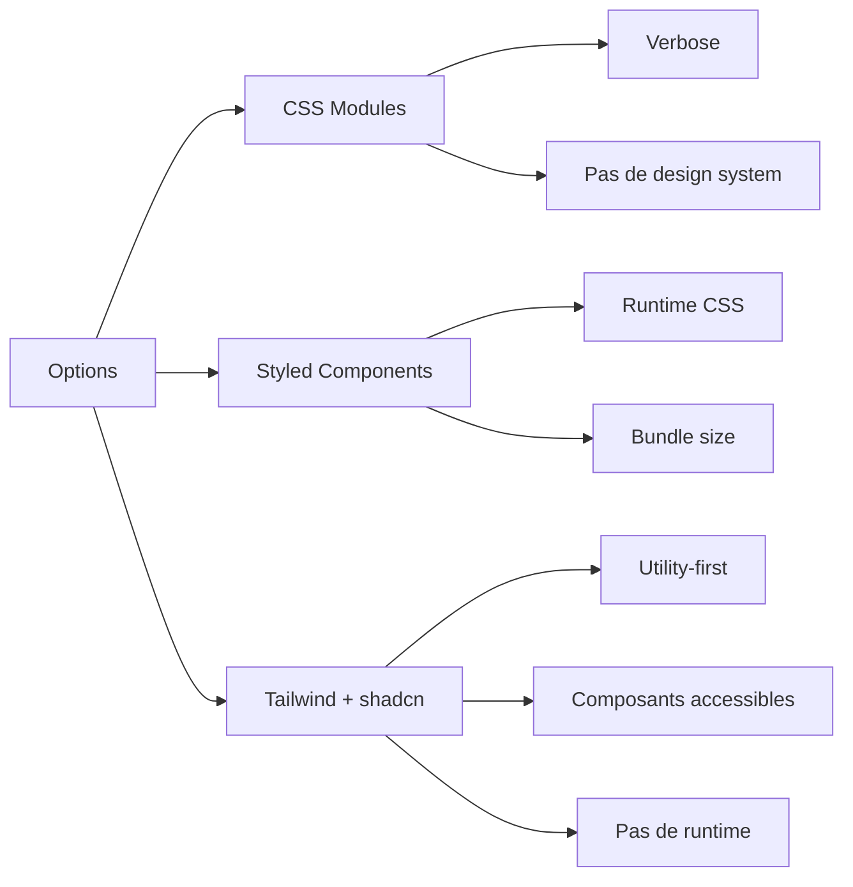

# ADR-002 : Tailwind CSS + shadcn/ui

## Statut

Accepté (2024-12)

## Contexte

Choix de la solution de styling pour le frontend SkillSwap.

## Décision

**Tailwind CSS avec shadcn/ui** plutôt que CSS Modules ou Styled Components.

## Alternatives considérées



## Conséquences

### Positives

- Utility-first : développement rapide
- shadcn/ui : composants accessibles prêts à l'emploi
- Pas de CSS runtime (meilleure performance)
- Design system cohérent

### Négatives

- Classes longues dans le JSX
- Apprentissage des utilitaires Tailwind

## Configuration

```plaintext
components/
└── ui/                 # Composants shadcn/ui copiés
    ├── button.tsx
    ├── card.tsx
    └── dialog.tsx
```

---

[← Retour à l'index](./index.md)
