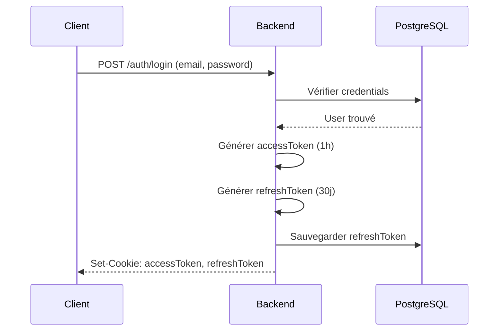

# ADR-007 : JWT Authentication

## Statut

Accepté (2024-12)

## Contexte

SkillSwap nécessite un système d'authentification sécurisé pour identifier les utilisateurs, protéger les routes sensibles et maintenir la session entre les requêtes. L'application est une SPA Next.js communiquant avec une API Express séparée.

## Décision

**JWT (JSON Web Tokens) stockés dans des cookies HTTP-only** plutôt que localStorage ou sessions serveur.

## Alternatives considérées

| Alternative          | Avantages                    | Inconvénients                    |
| -------------------- | ---------------------------- | -------------------------------- |
| JWT en localStorage  | Simple à implémenter         | Vulnérable aux attaques XSS      |
| Sessions serveur     | Révocation instantanée       | Stateful, nécessite Redis        |
| OAuth2 / OIDC        | Standard industrie           | Over-engineering pour un MVP     |

## Conséquences

### Positives

- Vérification de l'`accessToken` stateless : sa validité se contrôle par signature, sans consulter la base. Le `refreshToken` est en revanche **persisté** en table `refresh_token` et supprimé au logout comme à chaque rotation (`backend/src/lib/auth.ts:20-32`, `backend/src/services/auth.service.ts:103-108`) : l'authentification n'est donc pas entièrement stateless.
- Sécurisé : cookies HTTP-only protègent contre XSS
- Scalable : n'importe quel serveur peut valider le token

### Négatives

- Révocation complexe (token valide jusqu'à expiration)
- Nécessite HTTPS en production

## Configuration des tokens

| Token          | Durée    | Stockage              | Usage                    |
| -------------- | -------- | --------------------- | ------------------------ |
| `accessToken`  | 1 h (défaut) | Cookie HTTP-only  | Authentifier les requêtes|
| `refreshToken` | 30 jours | Cookie HTTP-only + BDD| Renouveler l'accessToken |

La durée de l'`accessToken` n'est pas figée dans le code : elle vaut
`TOKEN_EXPIRE` secondes, avec `3600` (1 h) comme valeur par défaut en
développement (`backend/config.ts:11`). Les 30 jours du `refreshToken` sont en
revanche codés en dur (`backend/src/lib/auth.ts:27`).

## Flux d'authentification

```mermaid
sequenceDiagram
    participant C as Client
    participant B as Backend
    participant DB as PostgreSQL

    C->>B: POST /auth/login (email, password)
    B->>DB: Vérifier credentials
    DB-->>B: User trouvé
    B->>B: Générer accessToken (1h)
    B->>B: Générer refreshToken (30j)
    B->>DB: Sauvegarder refreshToken
    B-->>C: Set-Cookie: accessToken, refreshToken
```

---

[← Retour à l'index](./index.md)
