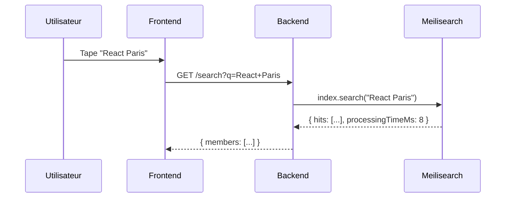

# ADR-008 : Meilisearch

## Statut

Proposé (2025-01)

## Contexte

SkillSwap nécessite une fonctionnalité de recherche performante pour rechercher des membres par nom, ville, compétences avec typo-tolerance et temps de réponse < 100ms. La recherche SQL actuelle (`LIKE '%term%'`) présente des limitations.

## Décision

**Meilisearch** plutôt qu'Elasticsearch ou PostgreSQL full-text search.

## Alternatives considérées

| Critère         | Meilisearch  | Elasticsearch | PostgreSQL FTS |
| --------------- | ------------ | ------------- | -------------- |
| Setup           | Simple       | Complexe      | Intégré        |
| Typo-tolerance  | Natif        | Config        | Non            |
| Performance     | Rapide       | Rapide        | Moyen          |
| Ressources      | Léger        | Lourd (JVM)   | Léger          |

## Conséquences

### Positives

- Recherche < 50ms même avec 10k+ membres
- Typo-tolerance native ("Raect" → "React")
- Open-source et self-hosted
- API REST simple

### Négatives

- Service Docker supplémentaire à maintenir
- Synchronisation BDD → Meilisearch à implémenter

## Architecture proposée

---

[← Retour à l'index](./index.md)
