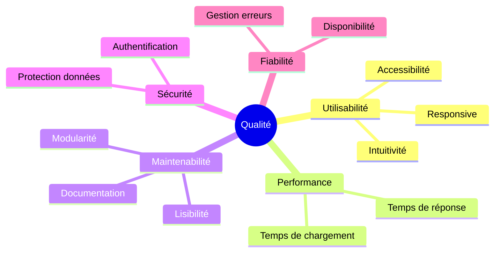

# 10. Exigences de Qualité

Ce chapitre définit les exigences de qualité du système et les mesures mises en place pour les atteindre.

---

## Arbre de qualité

---

## Documentation détaillée

| Section | Description | Lien |
| ------- | ----------- | ---- |
| **Scénarios de qualité** | Métriques et objectifs par attribut | [→](./scenarios.md) |
| **Tests** | Pyramide de tests et couverture | [→](./testing.md) |
| **Accessibilité** | Standards WCAG et implémentation | [→](./accessibility.md) |
| **Monitoring** | Métriques et surveillance (futur) | [→](./monitoring.md) |

---

## Résumé des objectifs

| Attribut | Métrique | Objectif |
| -------- | -------- | -------- |
| Performance | TTFB | < 200ms |
| Performance | LCP | < 2.5s |
| Utilisabilité | Inscription | ≤ 3 étapes |
| Sécurité | Passwords | bcrypt 10 rounds |
| Maintenabilité | Coverage | > 70% |
| Accessibilité | WCAG | 2.1 AA |

---

## Sous-sections

- [10.1 Scénarios de qualité](./scenarios.md) - Objectifs mesurables
- [10.2 Tests](./testing.md) - Stratégie et couverture
- [10.3 Accessibilité](./accessibility.md) - Standards WCAG
- [10.4 Monitoring](./monitoring.md) - Surveillance (futur)

---

## Navigation

| Précédent | Suivant |
| --------- | ------- |
| [← 9. Décisions](../09-decisions/index.md) | [11. Risques →](../11-risks/index.md) |
