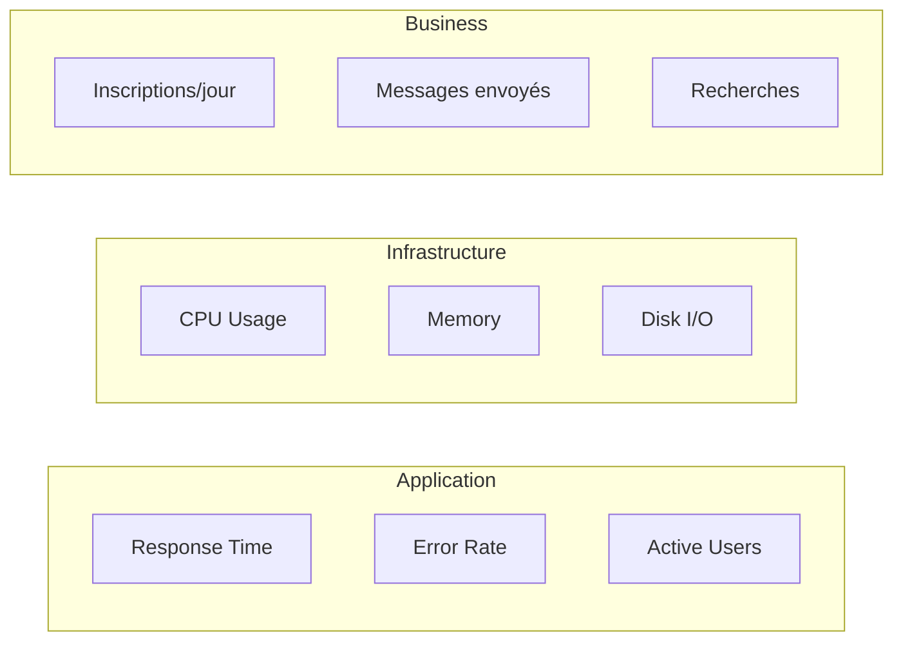

# 10.4 Monitoring (futur)

## Métriques à surveiller

---

## Métriques applicatives

| Métrique | Description | Seuil d'alerte |
| -------- | ----------- | -------------- |
| Response time (p95) | Temps de réponse API | > 500ms |
| Error rate | Pourcentage d'erreurs 5xx | > 1% |
| Availability | Uptime | < 99% |

---

## Métriques infrastructure

| Métrique | Description | Seuil d'alerte |
| -------- | ----------- | -------------- |
| CPU usage | Utilisation processeur | > 80% |
| Memory usage | Utilisation mémoire | > 85% |
| Disk usage | Espace disque | > 90% |

---

## Métriques business

| Métrique | Description | Objectif |
| -------- | ----------- | -------- |
| Inscriptions/jour | Nouveaux utilisateurs | À définir |
| Messages envoyés/jour | Activité messagerie | À définir |
| Recherches/jour | Utilisation recherche | À définir |
| DAU/MAU | Utilisateurs actifs | À définir |

---

## Outils envisagés

| Outil | Usage |
| ----- | ----- |
| **Sentry** | Error tracking |
| **Vercel Analytics** | Web vitals |
| **PostHog** | Product analytics |
| **Grafana** | Dashboards |

---

## État actuel

Le monitoring n'est pas encore implémenté. C'est prévu pour la V2 après le MVP.

---

[← Retour à l'index](./index.md)
