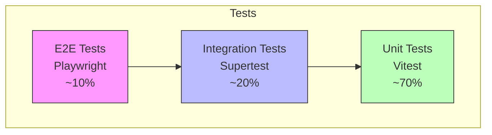

# 10.2 Tests

## Pyramide de tests



---

## Couverture cible

| Couche | Objectif | Outils |
| ------ | -------- | ------ |
| Services backend | > 80% | Vitest |
| Hooks frontend | > 70% | Vitest + Testing Library |
| Composants UI | > 60% | Testing Library |
| E2E critiques | 100% des flows | Playwright |

---

## Types de tests

### Tests unitaires (Vitest)

```typescript
// services/auth.service.test.ts
describe('AuthService', () => {
  describe('hashPassword', () => {
    it('should hash password with bcrypt', async () => {
      const password = 'myPassword123';
      const hash = await hashPassword(password);

      expect(hash).not.toBe(password);
      expect(await bcrypt.compare(password, hash)).toBe(true);
    });
  });
});
```

### Tests d'intégration (Supertest)

```typescript
// __tests__/auth.integration.test.ts
describe('POST /api/auth/register', () => {
  it('should create a new user', async () => {
    const response = await request(app)
      .post('/api/auth/register')
      .send({
        email: 'test@example.com',
        password: 'password123',
        firstname: 'John',
        lastname: 'Doe',
        city: 'Paris',
      });

    expect(response.status).toBe(201);
    expect(response.body.success).toBe(true);
  });
});
```

### Tests E2E (Playwright)

```typescript
// e2e/auth.spec.ts
test('user can register and login', async ({ page }) => {
  await page.goto('/inscription');

  await page.fill('[name="email"]', 'test@example.com');
  await page.fill('[name="password"]', 'password123');
  await page.fill('[name="firstname"]', 'John');
  await page.fill('[name="lastname"]', 'Doe');
  await page.fill('[name="city"]', 'Paris');

  await page.click('button[type="submit"]');

  await expect(page).toHaveURL('/profil');
});
```

---

## Scripts npm

```json
{
  "scripts": {
    "test": "vitest",
    "test:coverage": "vitest --coverage",
    "test:e2e": "playwright test",
    "test:ci": "vitest run && playwright test"
  }
}
```

---

[← Retour à l'index](./index.md)
