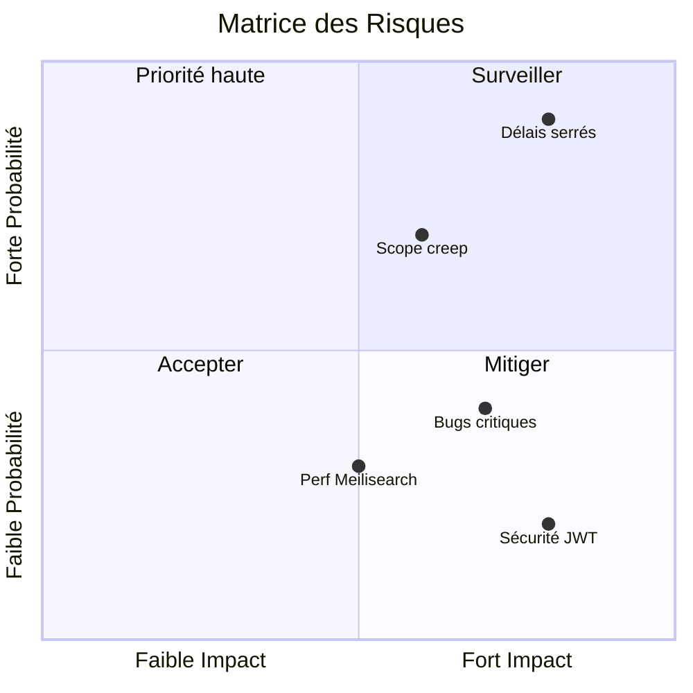
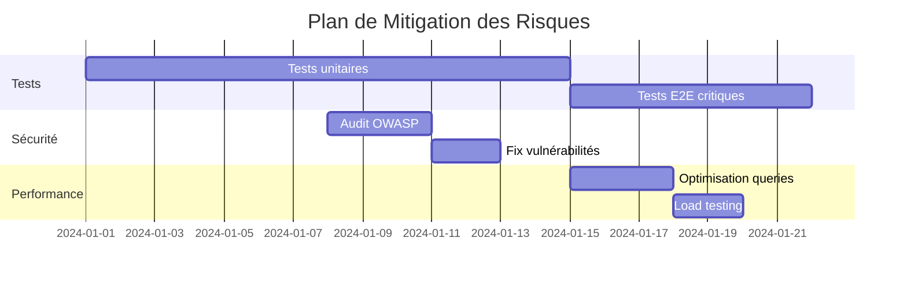

# 11. Risques et Dette Technique

## 11.1 Matrice des risques

---

## 11.2 Risques identifiés

### R1 : Délais serrés (4 semaines)

| Aspect | Détail |
| ------ | ------ |
| **Probabilité** | Haute |
| **Impact** | Élevé |
| **Mitigation** | MVP strict, features priorisées, daily standups |
| **Contingence** | Report des features non-essentielles |

### R2 : Scope creep

| Aspect | Détail |
| ------ | ------ |
| **Probabilité** | Moyenne |
| **Impact** | Moyen |
| **Mitigation** | Backlog fermé, validation des changements |
| **Contingence** | Refus des ajouts non planifiés |

### R3 : Bugs critiques en production

| Aspect | Détail |
| ------ | ------ |
| **Probabilité** | Moyenne |
| **Impact** | Élevé |
| **Mitigation** | Tests E2E, revue de code, staging |
| **Contingence** | Hotfix process, rollback |

### R4 : Performance Meilisearch

| Aspect | Détail |
| ------ | ------ |
| **Probabilité** | Faible |
| **Impact** | Moyen |
| **Mitigation** | Index optimisés, pagination |
| **Contingence** | Fallback PostgreSQL FTS |

### R5 : Vulnérabilité sécurité

| Aspect | Détail |
| ------ | ------ |
| **Probabilité** | Faible |
| **Impact** | Critique |
| **Mitigation** | Audit OWASP, dépendances à jour |
| **Contingence** | Patch immédiat, communication |

---

## 11.3 Dette technique

### Dette actuelle

| Item | Sévérité | Effort | Priorité |
| ---- | -------- | ------ | -------- |
| Tests E2E incomplets | Moyenne | 2j | P2 |
| Documentation API manquante | Faible | 1j | P3 |
| Logs non structurés | Faible | 0.5j | P3 |
| Monitoring absent | Moyenne | 2j | P2 |

### Dette acceptable (MVP)

| Item | Justification | Plan |
| ---- | ------------- | ---- |
| Pas de real-time (WebSocket) | Hors scope MVP | V2 |
| Pas d'emails transactionnels | Complexité SMTP | V2 |
| Pas de tests de charge | Utilisateurs limités | Post-MVP |
| Pas de multi-langue | Marché FR uniquement | V3 |

---

## 11.4 Plan de mitigation

### Actions préventives

### Checklist pré-production

- [ ] Tous les tests passent
- [ ] Pas de vulnérabilités critiques (npm audit)
- [ ] Variables d'environnement sécurisées
- [ ] HTTPS configuré
- [ ] Backups base de données
- [ ] Logs accessibles
- [ ] Rollback testé

---

## 11.5 Suivi des risques

### Indicateurs

| Risque | Indicateur | Seuil d'alerte |
| ------ | ---------- | -------------- |
| Délais | Vélocité sprint | < 80% prévu |
| Qualité | Bugs ouverts | > 5 critiques |
| Sécurité | Vulnérabilités | > 0 high/critical |
| Performance | P95 response time | > 500ms |

### Revue hebdomadaire

- Revue des risques en rétrospective
- Mise à jour de la matrice
- Ajustement des priorités

---

## Navigation

| Précédent | Suivant |
| --------- | ------- |
| [← 10. Qualité](../10-quality/index.md) | [12. Glossaire →](../12-glossary/index.md) |
