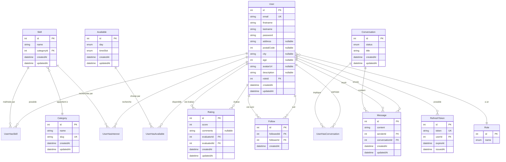

# Base de données

## Vue d'ensemble

SkillSwap utilise **PostgreSQL 16** avec **Prisma ORM** pour la gestion des données.

| Élément | Quantité |
| ------- | -------- |
| Modèles | 14 |
| Enums | 4 |
| Relations N:N | 4 |

---

## Diagramme Entité-Relation



---

## Modèles principaux

### User

Représente un membre inscrit sur SkillSwap. C'est le modèle central qui connecte toutes les fonctionnalités.

| Champ | Type | Contraintes | Description |
| ----- | ---- | ----------- | ----------- |
| id | Int | PK, Auto | Identifiant unique |
| email | String | Unique | Email de connexion |
| firstname | String | Required | Prénom |
| lastname | String | Required | Nom |
| password | String | Required | Hash bcrypt |
| address | String? | Optional | Adresse |
| postalCode | Int? | Optional | Code postal |
| city | String? | Optional | Ville |
| age | Int? | Optional | Âge |
| avatarUrl | String? | Optional | URL photo profil |
| description | String? | Optional | Biographie |
| roleId | Int | FK → Role | Rôle de l'utilisateur |
| createdAt | DateTime | Default now | Date d'inscription |
| updatedAt | DateTime | Auto | Dernière modification |

**Table SQL** : `user`

---

### Skill

Compétence pouvant être enseignée ou recherchée par les membres.

| Champ | Type | Contraintes | Description |
| ----- | ---- | ----------- | ----------- |
| id | Int | PK, Auto | Identifiant unique |
| name | String | Required | Nom de la compétence |
| categoryId | Int | FK → Category | Catégorie parente |

**Table SQL** : `skill`

---

### Category

Catégorie regroupant des compétences similaires.

| Champ | Type | Contraintes | Description |
| ----- | ---- | ----------- | ----------- |
| id | Int | PK, Auto | Identifiant unique |
| name | String | Required | Nom de la catégorie |
| slug | String | Unique | Slug URL-friendly |

**Table SQL** : `category`

---

### Conversation

Fil de discussion entre deux utilisateurs.

| Champ | Type | Contraintes | Description |
| ----- | ---- | ----------- | ----------- |
| id | Int | PK, Auto | Identifiant unique |
| title | String | Required | Titre de la conversation |
| status | Enum | Default Open | Open ou Close |

**Table SQL** : `conversation`

---

### Message

Message envoyé dans une conversation.

| Champ | Type | Contraintes | Description |
| ----- | ---- | ----------- | ----------- |
| id | Int | PK, Auto | Identifiant unique |
| content | String | Required | Contenu du message |
| senderId | Int | FK → User | Expéditeur |
| receiverId | Int | FK → User | Destinataire |
| conversationId | Int | FK → Conversation | Conversation parente |

**Table SQL** : `message`

---

### Rating

Note et commentaire laissé par un utilisateur à un autre.

| Champ | Type | Contraintes | Description |
| ----- | ---- | ----------- | ----------- |
| id | Int | PK, Auto | Identifiant unique |
| score | Int | Required | Note de 0 à 5 |
| comments | String? | Optional | Commentaire |
| evaluatorId | Int | FK → User | Auteur de la note |
| evaluatedId | Int | FK → User | Utilisateur noté |

**Contrainte** : Un utilisateur ne peut noter un autre qu'une seule fois (`@@unique([evaluatorId, evaluatedId])`)

**Table SQL** : `evaluation`

---

### Follow

Relation d'abonnement entre deux utilisateurs.

| Champ | Type | Contraintes | Description |
| ----- | ---- | ----------- | ----------- |
| id | Int | PK, Auto | Identifiant unique |
| followedId | Int | FK → User | Utilisateur suivi |
| followerId | Int | FK → User | Utilisateur abonné |

**Contrainte** : Un utilisateur ne peut suivre un autre qu'une seule fois (`@@unique([followedId, followerId])`)

**Table SQL** : `follow`

---

## Tables de jonction (N:N)

### UserHasSkill

Associe un utilisateur à ses compétences.

| Champ | Type | Description |
| ----- | ---- | ----------- |
| userId | Int | FK → User |
| skillId | Int | FK → Skill |

**Clé primaire** : `(userId, skillId)`
**Table SQL** : `user_has_skill`

---

### UserHasInterest

Associe un utilisateur à ses intérêts (compétences recherchées).

| Champ | Type | Description |
| ----- | ---- | ----------- |
| userId | Int | FK → User |
| skillId | Int | FK → Skill |

**Clé primaire** : `(userId, skillId)`
**Table SQL** : `user_has_interest`

---

### UserHasConversation

Associe un utilisateur à ses conversations.

| Champ | Type | Description |
| ----- | ---- | ----------- |
| userId | Int | FK → User |
| conversationId | Int | FK → Conversation |

**Clé primaire** : `(userId, conversationId)`
**Table SQL** : `user_has_conversation`

---

### UserHasAvailable

Associe un utilisateur à ses créneaux de disponibilité.

| Champ | Type | Description |
| ----- | ---- | ----------- |
| userId | Int | FK → User |
| availableId | Int | FK → Available |

**Clé primaire** : `(userId, availableId)`
**Table SQL** : `user_has_available`

---

## Enums

### RoleOfUser

Rôle d'un utilisateur dans le système.

| Valeur | Description |
| ------ | ----------- |
| `Membre` | Utilisateur standard |

---

### StatusOfConversation

Statut d'une conversation.

| Valeur | Description |
| ------ | ----------- |
| `Open` | Conversation active |
| `Close` | Conversation fermée |

---

### dayInAWeek

Jours de la semaine pour les disponibilités.

| Valeur |
| ------ |
| `Lundi` |
| `Mardi` |
| `Mercredi` |
| `Jeudi` |
| `Vendredi` |
| `Samedi` |
| `Dimanche` |

---

### Time

Créneaux horaires pour les disponibilités.

| Valeur | Description |
| ------ | ----------- |
| `Morning` | Matin |
| `Afternoon` | Après-midi |

---

## Contraintes et règles

### Suppression en cascade

Toutes les relations utilisent `onDelete: Cascade` :

- Supprimer un User supprime ses skills, interests, conversations, ratings, follows, messages, tokens
- Supprimer une Skill supprime ses associations UserHasSkill et UserHasInterest
- Supprimer une Conversation supprime ses messages et participants

### Index

| Table | Index | Colonnes |
| ----- | ----- | -------- |
| `user` | Unique | `email` |
| `category` | Unique | `slug` |
| `refresh_token` | Unique | `token` |
| `refresh_token` | Index | `userId` |
| `evaluation` | Unique | `(evaluatorId, evaluatedId)` |
| `follow` | Unique | `(followedId, followerId)` |

---

## Commandes Prisma

```bash
# Générer le client Prisma
npx prisma generate

# Appliquer les migrations en développement
npx prisma migrate dev

# Appliquer les migrations en production
npx prisma migrate deploy

# Ouvrir Prisma Studio (interface graphique)
npx prisma studio

# Seed la base de données
npx prisma db seed

# Réinitialiser la base de données
npx prisma migrate reset
```

---

## Navigation

| Retour |
| ------ |
| [🏠 Accueil](../index.md) |
