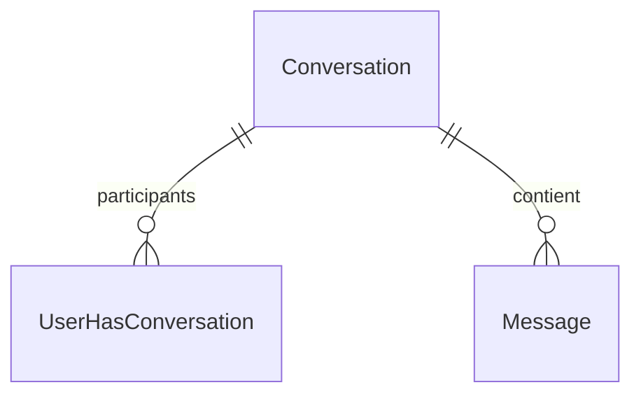

# Modèle Conversation

Le modèle `Conversation` représente une conversation entre deux utilisateurs.

## Schéma Prisma

```prisma
model Conversation {
  id        Int                  @id @default(autoincrement())
  status    StatusOfConversation @default(Open)
  title     String
  users     UserHasConversation[]
  messages  Message[]

  createdAt DateTime             @default(now()) @map("created_at")
  updatedAt DateTime             @default(now()) @updatedAt @map("updated_at")

  @@map("conversation")
}

enum StatusOfConversation {
  Open
  Close
}
```

## Champs

| Champ | Type | Nullable | Description |
|-------|------|----------|-------------|
| `id` | Int | Non | Identifiant unique |
| `status` | StatusOfConversation | Non | Statut (Open/Close) |
| `title` | String | Non | Titre de la conversation |
| `createdAt` | DateTime | Non | Date de création |
| `updatedAt` | DateTime | Non | Date de modification |

## Relations



| Relation | Type | Modèle cible | Description |
|----------|------|--------------|-------------|
| `users` | N:N | [User](./user.md) via UserHasConversation | Participants |
| `messages` | 1:N | [Message](./message.md) | Messages de la conversation |

## Statuts

| Valeur | Description |
|--------|-------------|
| `Open` | Conversation active (défaut) |
| `Close` | Conversation fermée/archivée |

## Table SQL

```sql
CREATE TABLE "conversation" (
  id SERIAL PRIMARY KEY,
  status VARCHAR DEFAULT 'Open',
  title VARCHAR NOT NULL,
  created_at TIMESTAMP DEFAULT NOW(),
  updated_at TIMESTAMP DEFAULT NOW()
);

CREATE TYPE "StatusOfConversation" AS ENUM ('Open', 'Close');
```

## Exemples

### Créer une conversation

```typescript
const conversation = await prisma.conversation.create({
  data: {
    title: 'Discussion React',
    status: 'Open',
    users: {
      create: [
        { userId: 1 },
        { userId: 42 }
      ]
    }
  },
  include: {
    users: { include: { user: true } }
  }
});
```

### Récupérer avec messages

```typescript
const conversation = await prisma.conversation.findUnique({
  where: { id: conversationId },
  include: {
    users: {
      include: { user: { select: { id: true, firstname: true, lastname: true } } }
    },
    messages: {
      orderBy: { createdAt: 'asc' },
      take: 50
    }
  }
});
```

### Lister les conversations d'un utilisateur

```typescript
const conversations = await prisma.conversation.findMany({
  where: {
    users: { some: { userId: currentUserId } }
  },
  include: {
    users: { include: { user: true } },
    messages: {
      orderBy: { createdAt: 'desc' },
      take: 1
    }
  },
  orderBy: { updatedAt: 'desc' }
});
```

## Voir aussi

- [Message](./message.md)
- [User](./user.md)
- [Exemple: Messagerie](../../api-reference/examples/messaging-flow.md)
