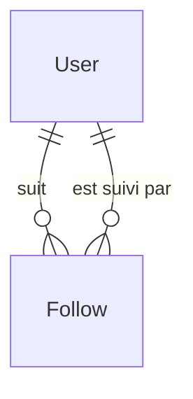

# Modèle Follow

Le modèle `Follow` représente une relation de suivi entre deux utilisateurs.

## Schéma Prisma

```prisma
model Follow {
  id         Int      @id @default(autoincrement())
  followed   User     @relation("FollowedUser", fields: [followedId], references: [id], onDelete: Cascade)
  followedId Int      @map("followed_id")
  follower   User     @relation("FollowerUser", fields: [followerId], references: [id], onDelete: Cascade)
  followerId Int      @map("follower_id")

  createdAt  DateTime @default(now()) @map("created_at")
  updatedAt  DateTime @default(now()) @updatedAt @map("updated_at")

  @@unique([followedId, followerId])
  @@map("follow")
}
```

## Champs

| Champ | Type | Nullable | Description |
|-------|------|----------|-------------|
| `id` | Int | Non | Identifiant unique |
| `followedId` | Int | Non | FK vers User (celui qui est suivi) |
| `followerId` | Int | Non | FK vers User (celui qui suit) |
| `createdAt` | DateTime | Non | Date du suivi |
| `updatedAt` | DateTime | Non | Date de modification |

## Relations



| Relation | Type | Modèle cible | Description |
|----------|------|--------------|-------------|
| `followed` | N:1 | [User](./user.md) | Utilisateur suivi |
| `follower` | N:1 | [User](./user.md) | Utilisateur qui suit |

## Contraintes

- **Unique** : Un utilisateur ne peut suivre un autre qu'une seule fois
- Pas d'auto-follow (géré côté API)

## Table SQL

```sql
CREATE TABLE "follow" (
  id SERIAL PRIMARY KEY,
  followed_id INTEGER NOT NULL REFERENCES "user"(id) ON DELETE CASCADE,
  follower_id INTEGER NOT NULL REFERENCES "user"(id) ON DELETE CASCADE,
  created_at TIMESTAMP DEFAULT NOW(),
  updated_at TIMESTAMP DEFAULT NOW(),
  UNIQUE (followed_id, follower_id)
);
```

## Exemples

### Suivre un utilisateur

```typescript
const follow = await prisma.follow.create({
  data: {
    followerId: currentUserId,
    followedId: targetUserId
  }
});
```

### Se désabonner

```typescript
await prisma.follow.delete({
  where: {
    followedId_followerId: {
      followedId: targetUserId,
      followerId: currentUserId
    }
  }
});
```

### Vérifier le suivi mutuel

```typescript
const mutualFollow = await prisma.follow.findMany({
  where: {
    OR: [
      { followerId: userA, followedId: userB },
      { followerId: userB, followedId: userA }
    ]
  }
});
const isMutual = mutualFollow.length === 2;
```

### Compter les abonnés/abonnements

```typescript
const counts = await prisma.user.findUnique({
  where: { id: userId },
  select: {
    _count: {
      select: {
        followerUsers: true,  // Nombre d'abonnés
        followedUsers: true   // Nombre d'abonnements
      }
    }
  }
});
```

### Lister les abonnés

```typescript
const followers = await prisma.follow.findMany({
  where: { followedId: userId },
  include: {
    follower: {
      select: { id: true, firstname: true, lastname: true, avatarUrl: true }
    }
  }
});
```

## Règles métier

| Règle | Description |
|-------|-------------|
| Suivi mutuel requis | Pour créer une conversation, les deux utilisateurs doivent se suivre |
| Notation requiert suivi | Pour noter un utilisateur, il faut le suivre |

## Voir aussi

- [User](./user.md)
- [Rating](./rating.md)
- [Conversation](./conversation.md)
