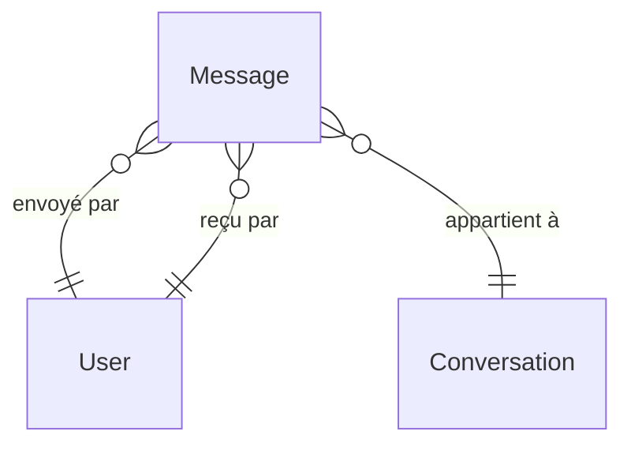

# Modèle Message

Le modèle `Message` représente un message dans une conversation.

## Schéma Prisma

```prisma
model Message {
  id             Int          @id @default(autoincrement())
  sender         User         @relation("SenderUser", fields: [senderId], references: [id], onDelete: Cascade)
  senderId       Int          @map("sender_id")
  receiver       User         @relation("ReceiverUser", fields: [receiverId], references: [id], onDelete: Cascade)
  receiverId     Int          @map("receiver_id")
  content        String
  conversation   Conversation @relation(fields: [conversationId], references: [id], onDelete: Cascade)
  conversationId Int          @map("conversation_id")

  createdAt      DateTime     @default(now()) @map("created_at")
  updatedAt      DateTime     @default(now()) @updatedAt @map("updated_at")

  @@map("message")
}
```

## Champs

| Champ | Type | Nullable | Description |
|-------|------|----------|-------------|
| `id` | Int | Non | Identifiant unique |
| `senderId` | Int | Non | FK vers User (expéditeur) |
| `receiverId` | Int | Non | FK vers User (destinataire) |
| `content` | String | Non | Contenu du message |
| `conversationId` | Int | Non | FK vers Conversation |
| `createdAt` | DateTime | Non | Date d'envoi |
| `updatedAt` | DateTime | Non | Date de modification |

## Relations



| Relation | Type | Modèle cible | Description |
|----------|------|--------------|-------------|
| `sender` | N:1 | [User](./user.md) | Expéditeur |
| `receiver` | N:1 | [User](./user.md) | Destinataire |
| `conversation` | N:1 | [Conversation](./conversation.md) | Conversation parente |

## Contraintes

- Cascade delete sur `sender`, `receiver`, `conversation`

## Table SQL

```sql
CREATE TABLE "message" (
  id SERIAL PRIMARY KEY,
  sender_id INTEGER NOT NULL REFERENCES "user"(id) ON DELETE CASCADE,
  receiver_id INTEGER NOT NULL REFERENCES "user"(id) ON DELETE CASCADE,
  content TEXT NOT NULL,
  conversation_id INTEGER NOT NULL REFERENCES conversation(id) ON DELETE CASCADE,
  created_at TIMESTAMP DEFAULT NOW(),
  updated_at TIMESTAMP DEFAULT NOW()
);
```

## Exemples

### Envoyer un message

```typescript
const message = await prisma.message.create({
  data: {
    content: 'Bonjour !',
    senderId: currentUserId,
    receiverId: otherUserId,
    conversationId: conversationId
  },
  include: {
    sender: { select: { id: true, firstname: true } }
  }
});
```

### Messages paginés d'une conversation

```typescript
const messages = await prisma.message.findMany({
  where: { conversationId },
  orderBy: { createdAt: 'desc' },
  skip: offset,
  take: limit,
  include: {
    sender: {
      select: { id: true, firstname: true, lastname: true, avatarUrl: true }
    }
  }
});
```

### Modifier un message

```typescript
const updated = await prisma.message.update({
  where: {
    id: messageId,
    senderId: currentUserId // Seul l'auteur peut modifier
  },
  data: { content: newContent }
});
```

### Supprimer un message

```typescript
await prisma.message.delete({
  where: {
    id: messageId,
    senderId: currentUserId
  }
});
```

## Validation

```typescript
const CreateMessageSchema = z.object({
  content: z.string().min(1).max(2000)
});
```

## Voir aussi

- [Conversation](./conversation.md)
- [User](./user.md)
- [Exemple: Messagerie](../../api-reference/examples/messaging-flow.md)
