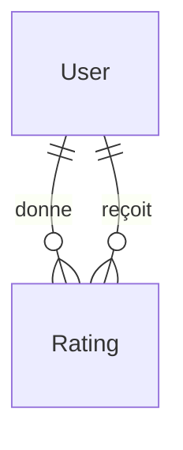

# Modèle Rating

Le modèle `Rating` (table `evaluation`) représente une évaluation donnée par un utilisateur à un autre.

## Schéma Prisma

```prisma
model Rating {
  id          Int      @id @default(autoincrement())
  comments    String?
  score       Int

  evaluator   User     @relation("EvaluatorUser", fields: [evaluatorId], references: [id], onDelete: Cascade)
  evaluatorId Int      @map("evaluator_id")
  evaluated   User     @relation("EvaluatedUser", fields: [evaluatedId], references: [id], onDelete: Cascade)
  evaluatedId Int      @map("evaluated_id")

  createdAt   DateTime @default(now()) @map("created_at")
  updatedAt   DateTime @default(now()) @updatedAt @map("updated_at")

  @@unique([evaluatorId, evaluatedId])
  @@map("evaluation")
}
```

## Champs

| Champ | Type | Nullable | Description |
|-------|------|----------|-------------|
| `id` | Int | Non | Identifiant unique |
| `score` | Int | Non | Note (1-5) |
| `comments` | String | Oui | Commentaire optionnel |
| `evaluatorId` | Int | Non | FK vers User (celui qui note) |
| `evaluatedId` | Int | Non | FK vers User (celui qui est noté) |
| `createdAt` | DateTime | Non | Date de création |
| `updatedAt` | DateTime | Non | Date de modification |

## Relations



| Relation | Type | Modèle cible | Description |
|----------|------|--------------|-------------|
| `evaluator` | N:1 | [User](./user.md) | Utilisateur qui donne la note |
| `evaluated` | N:1 | [User](./user.md) | Utilisateur qui reçoit la note |

## Contraintes

- **Unique** : Un utilisateur ne peut noter un autre qu'une seule fois
- **Prérequis API** : Les utilisateurs doivent se suivre mutuellement pour noter

## Table SQL

```sql
CREATE TABLE "evaluation" (
  id SERIAL PRIMARY KEY,
  score INTEGER NOT NULL CHECK (score >= 1 AND score <= 5),
  comments TEXT,
  evaluator_id INTEGER NOT NULL REFERENCES "user"(id) ON DELETE CASCADE,
  evaluated_id INTEGER NOT NULL REFERENCES "user"(id) ON DELETE CASCADE,
  created_at TIMESTAMP DEFAULT NOW(),
  updated_at TIMESTAMP DEFAULT NOW(),
  UNIQUE (evaluator_id, evaluated_id)
);
```

## Exemples

### Donner une note

```typescript
const rating = await prisma.rating.create({
  data: {
    score: 5,
    comments: 'Excellent professeur, très pédagogue !',
    evaluatorId: currentUserId,
    evaluatedId: targetUserId
  }
});
```

### Calculer la moyenne d'un utilisateur

```typescript
const avgRating = await prisma.rating.aggregate({
  where: { evaluatedId: userId },
  _avg: { score: true },
  _count: { score: true }
});
// { _avg: { score: 4.5 }, _count: { score: 12 } }
```

### Récupérer les évaluations reçues

```typescript
const ratings = await prisma.rating.findMany({
  where: { evaluatedId: userId },
  include: {
    evaluator: {
      select: { id: true, firstname: true, lastname: true, avatarUrl: true }
    }
  },
  orderBy: { createdAt: 'desc' }
});
```

## Validation

```typescript
const addRatingToUserSchema = z.object({
  score: z.number().int().min(1).max(5),
  comments: z.string().max(500).optional()
});
```

## Voir aussi

- [User](./user.md)
- [Follow](./follow.md)
